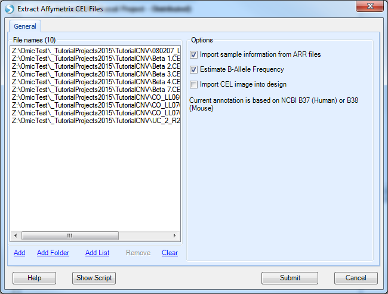
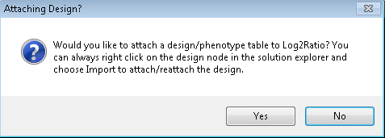

# Introduction

## Array studio

*Array Studio* provides an integrated environment for analyzing and visualizing high dimensional data. It is convenient for organizing and visualizing data with its *Solution Explorer*, which organizes each project into *Data, QC, Table, List, Cluster, Text, Attachments* and other categories. Multiple projects can be opened simultaneously in the *Solution Explorer*, and data can be shared among projects. Each view is controlled by a *View Controller*, which performs view customization, applies filtering, and displays legends. Furthermore, its interactive visualization technique provides the details of data with the *Details Window* and *Web Details On-Demand*.

It is highly recommended that the user complete the prerequisite for this tutorial: MicroArray Tutorial, which is a good introduction to basic usage, data structure and standard visualization in Array Studio.

## Downloading the Copy Number Sample Data

For this tutorial, the following materials will be required: the 10 .CEL files and the CopyNumber.design.txt file. The Copy Number Sample Data is available at:
[^link^](http://omicsoft.com/downloads/data/tutorial/CopyNumber30Data.zip )

The Copy Number sample data contains 10 samples and 1,855,448 CNVs from the Affymetrix platform. The 10 observations include cases of UPD on chromosome 15, DMD-del Xp21.1, Williams Syndrome, Mosaic Trisomy, Turner Mosaic, Trisomy 13, Smith-Magenis, Angelman/Prader-Willi, and a normal sample. An additional file that includes covariate information, relating the chip name to the type of syndrome, as well as the source of the chip, has been included as well. While this tutorial only includes 10 observations, *Array Studio* is easily capable of handling experiments with thousands of observations and millions of rows.

The CopyNumber.Design.txt file contains the design information for the tutorial’s study, including columns for *ID*, *Abnormality*, and *Source*. A design table can be created at any time by a user, using Microsoft Excel or Array Studio. As a rule, the design table must contain a first column, usually deemed *ID*, that contains the exact file names of the arrays used in the experiment, without the extension (e.g. .CEL). That is, the IDs have to match the names of the Affymetrix .CEL files, or the names listed in the Illumina text file, etc. Additional columns usually include *disease status*, *quantitative traits*, *etc.* (anything pertinent to the experiment). If you forget to include a particular column at the time of the creation of the design table, it is not a problem, because design factors can be added or edited after importing the design into *Array Studio*. An example design table is shown below.

After downloading the single .zip file, unzip the file to a folder of your choice (to be used in the remainder of this tutorial).

## Creating a New Project

When Array Studio is first installed, it will look similar to below. If you have previously had projects opened in Array Studio, just click Cancel so as to not reopen those projects now.

Notice at the top there will be multiple tabs: Analysis, Server, Land, and Browser. This tutorial will concentrate on the Local Analysis. A separate tutorial is available for accessing Omicsoft’s Array Server, and that tutorial can be used for the Server Explorer tab.

---
!!! note
    This tutorial is done in **Local** mode, but can just as easily be completed using **Server** mode if Array Server is installed. Array Server allows a user to perform analyses on a high performance computing cluster with job management capabilities, greatly accelerating the speed at which analysis, data visualization and file transfer can occur.
---

To create a new project, click the **New** button on the toolbar, or go to **File** Menu, then click **New Project**.

This opens the *New Project* window.

*Array Studio* allows the user to create two different project types: A simple project, in which all the outputs are saved in a single file (recommended for microarray and RT-PCR projects), and a distributed project, where output are saved in separate files (recommended for exon array, CNV, genotyping and NGS projects).

With a simple project, all data will be saved in a single file. In a distributed project, data will be saved in separate files, stored in a folder of the project’s name, and also includes a small project file **.osprj** (used for re-opening of the project).

Choose the **Create a distributed project** option. Click the *Browse* button to choose a location to save the project, and enter the project name. The Data folder information is automatically filled in based on the location of the Project file.

Click **OK** to continue.

The *Solution Explorer* will now be empty, containing a *TutorialCNV* Project and slots for *List, Cluster, Text, and Attachments*.

You can right-click on *List, Cluster*, and *Text* for additional options for each. For instance, right-clicking on *List* will bring up options to add a new List, add list from file, etc. A *List* can be used to filter the data, by either *Variables* (SNP data), or *Observations* (Chips or SNP arrays).

If you cannot see the *Solution Explorer*, switch to it now by clicking it on the bottom left of the screen, or going to the *View Menu | Show Solution Explorer*.

In the next section, we will import the downloaded CNV data into Array Studio.

## Importing CNV Data and Attaching Design Table

To import our sample CNV data, click  **Add Data | Add Omic Data | Add CNV/CGH Data**.

This opens the *Specify CNV Data Source* window. In this window, the user can choose the *CNV Data Source* for input. Choices include:

The sample data for this tutorial is in *Affymetrix .CEL* file format. Choose *Affymetrix .CEL files* now. This brings up the *Extract Affymetrix CEL Files* window.

The first step for this window is to add the files to be extracted by clicking the **Add** button. Navigate to the location of the downloaded 10 .CEL files, and then click **Open** to continue.

Options include:

*   *Import sample information from .ARR files* will automatically import sample/design table information if the user has previously generated .ARR files).

    Note: *Import sample information from ARR files* can be selected but will have no effect for this tutorial, as that information was not generated with the sample files ( **Array Studio** looks in the same directory of the CNCHP files for the .ARR sample information files).

*   *Estimate B-Allele Frequency*, which should be selected.

*   *import the CEL images into design*, which should be left unchecked.

Click **Submit** to begin the extraction.

The extraction process may take up to 15 minutes (the first time a specific chip type is used, annotation is automatically downloaded from Omicsoft’s web server, and this may increase the time it takes for extraction as well. However, a standard computer with 2 Gigabytes of memory should have no problem extracting a large number of CEL files (1000 files can be easily extracted).

---
!!! note
    Array Studio uses an algorithm similar to the Birdseed/Birdsuite algorithms for the SNP 6.0 and 500K Mapping chips (Tests have shown a 99.98% concordance between Omicsoft’s algorithm and Birdseed/Birdsuite). Array Studio achieves this by previously generating the model, based on the HapMap 270 dataset. For more questions on the exact details of the algorithm, please read the following white paper on our wiki page: [^link^](http://omicsoft.com/downloads/whitepaper/AffymetrixCNVAnalysis.pdf )
---

Upon completion of import, Array Studio will prompt the user to attach a *Design* table to the data. If the user wishes to attach a design table at a later time, this can be done as well (by right-clicking the *Design* section of the dataset in the *Solution Explorer*), however, it is recommended to build and have your design table ready for use upon import of the data. Click *Yes* to begin the Design import process.

Array Studio will prompt the user to specify a table source. As the design table for the sample data is in a **Tab delimited file** format, choose that option now, and click *OK*.

When prompted, choose the *CopyNumber .design.txt* file that was unzipped earlier, and click *Open* to attach the design table to the dataset. When the "Specify Options" window appears, just select "OK":

Once imported, Array Studio should look similar to the following screenshot. By default, a *TableView* is created for the imported dataset (Log2Ratio).

Also, note that a new item has been added under the *Omic Data* section of the *Solution Explorer* (on the left-hand side of the screen).

The *Solution Explorer* can provide important information about the different datasets and tables that are created in Array Studio. For instance, note that next to the name of the dataset, **Log2Ratio**, Array Studio lists the number of rows and columns (or variables and observations) in the dataset. In this case, there are 1,855,448 variables and 10 observations in each of the datasets.

The *Solution Explorer* also provides the user with information on the different views that have been created. Notice that the Project, *CNVTutorial*, contains a dataset **Log2Ratio**. There is a *TableView* under the *Design* section, as well as a *TableView* in the main section. This indicates that if the user was to double-click either of these views (named Table), these would open up in the main view window.

Expand the nodes (they are collapsed by default) to see something similar to below.

Congratulations! You have successfully imported your first CNV dataset into Array Studio. In the next chapter, we will explore some of the different visualizations and views available in Array Studio.
