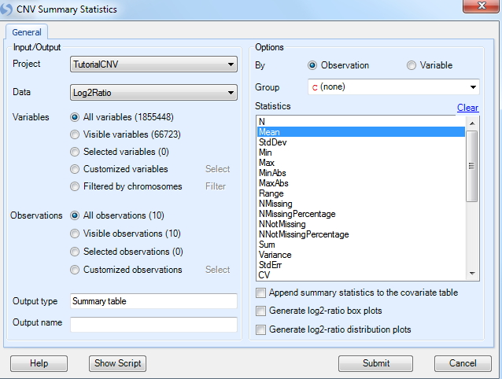
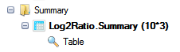

# Summarization of CNV Data

## Summary Statistics

*Array Studio* can also provide summary statistics on CNV data using the module, **Summary Statistics**. This module is available in the **CNV Menu | Summary Statistics**. Open it now.

This brings up the *CNV Summary Statistics* window. All module windows in *Array Studio* follow a similar pattern to this one.

 

*   First, the user can select the *Project* and *Data* to be analysed; in this case our *Project* is *Tutorial CNV* and our *Data* is *Log2Ratio*.

*   Next, if the user has generated a list of variables/markers for analysis, this can be selected through
    **Customized variables**. The user can also manually choose particular chromosomes for analysis.     For demonstration purposes, let’s only generate statistics on chromosome 13. To do this, check *Filtered by chromosomes* option and click the **Filter** button.

*   The **Observations** section allows the user to choose a list of subjects to analyze. Leave this to *All observations (10)*.

*   Under Options, the user has a number of choices. The user has the option to summarize either each **Observation** or each **Variable**. Here we choose **Observation** to summarize statistics across all markers on chromosome 13 for each sample.

*   The user can also choose to summarize by a specific annotation table (for observations) or design table (for variables) column as **Group**. For example, if the user is interested in statistics for each Syndrome     group, they could choose that column here.

*   Finally, the **Statistics** section contains a number of different statistics that can be calculated, including N, Mean, StdDev, Min, Max, MinAbs, MaxAbs, Range, NMissing, NMissingPercentage, NNotMissing, NNotMissingPercentage, Sum, Variance, StdErr, CV, Median, IQR, Skewness, Kurtosis, MAD, NPositive, NNegative, PositivePercentage, NegativePercentage, PositiveChangeSize, NegativeChangeSize, PositiveMean, NegativeMean and GenometricMean. Choose **Mean** here to summarize the mean of Log2Ratio values of all variables for each observation.

*   User also has the option to **Append the summary statistics to the covariate table** as new design column.

*   In addition to the table report, user can also choose to generate **log2-ratio box plots** or **distribution plots** in correspondence to the table. Leave these unchecked for this tutorial.

A new *Table* is generated under the **Table | Summary** section of the *Solution Explorer*, called **Log2Ratio.Summary**.

Note that we may still be filtering for the single chip, so we need to reset all filters in the *Filter* tab of the *View Controller* to see all the samples in the table.

Once unfiltered, the *TableView* should include 10 rows and 3 columns. It is clear that for sample Beta 2, which is the patient with Trisomy 13, the mean is 0.32545, significantly higher than for any of the other samples. This module can be used to perform similar analyses as desired, generating other types of statistics.

   
