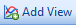
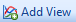
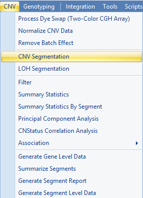
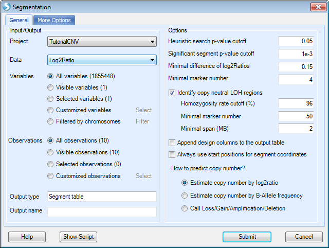
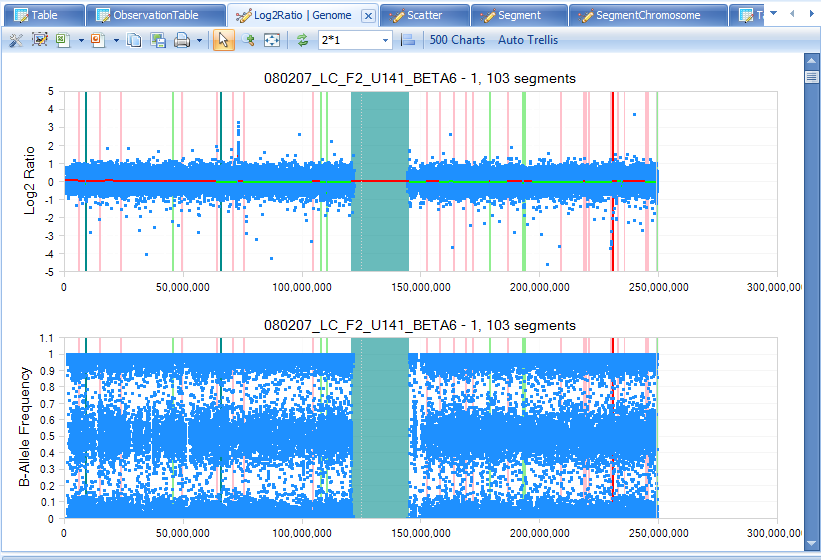

# Visualization of Data

## The TableView

Upon import, Array Studio will automatically generate a *TableView* for the CNV data.

The *TableView* in Array Studio can easily display millions of rows or columns. In this view, each observation is in a column, while each variable is a row. Copy Number information is shown in each cell. First, take a look at the Log2Ratio data. If you have not already done so, double-click the *Table* view for the *Log2Ratio* data from the *Solution Explorer*.

Scroll through the data now to see the speed that Array Studio can display data. Notice that this Tableview contains the Log2Ratio data, extracted from the CNCHP files, for each variable.

Please refer to Microarray Tutorial for different options and filters for table view.

## The ObservationTableView

Besides the regular *TableView*, where each row represents a variable and each column represents an observation, Array Studio also offers the *ObservationTableView*. In this view, each column represents a variable, while each row represents an observation. *Array Studio* can easily handle millions of columns in this view.

To add an *ObservationTableView* to the imported dataset, click the *Add View*  button from the toolbar.

Alternatively and usually preferred for quick opening of new views for different data or table objects, the user can right click on the dataset or table in the *Solution Explorer* for the relevant data or table object.

For instance, to open a new view for *Log2Ratio* data, the user could right-click on **Log2Ratio** and choose **Add View**, as shown below. Note: for *Data* object types, the user can also open new views for *Annotation* or *Design* as well (see figures below—for information purpose only, not necessary for this tutorial).

Similarly, to add a view for the **Annotation Table** under the *Log2Ratio*, right click on the **Annotation** icon in the *Solution Explorer* and select **Add View**.

The same can be done for adding a view for the *Design* icon as shown below.

If you have not already done so, click the *Add View*  button from the toolbar to open the *Select Data* window.

Select *Log2Ratio* and click *OK*.

For each different type of imported dataset in Array Studio, different views are available. Some of these different types of views will be discussed in the tutorial.

For Log2Ratio data, available views include *B-AlleleFrequencyTableView*, *BoxPlotView*, *FullTableView*, *GenomeView*, *HeatmapView*, *ObservationTableView*, *PairwiseScatterView*, *RBoxPlotView*, *RegionView*, *ScatterView*, *SnpTableView*, *TableView*, *VariableTableView*, and *VariableView*.

Notice that the preview window shows the user a basic preview of that view as you scroll through each option. Choose *ObservationTableView* now, and click *OK* to continue.

 

After adding the view, a new view is called "ObservationTable" appears in the *Solution Explorer*, under the dataset that was selected above.

In addition, this new view is opened in the main view window. The user can switch between different opened views by using the tabs at the top of the screen. This provides a fast mechanism for switching between views.

As you can see, a new *ObservationTableView* is now visible, where each column represents a variable, and each row represents an observation. The first several columns show the design information for each subject, as shown below.

The *View Controller*, found on the right-hand side of the screen in *Array Studio*, contains tabs that allow the user to customize each view, by changing options using the **Task** tab, or filtering the data (using the **Variables** or **Observations** tabs).

The *Task* tab for the *ObservationTableView* is shown below.

To filter for a particular marker, or CNV, click the **Variable** tab to switch to the *Variable* filter.

The *Variable* filter will contain one filter for every column in the *Annotation Table*. By default, Affymetrix .CEL imported files have annotation for *ID, Chromosome, Start, End*.

Expand the ID column, and enter the marker **SNP_A-4216564**.

Notice that when filtered, the *View Controller* provides feedback as to how many variables passed filtering. Also, notice that the view has automatically been filtered to only show the variable **SNP_A-4216564**, as well as the attached covariate information. This table can easily be exported to Excel or a text file, using the buttons available on the toolbar.

To remove any current filters on the dataset, manually click the *(no filter)* button for each filter (in this case just ID) or click the **Reset All Filters** button in the toolbar of the *View Controller* to show all variables.

Reset all filters now.

Besides filtering for a specific marker, we can also filter by chromosome and base pair position. Expand the *Chromosome* filter as well as the *Start* and *End* filters now.

Unlike the *ID* filter, the *Chromosome* filter shows radio buttons by default (instead of a string filter). For columns that contain limited number of levels (i.e. chromosome), users will have the choice of using **String Filter**, **Radio**, or **CheckBox**. Right-clicking on *Chromosome* will bring up a choice so the user can change the type of filter.

Now right click on *Chromosome* and click on *Check None*, which make it easier to select a few chromosomes. Select Chromosome *1*. Alternatively, you can simply right-click on Chromosome *1* and select the option *Check This Only*.

For the *Start* filter, enter ">150mbp" now.

Notice that the view is updated to show only the variables that correspond to this filter.

Switch back to the regular *TableView* for the *Log2Ratio* dataset to see that every view for that dataset has been updated for the filter. This is an important feature in Array Studio. *Filtering one view of a dataset will also filter the other views of that same dataset. In other words, the Filtering is linked among views.*

Reset any filters by clicking the **Reset All Filters**  button in *View Controller* now.

## The Details Window

*Array Studio* includes a feature called *Details on Demand*. In most views, selecting objects in the view will show details about that object (i.e. row, column, data point), in the *Details Window* (at the bottom of the screen).

Click on a marker in the row header of the *TableView*, and notice that the variable name changes to green. This indicates that this row has been selected, and information is available in the *Details* window.

The *Details Window* should be visible at the bottom of the screen, but if it is not, switch to it by selecting **Show Details Window** from the **View** menu. Note that all of the annotation information for the selected row or rows is shown in the *Details Window*.

The *Details Window* can also be used to show information about a particular subject. Click the header row of one of the subjects now.

Note that the *Details Window* is automatically updated with the design information about that subject.

## Segmenting Data

Before continuing the investigation of the *GenomeView* data, we are going to take a moment and generate segment data for our Log2Ratio ratio.

To begin segmentation, go to the **CNV Menu | CNV Segmentation**.

This brings up the *Segmentation* window. The user has the option of fine-tuning the segmentation algorithm, although Omicsoft recommends the set of parameters that have been tested to work effectively. Make sure that the *Project* is *Tutorial CNV* and that the *Data* is *Log2Ratio*.

The user can select from the following Options:

*   *Heuristic search p-value cutoff* the initial search for segments—decreasing this will decrease the number of
    segments, while increasing this will increase the number of segments).

*   After finding all possible boundaries, the segmentation algorithm will merge contiguous regions if the
    difference between regions does not meet or exceed the **Significant segment p-value cutoff** (decreasing this will decrease the number of segments, while increasing this will increase the number of segments).

*   A new segment will be created only if the difference is larger than **Minimal difference of log2Ratios**.

*   A new segment will be created only if the number of markers is larger than the threshold set by **Minimal
    marker number**.

*   The user can choose to **Identify copy neutral LOH segments**, and can set criteria:

    * Homozygosity rate cutoff (%)

    * Minimal marker number

    * Minimal span (MB)

*   The user can optionally **Append design columns to the output table** (useful for filtering or if exporting the
    segment report).

*   User can decide whether to **use start position for segmentation end coordinates.** The end coordinate of a
    segment can either be the **start** or the **end** position of the last marker.

*   The user can predict copy number based on one of the following three choices:

    *   Estimate based on **Log2Ratio** value: Copy Number = round(2^(Log2RatioMean + 1), example:

        *   When Log2RatioMean = 0, Copy Number =2

        *   When Log2RatioMean = -1, Copy Number = 1

        *   When Log2RatioMean = 0.32, Copy Number = 3 (rounded)

        *   When Log2RatioMean = 1, Copy Number = 4

    *   Estimate based on **B-Allele Frequency**. This option will only work well for Illumina data.

    *   Call **Loss/Gain/Amplification/Deletion** based on Log2Ratio values, see details here

[^link^](http://www.arrayserver.com/wiki/index.php?title=CNV_data_preprocessing_for_Affymetrix_SNP_Array )

Under the **More Options** tab, the following window is presented:

Calling Options include:

*   If the Log2Ratio is close to zero, then there is No Change? in copy number. User can set the cutoff for
    positive Log2Ratio or negative Log2Ratio

*   Minimal supporting marker# for BAF based calling

*   Minimal supporting marker% for BAF based calling

*   Log2Ratio Threshold to call amplification and deletion

*   Calling options for B-Allele Frequency is only effective when a user chooses to estimate copy number based on
    B-Allele Frequency

Click **Submit** to begin the segmentation. This should take approximately 10 seconds per sample (100 seconds).

After the segmentation is complete, a new **Genome** view will be generated under **-Omic Data** section and new data will be generated under **Table | Segment | Log2Ratio.Segment**. Also, a *ScatterView* will be created showing Log2Ratio.Mean vs. AlleleDifference.Mean, and this scatter view can be used to examine the segmentation patterns and calls.

Double-click the **Table** view for **Segment** data now to make it visible in the main view window.

Each row of the table corresponds to a segment and includes detailed annotation information for each segment. This table will be used in other visualizations and analysis. It can also be edited to create new segments, using some of the visualizations and analysis in *Array Studio*.

Next, click on the **Scatter** view for *Log2Ratio.Segment* in the *Solution Explorer* to open the *Scatter View* showing the *Log2Ratio.Mean vs. BAlleleFrequencyDeviation.Mean*. By default, this graph is trellised by observation, so there should initially be 10 charts shown, one for each observation in the experiment. The user can change the trellising by using the **Task** tab in the **View Controller**, and choosing **Trellis by Row Covariate**. Switching to the **Legend** in the *View Controller* will show a *Legend* for the different colors.

Individual segments can be selected, and the segment can be removed using the **Remove Segment** option under *Task* tab of the *View Controller*.

Note: The user can easily change the colors of the points in the plot or the column properties by right clicking in the Legend.

## The GenomeView and Loss of Heterozygosity

The *GenomeView* can be used to interrogate regions for Loss of Heterozygosity, and the sample dataset provides a nice demonstration of these features.

First, switch to the **Genome** view under the **Solution Explorer | Omic data** section.

The initial view shows the Log2Ratio data and the segment data, for the chip 080207_LC_F2_U141_BETA6 on chromosome 1, plotted against the chromosomal location of each data point on the X-axis. This view is completely interactive, so selecting an individual point on the graph will show information about that CNV in the *Details Window*.

Notice that there are 500 charts in this view. This is because the *GenomeView* includes both a Log2Ratio chart and a B-Allele Frequency chart for each of the 25 chromosomes and each of the 10 samples. A third chart, for visualizing LOH scores, is also available but not shown by default.

Note: to have the B-Allele Frequency chart generated, the option to "Estimate B-Allele Frequency" must have been selected when initially uploading the data to the CNV module.

Using the *View Controller* and the *Variable* and *Observation* filters, we can filter for specific chips and chromosomes. We know from our design information that the chip UC_2_R2271, contains a Copy-Neutral LOH, or uniparental disomy (UPD), on chromosome 15. So, let’s filter for this now.

First, switch to the *Observation* tab in the *View Controller*. Expand the *ID* filter, and type **UC_2_R2271** to filter the views to only include that chip.

Next, go to the *Variable* filter. Set the *Chromosome* filter to *Chromosome 15*.

By default, our segmentation table has been automatically attached to our *Log2Ratio* data, and segments are indicated by different colors (use the *Legend* to see what each color represents. Right-click in the legend to change the coloring scheme). It is very clear that a large section of this chromosome has copy-neutral LOH, or UPD.

Any view in Array Studio can be easily opened in *PowerPoint* or *Excel* using one click. Click the **Open Current View in PowerPoint** button on the toolbar in the main view window to open the current chart in PowerPoint.

## GenomeView and Copy Number Gain

To better visualize segments of copy number gain or loss, we will now take a look at sample **Beta 2**, and chromosome 13. Sample **Beta 2** is a patient with *Trisomy 13*, so it should show an increased Log2Ratio across chromosome 13. To do this, we will need to change our *Observation* and *Variable* filters to this sample and chromosome.

First, switch to the *Variable Filter* in the *View Controller* to filter chromosome 13.

Next, switch to the *Observation Filter* in the *View Controller* to filter sample **Beta 2**.

This immediately updates the main view window, as shown below.

First, more than half of the chromosome is colored in a light red. Checking the legend, this indicates that there is a gain in copy number (Copy Number =3) for this segment. This makes sense since this patient has the disorder *Trisomy 13*.

Notice that for each segment, there is a red line across the entire chromosome. This indicates the average *Log2Ratio*. It’s clear in this example that the average *Log2Ratio* and *B Allele Frequency* are much higher than that in other samples.

As stated before, this view is completely interactive. Select all data points in a segment by just one clicking an empty portion of that segment:

Notice that the *Details Window* is updated with information about the selected segment.

Summary information about the selected region can be shown on demand. In the *Task* tab of the *View Controller*, click the **Summary On Demand** option now.

This opens the *CNV Summary On Demand* window. This provides basic statistical information about the selected region. For this particular region, we can clearly see that the Log2 Ratio mean is 0.3573, which is well above the expected value of 0.

Array Studio also supports editing of the segments using drag-and drop. Drag the side of a segment to expand or contract that segment. Merge multiple segments together by dragging across boundaries.

## ChromosomeView For Segmentation Data

*Array Studio* also provides **Chromosome View** for visualizing segment data.

This view is trellised by chip, by default. So, there are initially 10 charts visible. For each chart, it shows any chromosome that has a segment (gain/loss). The legend indicates whether the segment contains a gain or loss (by default, red indicates gain, green loss, and blue indicates LOH).

Scroll through the charts until the chart for *Beta 2* is visible, as shown below.

Once again, it is very clear that this patient has trisomy 13, as most of chromosome 13 shows a gain (CN 3).

As with all views in *Array Studio*, this view is interactive. Selecting a particular region of a chromosome will give additional information about that region. Now click on any region to select (highlighted in purple) and see the details in the Details window below.

In the example shown below, the segment from chromosome 13 was selected, and information about those segments is shown in the *Details Window*.

