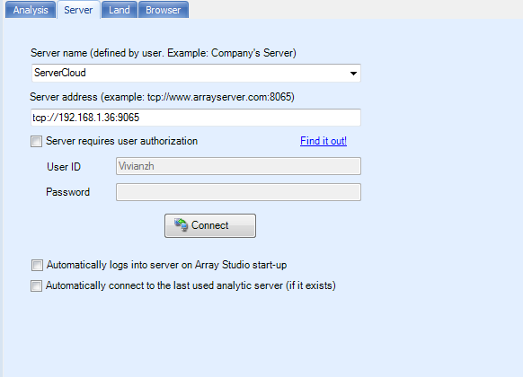
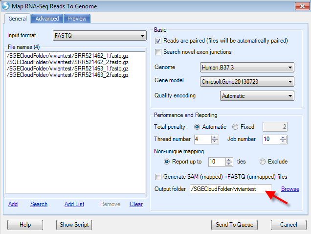

# Array Server on Cloud

The user can also run server jobs on cloud.
This tutorial is drafted for standard users. For how-to configure Server with Cloud, please contact Omicsoft Support to get the manual for Server on Cloud admin.
After ArrayServer admin configured the Server with Cloud, standard users do not need to set up Cloud Preferences but only need to connect to the server with cloud integration through **Server** tab:

When connected, the window looks the same as the server window:

Notice that the **Cloud** tab will not appear.

## Uploading Files to server cloud

To run server jobs on cloud, the users should upload the data files on specific cloud folder that assigned in advance. Go to **Server File | Browse Files** window:

Then go to the **cloud folder** configured in advance. Please contact the admin person if the user does not
know where the folder is configured as Cloud folder. In the folder, the users can create their own folder and upload the data the same way as running a server project:

## Run server project on cloud

To run server project on cloud, make sure that you already upload your files to the cloud folder. Please create a server project in **Analysis** tab first. The analysis window and analysis steps are same as running a server project. When adding data to project, remember to browse the right cloud folder for your files:

After sending the data to queue, the job progress could be monitored the same way as server project:

## Run multiple jobs on cloud

When running multiple jobs (For example, multiple samples sequencing data alignment), multiple cloud instances will be allocated. This makes it much faster to perform the analyses.

To test this, please download the RNA-seq demo dataset from:

[^link^](http://omicsoft.com/downloads/data/tutorial/RNASeq.zip )

More detailed description of the dataset can be found in RNA-Seq Analysis Tutorial.

For illustration purpose, we will only use two samples to reduce the process time. Again, remember to go to the right cloud folder to load the data:

The demo dataset is paired-end sequencing data; please check the **Reads are paired** check box.

For Server project to run on cloud, the users must specify output folder. The directory should be under the cloud folder.

Upon job submission, again, the job could be monitored:

The users can right click on the job and select **View Full Log**:

In the *Log* window, as you can see, the jobs are being submitted to cloud NGS instances, 2 cloud instances will be started as we have two samples to align:

As a general user, you cannot monitor the Cloud Instances for Server Cloud this time.

The users could go back to Analysis tab and continue any downstream analyses and visualization:

Congratulations! Now you can successfully run server project on cloud!
