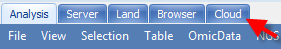

# Connecting to Cloud and Uploading Files

## Connecting to Cloud

Before creating a cloud project, first the user needs to connect to the cloud. Go to **Analysis | Tools** tab on the top of Array Studio and click on **Cloud Preferences**.

In the *Cloud Preferences* window, type in the *Access/API key, Secret key, Omicsoft cloud directory, Cloud user name and Email*:

Now, a new tab, **Cloud**, should appear on top of the Array Studio:

Upon successful login, the default **Cloud** window will look like this:

## Uploading Files

One requirement for performing cloud-based analysis is that the raw data (*e.g.* cel, fastq or bam files) has to be located on the cloud. One can use Array Studio to transfer local files to the cloud easily, similar to uploading file to Server, if one is familiar with running Server projects.

Click on **Cloud Files**. The window will appear with a listing of the current folders in the **/Users/username** directory:

In the example above, we are in the user folder **/omicsoft.test.vivian/OmicsoftHome/Vivianzh** and with the user id as *Vivianzh*. The user folder is one place to hold your personal data files. New folders can be created by right-clicking the mouse and selecting **Create New Folder** from the dropdown menu.

Create a new folder and name it **SampleData**.

Enter the **SampleData** folder and click **Upload** to transfer files from local computer to the cloud.

Select the *ServerTest.bam* file and click **Open**. As the files load, the progress is monitored in the lower portion of the **ServerFiles** window. Once the uploading has finished, the files will appear in the **SampleData** folder:

