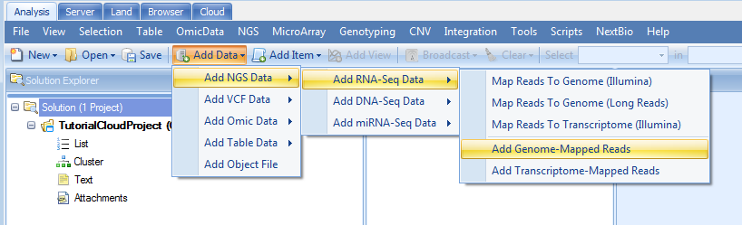
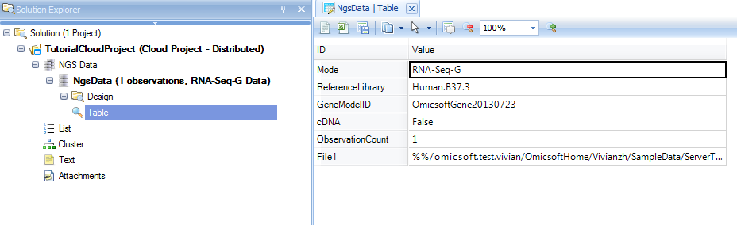

# Creating a Cloud Project

To create a cloud project, in **Analysis** tab go to **File | New Cloud Project**. A **Cloud Project Information** window should appear:

Enter *Project ID and Title*, and an optional description. Click the **Create** button.

Now an empty project will be created (below):

Notice that the project name includes **Cloud Project - Distributed** in the name so that the user can quickly see that this is a cloud project and the type is *Distributed*. **Distributed** indicates that data objects are saved in separate files. By default, a cloud project is a distributed project.

From here, we can perform all the analysis tasks on the cloud using the interface of Array Studio. For example, we can add the alignment analysis file(the test dataset) by going to the toolbar **Add Data | Add NGS Data | Add RNA-Seq Data | Add Genome Mapped Reads**:

Choose the file uploaded in previous section (*ServerTest.bam*).

Then click **Send to Queue**.
After a few seconds to minutes, depending on the project, CloudQueue window will show up, listing all the jobs running on cloud by the user:

Now we switch back to the Analysis tab. Once the job is completed, we will see an **Update Project** on the far right in the menu selection of Array Studio (below):

Clicking **Update Project** will show the results of finished job: one **NgsData** object is created for this BAM file.

If we would like to see the parameters used for the alignment, select the data set name **NgsData** and right click, then choose **View Source**

Users can run all data analysis based on this **NgsData** in the same way as they run in Array Studio locally.

Congratulations! You have successfully created a cloud project. Remember to *save* the project through the **Save** button:

You can reopen this project later on to get back to the same state as you saved.
This includes all views, filters, analyses, etc..
