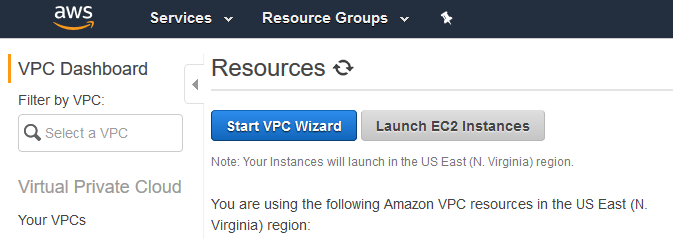
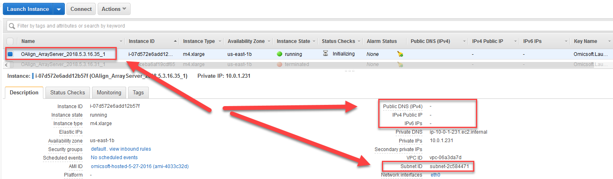

# ArrayServer Cloud Installation Tutorial

## Set ArrayServer Job EC2 instances to Private
ArrayServer may launch EC2 instances for various analysis jobs. There is a parameter (AssociatePublicIpAddress) in ArrayServer.cfg that controls whether to allow AWS to assign public IP address to the EC2 instances. Setting AssociatePublicIpAddress to False would request AWS to not assign IP address to the instances, therefore make the instance private.

It requires proper configuration of AWS Virtual Cloud and ArrayServer.cfg file in order to Array Server to launch private EC2 instances. This is because the instances needs to communicate with Omicsoft during its lifetime. This requires the private instances to reside in a private subnet with NAT gateway in the VPC to communicate with internet.

Below we show the steps to configure AWS VPC and ArrayServer.cfg to allow the instances that ArrayServer launches to be private:

  * Set up an Amazon Virtual Private Cloud (VPC) with a public and private subnet and NAT gateway.
  * Set up VPC Endpoint Gateway to free-of-charge data transfer between the EC2 instances and S3 buckets.
  * Modify ArrayServer.cfg (SubnetID and AssociatePublicIpAddress).

### 1. Set up a VPC with a public and private subnet and NAT gateway

 1. Create VPC in AWS VPC with public and private subnets using VPC Wizard

  

 2. Select VPC with Public and Private Subnets

  

 3. Choose VPC name, Availability Zones, Public and Private subnet name, and Specify the Elastic IP Allocation ID of your NAT Gateway

 Please note that the NAT gateway set up is necessary because it enables ECs machines in private subnet to communicate with outside world.

  

 4. Obtain the ID of the subnet

  

### 2. Set up VPC Endpoint Gateway to free-of-charge data transfer between the EC2 instances and S3 buckets

Create VPC Endpoint, and choose service S3 to allow free-of-charge data transfer between AWS EC2 and S3 services. Add the endpoint to the private subnet's route table

  

  

### 3. Modify ArrayServer.cfg (SubnetID and AssociatePublicIpAddress)

Users need to modify the SubnetID and AssociatePublicIpAddress parameters in ArrayServer.cfg in order for ArrayServer to launch private instances to the specified private subset.

1.    Modify ArrayServer.cfg

  

2.    Run a cloud job in ArrayServer, and check in AWS Console if the new instance has Public IP
  
