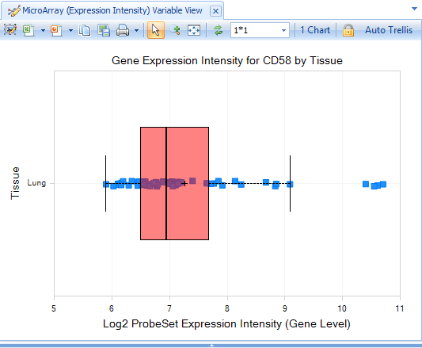

# Explore ComparisonLand

ArrayLands with comparisons will have different Views that are customized for different types of data:

* Gene
* Gene Sets
* Samples
* SampleSets
* Comparisons/ComparisonSets

In ComparisonLands, even Gene-Level data can show special *Views* using your Comparison inferences.

## Gene-Level data

When you connect to your new Land, the default View will display the number of samples,
as derived from the Sample metadata, which should be the same as the number of .alv files you added.

While this is a nice overview of your Land data, especially as you add hundreds or thousands of samples, for multiple projects or tissues, it is not very informative now.

Instead, search for the gene **CD58**.

The default View will display the log2-fold change data from the comparisons,
separated by Treatment:

Click **Select View**, where you can see additional Views available for Land Gene-Level data:

These Views are explained in more detail in the ImmunoLand and OncoLand tutorials, in addition to the many ways to customize Views, so will not be described in detail here.

However, one View to check is the **Expression Intensity** View:

In contrast to the default GeneLevel View (Comparison.Treatment vs. Control), which is displaying the log2-fold change values from the comparison data, the Expression Intensity View is displaying the expression data for each sample.

As you explore your ComparisonLand, it will be clearer where each source dataset is being used.

Furthermore, you will identify additional Sample and Comparison metadata columns that will be useful
for grouping and filtering your data.

This is important to note before you begin constructing a large ComparisonLand, because the comparison metadata are contained within the .tlv files, so cannot be updated as easily as Sample Metadata; you must re-process your comparisons and over-write the .tlv files, then re-publish them to Land.

Thus, you should plan ahead for including important information about different sample groups.

## Comparison-Level Data

In addition to viewing Comparisons at the single-gene-level, you can also view all measured genes for a given comparison.

Search for "Slurmycin_10um_htb-57.test1" in the **Search Bar**; you will notice that matching hits (genes, comparisons, samples) will be dynamically displayed as you type:

The default View is a Volcano plot, with **Estimate** (log2-Fold Change) on the X-axis and **Raw P-value** on the Y-axis.

However, you can change the X- and Y-axis values, change display of the View, and add **Cutoff Lines** in the **Task** tab of the **View Controller**:

You can identify similar Comparisons to your Comparison-of-Interest under **Select View | Gene Set Analysis (plot)**. This analysis performs a Wilcoxon test, separating all significantly up- and down-regulated genes in your selected Comparison from insignificant genes, and compares these two lists to the set of significant genes in all other Comparisons in your Land, to identify the Comparisons that share a large number of significant genes.

If you did not add **DiseaseCategory** in your Sample Metadata file, and did not include **DiseaseCategory** in your comparison Metadatafile **MetaColumns**, the default plot will be blank, because ArrayLand is attempting to *profile* by a non-existant column. This demonstrates one way that Sample and Comparison metadata columns can affect Views.

However, this is a simple issue to fix. In the **View Controller: Task tab**, simply select **Specify Profile Column**:

Then select another Comparison Metadata column, such as **Case.TreatmentLevel** or **Case.CellLine**:

If using **TreatmentLabel**, all Comparisons with *Slurmycin* will be displayed in one row, and *Brawndocin* columns will be displayed in another.

Comparisons that are most similar to Slurmycin_10um_htb-57.test1 will be further to the right (lower P-value).

In the **View Controller:Task tab**, select **Change Symbol**, and change **Labels** to *Selected* By *ID*.

Now select the two significant comparisons:

You will see that the most significantly similar comparison to Slurmycin_10um_htb-57.test1 is Slurmycin_10um_htb-57.test1. However, the second-most similar comparison is Slurmycin_1um_htb-57.test1.

## Comparisons of Comparisons

In ComparisonLand, Comparisons can be grouped together, in the same way that genes or samples can be grouped.

To make a ComparisonSet, you can either generate a text list of ComparisonIDs, then load them into your Land as a ComparisonSet, or you can select multiple Comparisons in a View, and select "Create ComparisonSet" in the ***Action Window***.

For example, in the main ComparisonLand Comparisons View (***Select View | Overview | Comparisons***),
click ***Specify Histogram Columns*** in the ***Task*** tab of the ***View Controller***:

and specify "Case.Treatment" as the Histogram column:

Now the histogram will list each comparison, so you can easily select the four ***Brawndocin*** comparisons with your mouse:

In the ***Action*** Window, you can either choose to ***Create ComparisonSet***, or you can simply ***Browse Selected Comparisons***:

If you click ***Browse Selected Comparisons***, a new tab will open, displaying a Volcano Plot of each Comparison's up- and down-regulated genes. First, change the layout of charts to "2 * 2", then click the "Toggle Uniform Scale":

You will see all four Comparisons in a single window, with the same X- and Y-axis scaling. It is clear that increasing the dose of Brawndocin also increases the number of up- and down-regulated genes.

Select some of the up-regulated genes in the ***Brawndocin_10uM*** plot to see those same genes in the other plots, as well as details in the ***Details Window***.

If you wish, you can create a ***GeneSet*** of your selected genes, in the ***Action*** Window:

## Further Directions

As you build your ComparisonLand with real data, you will be able to identify Comparisons (e.g. treatments, diseases, cell types) that are most similar to each other, and directly visualize this similarities with Venn Diagrams, Heatmaps, and more; see the ImmunoLand tutorial for more details on these.

Congratulations, you have successfully built your own Land from raw expression and inference data,
converting text quantifications to rich visualizations, ready for analysis!

For additional information, don’t hesitate to contact Omicsoft’s support team (support@omicsoft.com).

**Thank you for using Array Studio.**
