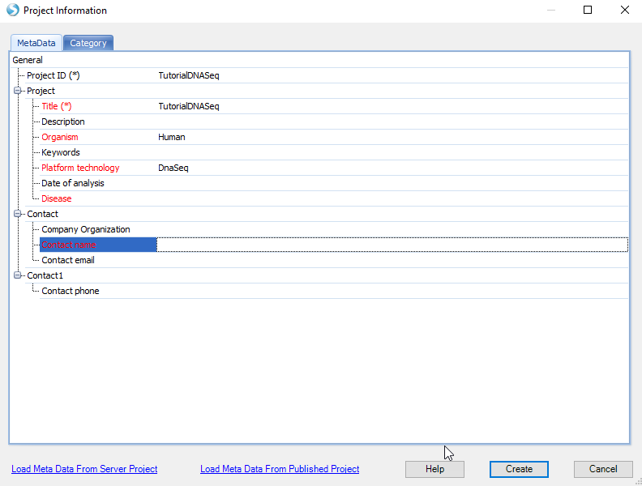
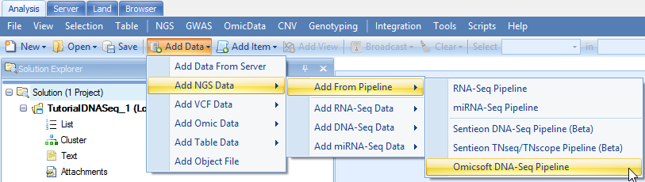

# Create Array Studio Project

## Create New Project
Array Studio provides an integrated environment for analyzing and visualizing high dimensional data. It is convenient in organizing and visualizing data with its Solution Explorer, which organizes data/results as projects. User can create a local project which uses the local computer power to do analysis, or create a server project which will run all analyses in Array Server. Server-based analysis allows the user to run jobs on a remote server (Linux or Windows), which usually has more computing power than a desktop computer. The Array Studio client software, installed on a local desktop machine, is used to interact with the ArrayServer (like a server terminal). Tasks such as job submission, monitoring, file transfer and data visualization can be done through the client software. Moreover, ArrayServer has a built-in scheduling system that supports high performance computing clusters (both SGE and PBS/Torque), accelerating the analysis of tremendous amounts of NGS data. In this tutorial, we will create a server project to run the analyses. This assumes the user has Array Server installed - the user can run this tutorial as a local project (distributed) and analysis steps are almost the same as described in this tutorial. The interface of creating of new local project is different from creating a new server project, but the rest of the steps, such as data import, and data analysis share the same interface.

Different project types tell Array Studio where to run the analysis:
If it is a local project, Array Studio will run the analysis in local machine;
if it is a server project, Array Studio will run the analysis on server.

Once Array Studio has been opened, click **File | New Server Project** from the File Menu (also can be accessed via the **New** button on the toolbar).

Note: For a local project, it is required that the user have approximately 10GB of available space on their hard drive for this tutorial.
The general rule of thumb is that the user has 3x the size of the raw data files available for the import of data. The user might also want to specify a different location for the "Omicsoft" home folder using **Tools Menu | Preferences | Advanced**.
This will place the Omicsoft folder, which is used as storage for any genome reference index and temp files for the process, at a specified user location. The reference library and index will take ~10Gb of space.

Users may enter some basic metadata and click Create to create an empty server project:

Another way to create a new project is by this icon:

Once a project is created, users can choose to follow the DNA-Seq Analysis Pipeline module (all-in-one, Chapter 3) or perform QC/filtering/alignment/mutation analyses (Chapters 4-6,8) all as individual steps.

## DNA-Seq Analysis Pipeline

Array studio provides an easy way for new users to do all analyses in one module:

This function has a similar interface to the DNAseq alignment module.

Users need to provide the DNA seq files and choose the genome. Then in the reporting section, users can choose which related analysis want to perform. The available analysis include

* Perform raw data QC

* Filter Raw data

* Perform post alignment QC

* Summarize mutation + SNP

* Generate BAM Summary (.bas Files)

Each analysis is done by default setting and will generate data objects in the Solution Explorer when the entire pipeline is complete. Users can perform step-by-step analysis with customized settings as described in later chapters.
