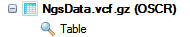
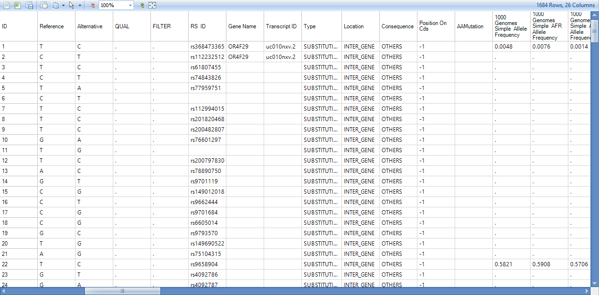

# DNA-Seq Mutation Detection

Mutation data can be generated from DNA-Seq data.
This allows the user to compare frequencies of mutation, for individual sites, between groups of samples. All mutation functions can be found in **NGS | Variation**.

In this tutorial, we will cover three mutation detection workflows:

*    **Summarize Variant Data + Annotated Variant Report**
*    **Generate VCF files + Annotated VCF files**
*    **Summarize Matched Pair Variation Data + Annotated Mutation/SNP Report**

User can find the documentation for other functions by clicking the **Help** button in each function menu.

## Summarize/Annotate Variant

**Summarize Variant Data** is developed by OmicSoft.
Variant (Mutations and SNPs) are reported based on the pileup data from alignment data (**NgsData**).

Choose the NGS data. In the reference section, all references are selected by default.
User can select a list of regions to summarize mutations. Selections can be on *Gene list* (a list of gene symbols from project lists), *Customized regions* (load a bed file), or *Filtered by region* (e.g. chr9:133710831-133763062, or more regions separated by \|).
Keep the default selection for this tutorial.

Specify the base and mapping quality cutoff; choose the minimal coverage and mutation options. By default, the module only counts a mutation if the coverage >= 20 reads, # of reads supporting the minor allele >= 5 and the minor allele read frequency >= 5%. Note: you should lower the coverage cutoff if you are using the subset (10%) tutorial dataset.

In the **Advanced** tab, user can adjust quality by neighbours at each position, check more output options and ask the module to add dbSNP information (dbSNP annotation can also be added in the next step) at this step. Users can also adjust *Score cutoff* and *maximal ratio* for the SNP calls.

Also, Omicsoft provides the options to generate VCF files (both merged VCF and individual VCF files). Those generated VCF files can be used for futher annotation by Array Studio or other tools.  

Leave all settings as their defaults and click **Submit** to run the module. The output is a mutation2Snp report table listed under **Table** in solution explorer:

In the mutation2Snp report table, there are four columns for each sample:

*   **MutationFrequency**;

*   **Coverage** at this genomic location;

*   Percentage of mutation detected on the **plus strand** (MutationReadOnPlus/MutationReadTotal).

*   **Genotype** for this mutation allele.

If there are multiple minor alleles at the same location with frequency >= cutoff, they will be reported as different rows. The report comes complete with annotation for each site, including chromosome, position, and reference nucleotide, mutation (either a change in sequence or insertion/deletion). The whole table is a merged report from multiple samples grouping by mutation site (location + type) in rows. The mutation will be reported if at least one sample contains it with read frequency >= cutoff. The mutation read frequency, even 0%, and coverage in other samples will be also reported. Dots in the table are missing values, indicating that the coverage at this position in that sample is less than cutoff.

The variants are then annotated with gene coding information, known SNPs and functional prediction databases.

Open **NGS | Variation | Annotate Variant Table Report** module; choose the mutation2Snp report in **Data**, OmicsoftGene20130723 as gene model in **Gene model**. Leave all settings as their defaults in this tab. The first time the user specifies a reference/gene model, it will download files from Omicsoft.

In the **Annotation Sources** and **Additional Sources** tab, user can specify more annotation sources such as functional prediction and COSMIC annotation, or custom mutation annotators built using **NGS | Build Mutation Annotator**.

User also has the option to write the annotated mutation result directly to a text file.

Leave all settings as their defaults and click **Submit** to run the module. The output is a **MutationAnnotation** report table listed under **Table** in solution explorer:

Besides the columns for each sample (mutation frequency, coverage, PlusStrand%, and Genotype) in mutation annotation table, there are a number of annotation columns: Dbsnp ID, Dbsnp Category, Gene name/Transcript ID, Type, Location, Consequence, mutation position in the open reading frame (Position On Cds), AAMutation and RS ID. In addition, there are columns that correspond to the annotations chosen in the **Annotation Sources** prior to running the analysis. Using the **View Controller**, choose filters to focus on items of interest.

## Generate VCF files + Annotated VCF files

With **Summarize Variant Data**, user can choose to export VCF file on both merged file and individual file for further analysis.

The user can specify to generate a VCF for each observation or generate a merged VCF file under **Advanced** tab. Also the user can change the output result folder by providing a directory path to the option **Output folder**.

Leave the options as defaults, and click **Submit**. Both individual VCF files and a merged VCF file would be generated in specified output folder:

Next, the user might want to further annotate the VCF variation. This can be accomplished by using **NGS | Variation | Annotate Variant Files(VCF/BED/GTT/RS_ID)** module.

Here, users need to specify the VCF file location, note that only merged VCF file is supported. Users need to specify the Reference and Gene model in the General Tab. And in the **Annotation Source** Tab, users can choose extra annotator to further annotate VCF file.

Leave all other settings as-is, choosing to extract genotype only, and click **Submit** to continue. A new table is output to the Solution Explorer.

Each gene that shows variation in the mutation report is returned in the resulting table, along with further annotation for that gene, including any known dbSNPs at that position, annotation type, amino acid position (if AA change), AA Change, transcript ID, transcript name, transcript strand, and distance to 5'/3' ends and closest exon boundary.

## Summarize/Annotate Matched Pair Variation

**Summarize Matched Pair Variation Data** is implemented based on the principle of VarScan2, so the options are the same as in VarScan2, including a few pileup and filtering options.

The module requires a matched normal sample during the analysis. The module was initially designed to detect somatic mutation in tumor comparing to matched normal samples. It can also be applied to detect mutation in other cases, such as comparing induced pluripotent stem cells (iPSC) vs. somatic cells. To incorporate the sample information, user has to prepare a design table and import for **NgsData**. Double click the **Table** under **Design** to show design table. To import new design table, right click on the **Design** Folder under **NgsData** and choose **Import**:

The design file for this tutorial is located in the downloaded zip file. Once a design file (usually it is a tab delimited file) is selected and imported, user can choose to replace or append to existing design table:

Click **OK** , the design table is imported.

In this tutorial,
only SRR097848 and SRR097849 are paired: SRR097849 is from breast cancer cell line MCF7 while SRR097848 is from non-tumor breast cell line MCF10A. Left click and select two NGS samples:

Both sample IDs will be highlighted; then open **NGS | Variation | Summarize Matched Pair Variation Data** module:

Choose the NGS data, change the *Observations* to **Selected observations** only. The analysis will use two NGS samples selected in the design table.

Specify the **Pair** based on **Tissue** column (Breast for both),
**Tumor** **status** based on **cell type** column, and choose **Non-tumor epithelium cell lines** factor level to be **Normal**. There are more pileup, variation calling and filtering options in the **Advanced** tab.

Leave all settings as their defaults and click **Submit** to run the module. The output is a matched pair variation (MPV) report table listed under **Table** in solution explorer:

In the MPV report table, there are ten columns for each sample:

*   Minor allele **MutationFrequency** in normal

*   **Coverage** in normal

*   Minor allele **MutationFrequency** in tumor

*   **Coverage** in tumor

*   **Somatic P value** for somatic or LOH events

*   **Variant P value** from testing whether the variant allele exists in at least one of the (two) samples

*   **Filters** for the status of mutation calling, such as strandness and mapping quality difference

*   Somatic status **call** (Germline, Somatic, LOH, or Unknown)

*   Predicted genotype in normal

*   Predicted genotype in tumor

If there are multiple minor alleles at the same location with frequency >= cutoff, they will be reported as different rows. The report comes complete with basic annotation for each site, including chromosome, position, and reference nucleotide, mutation (either a change in sequence or insertion/deletion).

In this tutorial, we only analyzed one pair of samples. If multiple pairs are analyzed in the same run, the whole table is a merged report from multiple samples grouping by mutation site (location + type) in rows. The mutation will be reported if at least one sample contains it with read frequency >= cutoff. The mutation read frequency,
even 0%, and coverage in other samples will be also reported. Dots in the table are missing values, indicating that the coverage at this position in that sample is less than cutoff.

As with the mutation table, the MPV table can also be annotated by **NGS | Variation | Annotate Variant Table Report** module. Open the module; choose the MPV mutation report in **Data**, UCSC gene model in **Gene model**, v137 in **DBSNP version**. The user also needs to select the data columns in the mutation report; however Array Studio should in most cases select them automatically. Users can also specify an **Output name** such as MPV?.

Leave all other settings as-is and click **Submit** to continue. An annotated MPV mutation table with the name specified (MPV) is output to the Solution Explorer:

Besides the columns in MPV mutation table, there are following annotation columns: gene/transcript name, dbSNP name, mutation type, mutation position in the open reading frame, amino acid position and change in the transcript, distance to 5', 3' of the transcript and to the closest exon boundary. Annotation columns from functional prediction and COSMIC are also attached if these options are checked in the **Advanced** tab.

