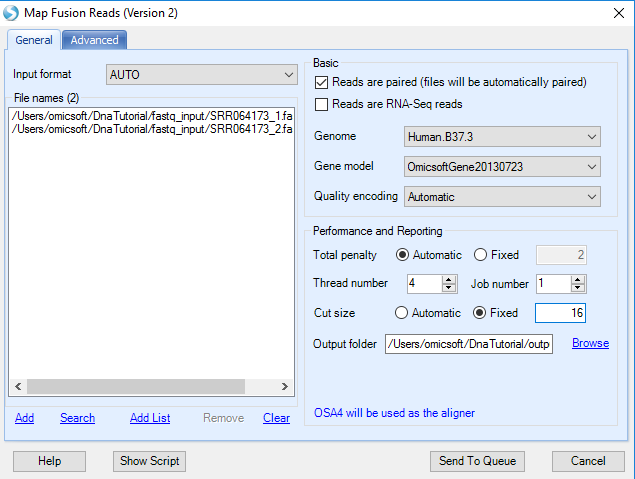

# DNA-Seq Fusion Gene Detection

In DNA-Seq datasets, fusion genes can be detected based on both paired- and single-end reads. In a paired-end NGS dataset, a discordant read pair is one that is not aligned to the reference genome with the expected distance or orientation. If a set of discordant read pairs are mapped to two different genes, a fusion gene is suggested. On the other hand, single-end reads that span the fusion junctions provide base-pair evidence for the fusion events.
In paired-end datasets, two fusion reports from junction-spanning reads and discordant read pairs can be combined to eliminate false positives and provide accurate base pair resolution detection of fusion.

Two fusion detection functions for DNAseq data can be found in **NGS | Fusion** menu: **Map Fusion Reads (Illumina)** and **Report Fusion Genes (Paired End)**. Note that the first function, **Combined Fusion Analysis**, is only designed for RNAseq data.

## Report Paired-End Fusion Genes

**Report Fusion Genes (Paired End)** module will detect fusion genes from inter-transcript paired-end reads based on DNA-Seq alignment (**NgsData**).

Choose the NGS data and Gene model; specify the fusion report cutoff and alignment tie cutoff. Check **Output fusion reads** option and specify the directory path, supporting fusion reads will be saved as BAM files, which can be used for visual check in genome browser. Leave all other settings as their defaults and click **Submit** to run the module. The output is a paired fusion report table listed under **Table** in solution explorer:

The information in **Filter** column in the report table comes from a fusion black list.
For more information about the blacklist, please read the following wiki article:
[^link^](http://www.arrayserver.com/wiki/index.php?title=Fusion_gene_detection_in_RNA-Seq#Blacklist_filter )

In the report table, there are three columns for each sample. The first column shows the number of **unique mapping positions** from reads in *Gene1*, the second columns shows the number of **unique mapping positions** from reads in *Gene2*, while the third column shows the total **count** of read pairs mapped to that fusion. If reads map to only a small number of unique positions, this could indicate a false positive (potentially PCR duplicates). There are 3*3=9 columns of data, and annotation columns: gene name, strand and genomic locations. The start and end positions in the table describe the genomic coordinate of the gene, not the breakpoints of fusion gene. The exact breakpoint cannot be determined by fusion detection based on discordant read pairs.

Below are rows for identified known fusion *BCR-ABL1* fusion in SRR064173 (K562) samples at the genomic level:

**Report Fusion Genes (Paired End)** module reports fusion events by grouping gene pairs by rows in one table. It provides an easy way to detect recurrent fusion events when the analysis was run on multiple samples.

## Map Fusion Reads

**Map Fusion Reads** module will detect fusion genes from fusion junction-spanning reads, which can characterize fusion genes at base pair resolution.
It is the preferred approach to detect fusion events, using OmicSoft's fusion alignment method (*FusionMap, Ge, H, et al. Bioinformatics (2011): 1922-1928*).

It is not recommend to run Map Fusion Reads module on multiple samples with different read lengths. In this tutorial, the read length of SRR064173 is 38bp and one of SRR097848/SRR097849 is 50bp. Thus, this tutorial step will focus on the fusion junction detection in data SRR064173, since it is enrichment on BCR-ABL1 fusion regions.

Fusion detection can use raw sequence files (Fastq, fasta, or qseq format) or alignment NGS data (BAM/SAM).
If the user is using the original **FASTQ** files, the first step is to filter out normal reads and get a pool of potential fusion reads. Make sure to click **Reads are paired** option so that a pair of files will be considered as one sample during fusion detection. The module will automatically pair two files based on file names. If it is unchecked, one file will be treated as one sample.

If user is using **BAM** files, potential fusion reads (such as reads spanning two nearby genes) in alignment and unmapped reads will be extracted for fusion detection. It is the **preferred** approach, which saves running time at the filtering step.

Remember to uncheck **Reads are RNA-Seq reads**. By default, this module is used for RNA-Seq data.

Choose the **Gene model** to be OmicsoftGene20130723.

**Minimal cut size** is the minimal seed length for fusion detection, which requires the minimal length of a fusion read mapped in two fusion partners. For details, see wiki page:
[^link^](http://www.arrayserver.com/wiki/index.php?title=Seed_Read )

The default **Cut size** is to use value min(25, max(18, readLength/3). However, the read length for dataset SRR064173 (K562) is 38. For this tutorial dataset, we use a *Fixed* cut size of 16 to require at least 16 nucleotides to match each of the two genomic location, allowing 6 nucleotides in the middle of each read to detect fusion breakpoints.

There are more fusion alignment options. Leave all settings as their defaults and click **Submit** to run the module. The output is a fusion report table listed under **Table** in solution explorer:

In the report table, there are three columns for each sample. The first column shows the number of unique mapping positions from fusion junction spanning reads, the second columns shows the number of fusion *seed* reads, while the third column shows number of fusion *rescued* reads. There are 3 columns of data, and 11
**annotation columns** for fusion strand, fusion breakpoint, known gene/transcript names of two genes, fusion junction sequence, splice pattern, predict fusion gene.

Below is the result for identified known fusion *BCR-ABL1* in K562 samples at genomic level:

