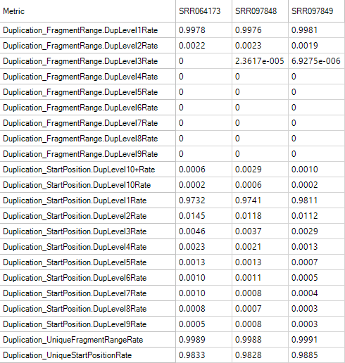
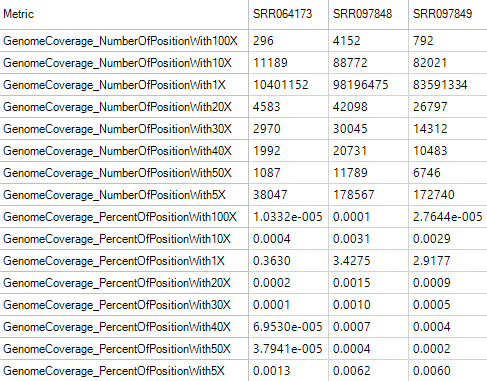
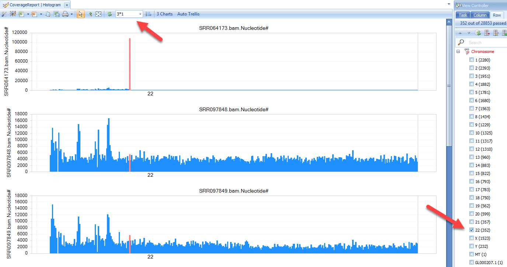

# QC of Aligned Data

## Alignment Report

By default, an alignment report is generated anytime an alignment is done in Array Studio.
If it is not already open, go to your Solution Explorer and double click on Report from the **AlignmentReport** table.

This will show, for each pair (or single file if the user did not do a paired alignment), some information regarding mapping. One of the key statistics is the uniquely paired reads (uniquely mapped and properly paired).

## DNA-Seq Aligned QC

This module can be used to generate a table of metrics, along with visualization for each metric by scanning the alignment BAM files. These metrics can be used to provide an overview of different statistics on alignment, coverage, Flag, mapping location, insert size strandness, and more, in a single table. Also generates a **ProfileView** showing a chart for each metric.

Here we assume that the alignment data (NGS data) exist in a project. If not, one can add bam files into a project by going to **Add Data | Add NGS Data | Add DNA-Seq Data | Add Genome-Mapped Reads**. To run the DNA-Seq QC module, go to **NGS | Aligned Data QC | DNA-Seq QC Metrics** now.

Choose the NGS data and leave all other settings as their defaults and click **Submit** to run the module.

**Profile** metric is based on the provided gene model. It provides the most information with gene models like Ensembl that have detailed information for the source of each transcript. Here, we specify to use gene model OmicsoftGene20130723.

The analysis returns a **Table** View of QC metrics and **Profile** view in the **Aligned Data QC** folder:

In the **Table** view, you will find the following sections:

### Alignment Metrics

These metrics can be used to give an overall idea of the quality of the alignment for your samples.

### Duplication Metrics

The duplication metrics can give you an idea of the total level of duplication for an experiment (after alignment). This is based on coordinates (start position), rather than the raw data QC which was based on sequence. It is expected that an DNA-Seq experiment will have a large amount of duplication, so do not be alarmed if these metrics show high values.

### FeatureMetrics

Feature metrics measure the rate of CDS/Exon/Gene/Transcript coverage by DNA-Seq data.

### Flag Metrics

Flag metrics are generally only useful for paired end reads when data has been aligned with OSA. It provides metrics using the SAM Flags.

### Genome Coverage Metrics

Genome coverage metrics provides metrics for genome coverage with different depth, from 1X to 100X.

### Insert Size Metrics

Insert size metrics provide some basic metrics on the insert sizes for paired end experiments. Use these metrics to ensure that the paired end experiment is performing as expected, and to look for any outlier values such as mean insert sizes that are significantly different from the library's size-selection range.

### Profile Metrics

Profile Metrics provide important overall statistics based on the provided gene model. It is usually used for RNA-Seq data, but it is also a useful metric for exon capture DNA-Seq sequencing, since DNA regions fragments are captured based on a gene model. Metrics include the rate of reads mapped to an exon, exon junction, intron, anywhere in a known gene, in a known gene with an insertion or deletion, an inter-gene region, inter-gene region with insertion, inter-gene region with deletion, or a deep inter-gene region (>5kb outside the known gene model). Use these metrics to determine the overall success of the profiling.

### Strand Metrics

The strand metrics give you the rates at which reads are aligned to the sense or anti-sense strands. For most Illumina RNA-Seq experiments (in which the reads are unstranded, it is expected that reads would align in equal portion (50/50). However, for some stranded protocols, this might not be the case.

## Individual Aligned Data QC

**DNA-Seq QC Metrics** provides comprehensive assessment of the alignment data. We also provide metrics such as **Flag Summary Statistics**, **Mapping Summary Statistics** and **Paired End Insert Size** as separate functions, where users can specify more analysis options.

## Coverage Summary Statistics

Additional coverage summary statistics can be generated by going to **NGS | Coverage | Coverage Summary Statistics** now.

The user can set the **size of the coverage for each bin**, and whether to **output bedGraph files** for use in outside programs.

Leave options as-is and click Submit to continue.

This generates a new table, **NgsCoverageReport**, which can be used for downstream analysis and visualization.

Open the histogram; filter to Chromosome=22 only under **View Controller|Row**; layout three charts in 3*1 mode. You can get:

There is a clear enrichment at chr22:23600001-23700000 in SRR064173, which is expected since this sample is a targeted sequencing experiment of BCR-ABL1 fusion DNA fragment.

In the detail window, users can further check  read information in the Genome browser by right clicking the row:

