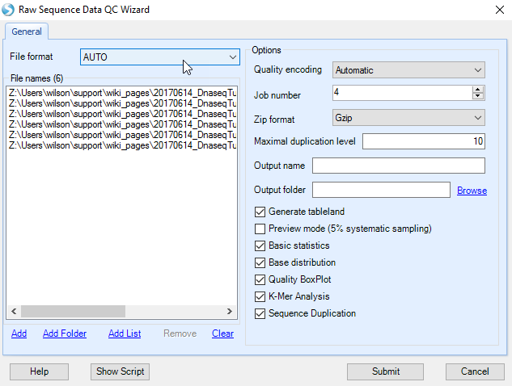
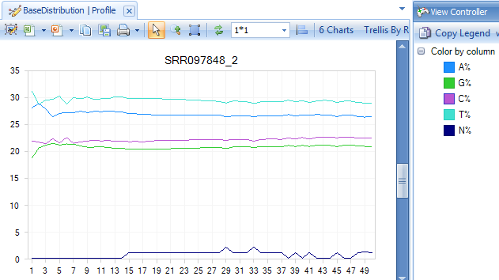

# QC of Raw Data Files

Array Studio contains several modules for QC of raw data files. The easiest way is to run **Raw Data QC Wizard**, which scans each file once to calculate all quality statistics such as GC content, per position nucleotide distribution, read length distribution, quality box plot, sequence duplication and K-mer analysis. User can also try each function individually, which offers more options to specify, such as adapter stripping and max read position.

Click **Add** to find all 6 files for the three samples. The Array Studio **Raw Data QC Wizard** provides lots of different QC metrics such as **Basic statistics**, **Base Distribution** etc. Users can select each QC metric they want to run. Optionally, for a quicker analysis, the user can choose **preview mode** to only generate QC on the 5% sampled reads. This is, in most cases, good enough to get an assessment of quality.
Leave **Quality encoding** as **Automatic** to automatically set the correct quality encoding method (this tutorial has fastq files with the Sanger method of quality encoding).

Click **Submit** to begin the analysis.

The **Raw Data QC** module returns multiple raw data QC results/reports in **Raw Data QC** folder, which are described in the following subsections.

## Basic Statistics

The basic statistics table contains some important information about your samples, including total Sample #, Minimum and Maximum read length (if pre-filtering has occurred), total Nucleotide #, and GC%. Use this table to confirm any expected values, as well as to get an idea of the overall size of your experiment.

Base distribution QC results are located in the **Raw Data QC** folder with name **BasicStats**. Double-click the table view to open if you do not see the basic statistics table in the middle window:

## Base Distribution

Base distribution of each raw data file is useful for ensuring that the base distribution is expected (sometimes can be used to notice adapter sequences if the user is not aware that adapter sequences are in the read file). Base distribution QC results are located in the **Raw Data QC** folder with name **BaseDistribution**. By default, the BaseDistribution **ProfileView** should be shown, but if not, open it by double-clicking the Profile view from the Solution Explorer.

Switch to the **Legend** in the **View Controller** to see the percentages of A, G, C, and T for each base pair position. Notice that there are a total of 6 charts (scroll through them to look at each sample), one for each file that was QC'ed. Selecting points on the chart will also show additional details in the Details Window, as shown below.

One can also switch to line plot view by going to **View Controller | Task | Customize | Change To Line Type**.

## Read Quality QC

The QC results include a **PerSequenceQuality** (view and table), a **QualityBoxPlot** (view and table) and a **OverallQualityReport** (view and table) in the Solution Explorer.
Per Sequence Quality calculates the average quality score for each read and shows the distribution of quality for all reads in each file.

In Quality BoxPlot, all reads in a file are overlaid and box plot for each base pair position is shown. This gives the user an idea where the quality starts to drop for most reads in a sample. It is useful to compare plots when evaluating sequencing quality for multiple samples.

From the **QualityBoxPlot** view (shown above), it is clear that the quality of the read1 starts to drop off earlier than read 2 in sample SRR097848. Scroll through each of the 6 charts to see the quality BoxPlots for each individual fastq file. Selecting a point on the chart will show additional details in the **Details Window** below the plot.

The Overall Quality Report summarizes quality of each base pair. It shows the total number of base pairs in one input file that have a certain quality score.

## K-Mer analysis

The K-Mer Analysis module counts the enrichment of every possible 5-mer across the positions of the reads. This analysis identifies whether there is an enrichment of a kmer in a particular region of the read. It can help find overrepresented patterns, such as adapters being read through when inserted fragment is short (*e.g.* miRNA-seq) and unfiltered adapter dimers.

In the **KMerAnalysis** profile view, Y-axis is the percentage of reads (0.01 means 1%) that contain each KMer. There is no significant (all less than 1.5%) enrichment of k mer in this tutorial dataset.
