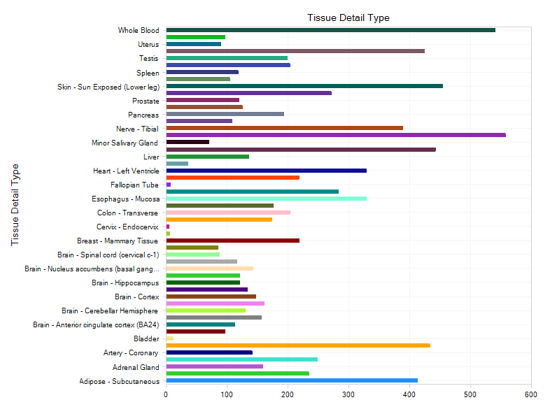
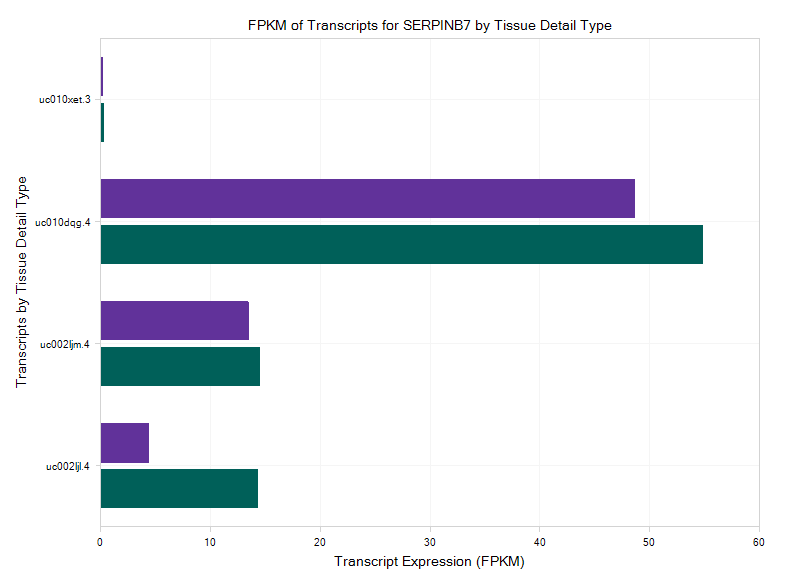
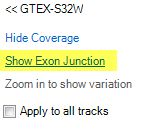

# Body Map

## GTEx

GTEx shows  data from tissue profiling experiments, and is a good tool to visualize gene expression variation within and across tissues.

In this section, we will provide an overview of GTEx, including how to search a gene in GTEx, how to restrict gene expression queries to certain tissues, and how to visualize this gene expression in Genome Browser.

### General View

Once the GTEx data are loaded, users can select the **Samples** view under the "select view" tab. This displays the number of samples for each tissue, colored by Tissue Detail Type.

Some of the tissues are broken down by color to show the detailed type of tissues. If you want to see the sample numbers for detailed tissue types, click Grouping - Tissue, and select Tissue Detail Type:

The view will plot each sample by detailed tissue type category:

### Gene Search

Let’s search for a gene to see its expression across different tissues. The gene used in this tutorial is *serpinb7*, which encodes a member of a family of proteins functioning as protease inhibitors.

When you start to input a gene name, the search box will show the auto-complete feature (more than 2 letters):

Select **serpinB7** from the list, or complete the entry and select **Search**. The user can see the expression level of serpinb7 across all the GTEx tissues:

It is clear that serpinb7 is highly expressed in Skin. The user can use the Filter pane (left-hand side) to select Skin as the only Tissue type in Meta Data:

This will leads to a gene expression view focused on Skin Tissue:

Then user can group the data by tissue detail type to take a further look,

The view will show serpinb7 expression in both Sun Exposed Skin and Not Sun Exposed Skin:

### Transcript and Exon View

The RNA-Seq data on this Land is not only available at the gene level, but also available at the exon and transcript level. If the user wants to figure out which transcript has a high level of expression for the
serpinb7 gene, it can be done with the Transcript FPKM (Multi-Transcript Chart)?:

The results demonstrate that there are four transcripts for serpinb7, among which the second one has very high expression level in skin tissue (uc010dqg4).

Then if user wants to quickly visualize the expression of these transcripts at the exon level, just select the GenomeBrowser view:

The GenomeBrowser view plots coverage level of each exon for visible samples, by the specified **Grouping**. All transcripts in the gene model for the gene are shown at the top of the view, ranked by expression (highest expression on the top). Opacity of the transcripts indicates relative level of expression. In this view, we can tell that uc010dqg.4 is the most highly expressed:

You can also directly visualize RNAseq coverage, in the **OmicSoft Genome Browser**.

Switch back to the **Gene FPKM** View, and select some samples of interest in the plot (e.g. some samples near median); multiple groups of samples can be selected by holding down **Ctrl**.

Click on Browse Selected Samples? in the **Action** pane, and select Open RNA Seq BAS files For Selection? (see the OmicSoft wiki to learn more about BAS files):

Then select SubjectID? (View data from each Subject as a separate track) and click OK:

Now the user can see expression of the gene SERPINB7 in these samples:

Move the mouse to the subject ID label on the left, and click on Show Exon Junction?,

Then the Exon junction will be available in the genome browser view:

This also reveals the differential expression of splice variants.

## Blueprint

The data in Blueprint land are categorized by different haematopoietic cell lineages, so it’s a great tool to look into the gene expression variation across related cell types. The ChIP-Seq data from Blueprint are not available yet in Blueprint Land, but we have processed all of the RNA-Seq data from Blueprint, and new data will be updated every quarter.

For this section, we will search for a gene named BLK in Blueprint Land. (the Blk gene is involved in B-lymphocyte development, differentiation and signaling.)

The Gene FPKM view shows that BLK gene has a very high expression level in B cells, which makes sense as it plays an important role in B-lymphocyte development, differentiation and signaling.

Similar to GTEx Land, you can also select samples and browse them in the Genome Browser to visualize the gene expression across different cell lines.
