# DiseaseLand

While the GTEx and Blueprint collections serve as atlases of gene expression, DiseaseLand provides expression data from thousands of curated studies focusing on diverse diseases. In addition, you have access to precomputed comparisons from each study:
Treated vs Control, Disease vs Normal, Responder vs Non-Responder, where each comparison includes fold changes, raw p-values, adjusted p-values, sample IDs that generated the comparison, ranks, etc.

DiseaseLand studies are separated by whether the study was performed in Human (HumanDisease_B37) or Mouse (MouseDisease_B38); the B37/B38 extension indicates the genome build used as the reference library.

In this tutorial, **HumanDisease_B37** will be used, but many more studies can be found in MouseDisease_B38.

## Sample View

After opening DiseaseLand, the Sample Distribution view will be available, from which you can see how many samples are available for each disease.

By default, each sample is grouped by **DiseaseCategory**, which uses a controlled vocabulary to categorize each sample in Land by the type of disease (for more detailed categorization of diseases, use **DiseaseState**). Each sample is colored by **TissueCategory** (**Tissue** provides a more specific description of the tissue source of each sample).

In the Sample Meta Data, we have a fully controlled vocabulary for most fields:

* ProjectName, PlatformName, Organism, SampleSource, SampleType

* TissueCategory, Tissue, CellType

* DiseaseCategory, DiseaseState, DiseaseStage, Symptom, SamplePathology

* Treatment, Response, Transfection, SamplingTime

* Ethnicity, Gender, Title, Description,

* etc.

With these data, user can easily filter the data by each categories, for instance, data can be filtered by different DiseaseCategory.

## Comparison View

Nearly every DiseaseLand project includes at least one comparison between samples within the project, comparing groups of Case and Control samples across all genes, to identify differentially expressed genes. A comparison is based on grouping of samples based one or more metadata columns (e.g. **DiseaseState** or **Treatment**), so that all **Case** samples in a **Comparison** will share the same metadata term (factor), but will differ from the **Control** samples.

To see an overview of available comparisons, Select the **comparisons View** in the Land:

The user will be able to see all comparisons, classified by **Case.TissueCategory**:

Select the samples for *Case.Skin*. The detailed comparison table will appear in the detail window, from which you can find the comparison details, like **Comparison Type**, **Category**, **Contrast**, **etc**.

Instead of using t-test for all comparisons, Omicsoft statisticians/bioinformaticians work with curation scientists and select the best experimental factors to include in the analysis for each project. We also consider block effects, match samples, and random effects during mathematical modeling. For microarray expression data, linear models are used for log2 transformed intensity and DESeq2 is used for RNA-Seq counting data.

## Download Comparison Data
If the user is interested in particular comparisons, they can download the comparison set to local projects or text files for further analysis. DiseaseLand provides the option to download a set of comparison data for several interesting genes, or for all genes.

For instance, if you are interested in comparisons related to diabetes, use the main Comparison View to identify interesting comparisons, then create a comparison set for diabetes first, and then download the comparison data.

Here are the steps to create a comparison set. Open the Comparison view (from the main Land View), and filter the **Case.Diseasecategory** for diabetes:

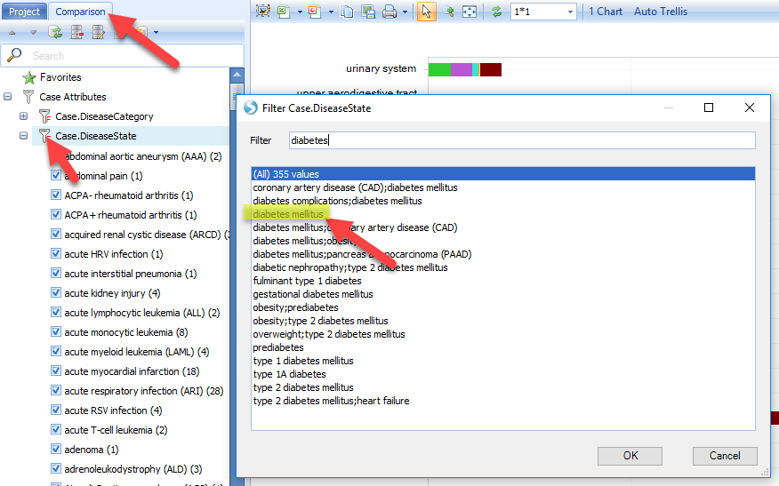

The **Comparisons View** will show a bar plot of comparisons that used Diabetes samples in the **Case** set.

Select the "Disease vs. Normal" comparisons for hematopoietic system. The details window shows the number of comparisons available related to diabetes. Click on **Create ComparisonSet**, and choose "Create Comparison Set From Selection":

Input the name and tags for this comparison set (you can input whatever content you like):

Once the comparison set is created, it should be able to be seen from Manage | Comparisons | Manage Comparison Sets:

The next step is to download the comparison data. As the following image shows, users can download the data to local analysis or text files, both with the option to download selected genes across all comparisons, or download selected comparisons across all genes:

And

In this tutorial we will just show the example of downloading selected genes across all comparisons (in the comparison set) to local analysis. Be sure to open a local project in Analysis first.

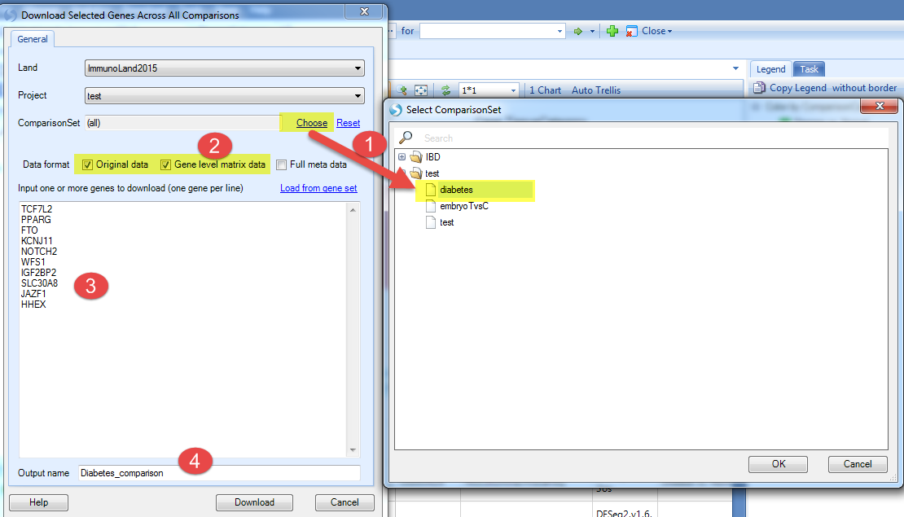

1. Choose the comparison set just created;

2. Select the data format you want to downland;

3. Input the genes you are interested in (here we used genes associated with developing type 2 diabetes, including TCF7L2, PPARG, FTO, KCNJ11, NOTCH2, WFS1, IGF2BP2, SLC30A8, JAZF1, HHEX);

4. Input the output name and click **Download**.

Once the download is finished, switch to the **Analysis** tab, and the table view will show the relative gene expression value for the selected genes across all of the comparisons:

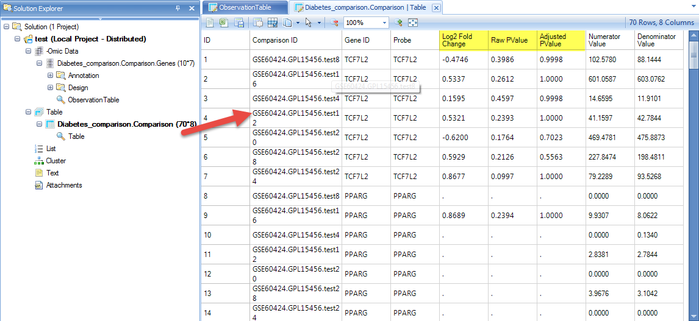

Be sure to try the other options to download comparison data to text file, or download all genes for these comparisons.

## Gene Views

If we do a gene search for *serpinb7* in DiseaseLand, the default view that appears is the **Comparison - Disease vs. Normal** view, which quickly shows all **Disease vs. Normal** comparisons (*e.g.* Psoriasis vs. Normal Control), categorized by different diseases.

As shown in the figure below, each circle indicates one Comparison: Log2 Fold Change between Case and Control is plotted on the X-axis, and the size of the circle indicates the P-value (significance) (larger circles are more significant).

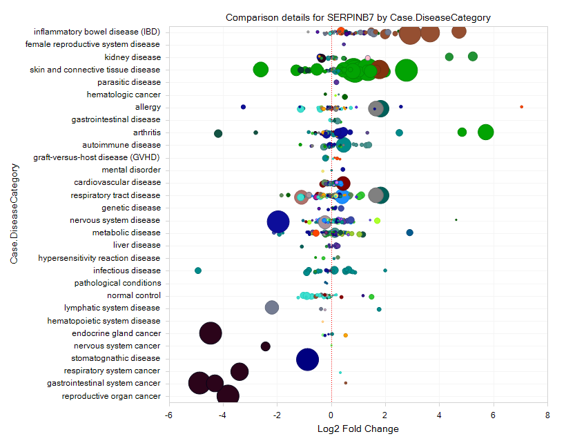

From the comparison view, it should be clear to the user that this gene is upregulated in several comparisons related to IBD (inflammatory bowel disease), but down-regulated in several cancers.

Drag the mouse over one or more spots and select them. This will bring up the comparison details at sample level, which shows the comparisons, genes, meta data information, and a box-plot that shows the sample-level comparison, in this case for ulcerative colitis (UC) vs. normal control.

Double-click on the box plot in the right corner to expand the plot so that user can see a full window of the expression profile for *serpinb7* in this sample, which demonstrates the original comparison data composing the dot in comparison view. There is an obvious up-regulation for this gene in ulcerative colitis (UC) samples vs. normal control:

If the user clicks on the "+" symbol to the left of the Details window, a "Selection Details" window will pop out from the left corner, and you can view additional details at Gene level, probeset level, and project level. If you select gene level, you can see table view for the comparison in the Details window, as you can see below, we also have a fully controlled vocabulary for the comparison data:

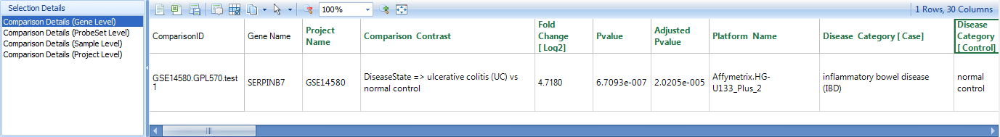

The data includes ProjectName, PlatformName, ComparisonType, ComparisonCategory, ComparisonContrast, Fold Change [log2], PValue, Adjusted PValue,
ComparisonModel, SampleDataMode, Case.DiseaseState, Case.SampleSource, Case.Tissue, Case.CellType, Case.SampleIDs, Control.DiseaseState, Control.SampleSource, Control.Tissue, Control.CellType, Control.SampleIDs, etc.

Click on the Comparison Details (ProbeSet Level), the detailed information will show which probe set was displayed for this gene:

Click on Comparison Details (Project Level) to get more information regarding the project itself:

And the detail window will show all the information related to the project, like authors, study type, title of the project, etc.

In the **Filter** pane, Click on the Comparison tab.  All of the displayed data can be filtered by various types of categories for categorical data (e.g. Case.DiseaseState, Control.Tissue, etc), and by different Cutoffs for numerical data (Fold-Change, Sample Size, P-value, etc):

Now click on the Select View Tab. By default, the **Disease vs. Control** comparisons are displayed, but there are many comparison types available in ImmunoLand: Disease vs. Normal, Disease1 vs. Disease2, CellType1 vs. CellType2, Treatment vs. Control, Treatment1 vs. Treatment2, Responder vs. NonResponder, etc.

Explore these different Comparison Views to learn more about the different comparison types.

## Project View for all samples

If the user is interested in a specific microarray project, it can be selected in the view for Expression Intensity (project View)?:

Initially, the view will show one chart for each available array project:

The user can click on the sample tab, then expand the filter categories to view Meta Data, and click on the symbol to the left of "DiseaseCategory". The user can filter for diseases by keywords, for example "skin", which will show "skin and connective tissue disease".

The data will be immediately filtered down to only show charts matching the filter criteria:

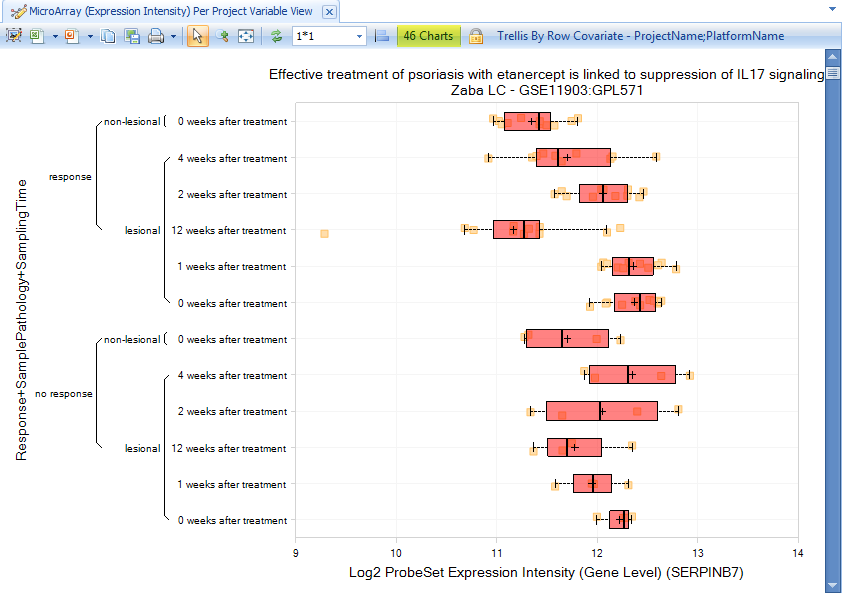

Besides project information, there are also other filters available for the comparison, like project Description, contact information, platform information, publication information, and project name.

Click on the **Reset All Filters** button to reset all the filters:

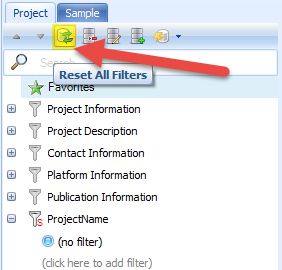

Similarly, users can browse RNA-seq data and filter to studies of choice:

This opens >150 charts in the project view for RNA-seq, with the project and platform name in the title of each chart:

You can also view RNAseq and microarray expression data across projects, grouped by one or more metadata columns.
As we demonstrated in GTEx and blueprint, the user can get views for DiseaseLand RNA-seq data like Gene FPKM, Transcript FPKM, and Genome Browser view for Exon Details:

Select Gene FPKM view: The view will show gene expression levels across different disease categories:

And ArrayStudio allows the user to compare the gene expression across different datasets. Select skin disease to filter the disease again:

And then group the data by Sample Pathology:

These samples will be separated to lesional and non-lesional, from which we can see a pattern for increased expression of *serpinb7* in lesional samples.

Samples can be profiled by multiple metadata factors, using **Specify Multiple Profile Columns**:

Select **DiseaseState** and **SamplePathology**.

The **Gene FPKM** plot will now subset expression of each sample by the Disease (e.g. psoriasis, atopic dermatitis, etc.) and the pathology of the sample (lesional or non-lesional):

## Alternative Splicing Detection

With the former result, you might be interested to find a list of genes with alternative splicing between the lesional and non-lesional samples. How can you find these genes? The basic logic is to create a Sample Set including lesional and non-lesional samples, upload this sample set to the Land, and analyze the alternative splicing through the **sample grouping => splicing** function in the analysis:

The first step is to create the right sample set. Recreate the View made in an earlier section (Gene FPKM view for serpinb7), where the samples were filtered by skin and connective tissue disease, and the view was grouped by sample pathology (filtering for lesional and non-lesional):

Then we can choose **Create SampleSet**, then select all samples and **Create SampleSet from Selection** (This will create a SampleSet containing all selected samples that passed your **filter** criteria). Give the SampleSet a name, and provide at least one tag for the sample set, then click Upload:

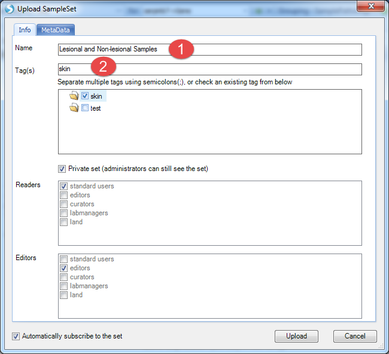

Now go back to do the analysis. Select **Analytics | Integration Analysis | Sample Grouping=>Splicing**:

1. Select the SampleSet you just created (restrict the analysis to these samples)

2. Choose SamplePathology from the meta data (compare samples by this metadata column)

3. Use RNASeq_Transcript as the data (contains transcript-level information)

4. Provide a name for the result set

5. click on Send To Queue?:

This analysis will be submitted for a server job:

When complete, this analysis will return a result table. Open the results in **Analytics | Open Result Sets**. Find the one with your output name.

The results should look similar to below:

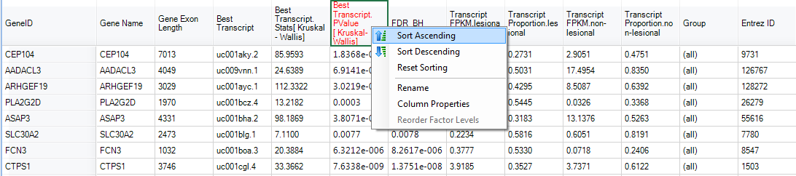

By sorting with Transcript PValue, SerpinB7 appeared as one of the most significant high level splicing genes:

And the alternative splicing can be visualized in Genome Browser. Go back to the Gene FPKM view and select several samples from lesional and non-lesional (hold the 'ctrl' keyboard button to select multiple sample groups):

These results can be visualized in the browser:

And select SamplePathology as the grouping factor:

Based on the genome browser view, user can easily tell the alternative splicing pattern compared between lesional and non-lesional transcripts (marked in green circle):

Actually, as we can see from the Integration Analysis view, besides alternative splicing, similar methods can be applied to compare the Expression level, Copy Number, and Mutation between the pre-defined sample sets, based on the corresponding data availability:

These Analytic functions can be used to quickly identify differences between customized sample groups.

## Clinical Association For DiseaseCategory

**Clinical Significance - Group Association** can quickly scan **all** clinical variables in DiseaseLand to find the association of each clinical variable with your selected grouping metadata column.

Because this calculation can be quite complicated, it is recommended that you first filter down to samples of interest (e.g. DiseaseCategory or TissueCategory), then open this View.

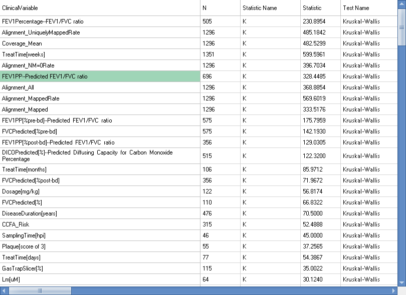

The association table is dynamic. Using SampleSets and Omic Data Queries, you can create a custom cohort to separate the groups to compare.

Here are the steps to create a custom query:

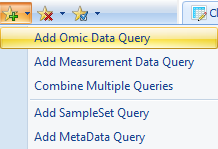

Separate Expression intensity of Serpinb7 into three groups based on percentile. Specifically, specify two breakpoints (33% and 67%, separated by commas), then label the three groups that are created by the two breakpoints (low,mid,high) (You can specify any number of breakpoints, as long as you provide a label for each group):

Then group the association with the custom query:

User can also filter the metadata to get a more specific correlation:

## Find Genes with Similar Expression Pattern

In order to find genes with similar expression pattern with the searched gene, the user can either compare genes at the **Comparison** level (i.e. fold-change between case and control) or the **Expression** level (e.g. compare Gene FPKM levels in each sample). To look for genes that have similar patterns of up- and down-regulation with your gene of interest, select Comparison Correlations view:

For instance, this is the dynamic correlation comparison view for serpinb7 gene, which shows that IL12B is the most highly correlated gene to serpinb7 (As additional data are added to DiseaseLand, these correlations may change in rank):

Click on View Correlation Table, for the detailed information for these genes:

Users can also specify the disease type for a smaller sample, for instance, just focus on the disease type related to Psoriasis:

Filtering for psoriasis samples reveals several genes with strong correlations with SerpinB7.

Besides the dynamic correlation at the comparison level, DiseaseLand also can correlate at the gene expression level, using **Integration|RNA-Seq-Expression => RNA-Seq-Expression**:

This view will show the genes with similar expression levels compared to serpinb7:

## Explore Related Comparisons

After searching for a gene of interest, such as Serpinb7, certain **Comparisons** may show significant differential expression of this gene. You can explore these Comparisons to see the up- and down-regulation of *all* genes, to get a global perspective on these results.

Select view of Disease vs. Normal for serpinb7 gene:

Group the data by Case.DiseaseCategory:

From the comparison view we can find that an upregulation of gene expression for the samples related to IBD. What other genes are upregulated in these samples besides serpinb7? What else is changing in IBD?

Select several comparisons for IBD (or comparisons from IBD and from other diseases), then go to Browse Selected Comparisons? on the bottom-left corner:

The default view is a set of **volcano plots**, one per Comparison, with log2(fold change) on the X-axis and -log10(RawPValue) as the Y-axis (for each project):

For each comparison, genes that are significantly differentially expressed will be higher on the Y-axis, with up-regulation to the right, and down-regulation to the left.

Go to the **Select View** tab, where there are several options:

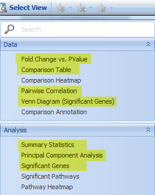

**Venn Diagram** shows how the significant genes correlated with each comparison (up to four comparisons per Venn Diagram):

Use the **Cutoff** Filter tab to control the significance cutoffs (fold-change, P-value, etc) for genes in the Venn Diagram view, as well as the Gene, pathway, project, etc.

The Comparison Table contains the full **Inference Report** for selected comparisons; the user can see a matrix with all the PValue and fold changes, for all the genes curated for the selected samples.
(Not all the platforms have every gene, so some of them are missing in the table). This is a useful table if the user wants to analyze it outside of the software. For example, users with a license for QIAGEN Ingenuity Pathway Analysis (IPA) can directly send these results to IPA with a single click:

The **principal component** view shows a generalized distribution of all comparisons selected:

The **Summary Statistics** view shows which gene is most up/down-regulated, how many genes have significant changes for their expressions, etc:

The **Significant Genes** view shows each gene whose expression is up- or down- regulated; and user can sort to organize the result, such as by **Up-Regulated Count**:

Then user can select the genes with the highest up-regulated count and create a gene set from the selection:

Input names and tags for the GeneSet:

GeneSets are a convenient way to group collections of interesting genes. The user can search with the newly created gene set:

And filter the result with IBD disease in Case.DiseaseCategory:

Then heatmap of comparison clearly shows an up-regulation pattern for these genes:

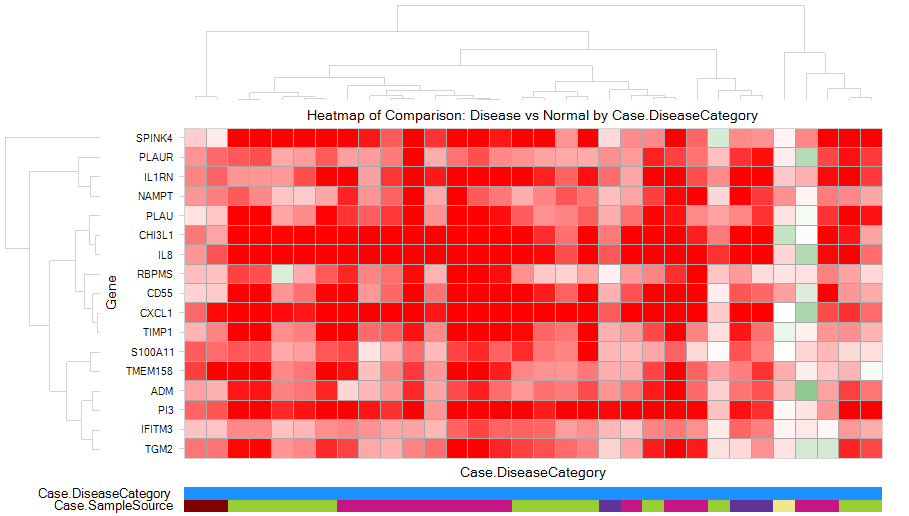

## Gene Set Analysis
If user has followed the previous step (Gene Expression Based on Disease/Comparison) to generate a gene set (named as IBD upregulation), user can directly search in the land:

If there is no gene set already created, the user can also directly search with multiple genes:

And paste genes: CHI3L1,CD55,CFB,IL8,TIMP1,PLAU,NAMPT,CXCL1,ADM,IL1RN

Following the Gene set search or searching with multiple genes, ArrayStudio provides a function for identifying Comparisons within the Land that share lists of significant genes with the input set, named **Gene Set Analysis**:  

For each Land Comparison, a set of significant genes are identified, and Gene Set Analysis performs a Fisher-exact test for the overlap of your input GeneSet and each Land GeneSet to generate p-values for each comparison. Significant overlaps will be plotted to the right, which might reveal unexpected similarities between your input GeneSet and Land Comparisons.

In this view, the X-axis represents the Log10 of P-Value resulted from Fisher-exact test, and Y-axis stands for the Disease Category (the user can also use Specify Profile Column? under Task tab to regroup the comparisons with other metadata columns):

If the user selects one of the dots, the detailed window will show the P-value, up/down-regulated gene#, and the project information.

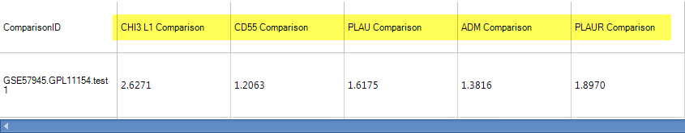

DiseaseLand also allows for the creation of GeneSets with other columns, like "Fold Change", "Raw PValue", "Adjusted PValue", etc. An example gene set is shown here:

Users can save an inference table from their local analysis as a .txt file and load them to the Land as a gene set, by going to **Manage|Genes|Manage Gene Sets**:

Then Add the Geneset like this:

In the MetaData section, load the txt file saved earlier (you can use your own table):

Once it's done, go to DiseaseLand without searching any gene, and open the view of Gene Set Analysis (Plot or Table),

And choose the Geneset just created. Because P-value and/or Fold-change was provided, GeneSet Analysis uses a Wilcoxon test. For detailed information of the Geneset analysis and the underlying statistics, please refer to our wiki: http://www.arrayserver.com/wiki/index.php?title=Comparison.GeneSetAnalysis.   

## Pathway Search

Users can also search with Pathways in DiseaseLand for a list of genes:

As the window shows, we provide Positional gene sets, Curated gene sets, Motif gene set, Computational gene sets, GO gene sets, Oncogenic signatures, and Immunologic signatures:

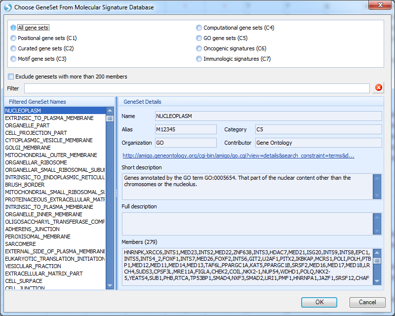

Select the gene set of interest, and click OK. Genes in this curated pathway will be searched, and the view will show a Heatmap of Comparison for Disease vs. normal for all the genes in the gene set, categorized by disease type and tissue type.

