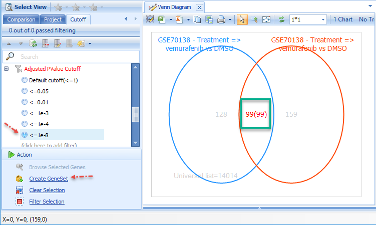

# LINCS

LINCS Land provides access to expression data of 23 cell lines, exposed to over 360 different perturbations at different concentrations, resulting in over 100,000 different samples.

Expression profiling was performed using Broad Institute's L1000 platform, which profiles ~1,000 "Landmark" genes, and uses expression profiles of these genes to extrapolate the expected expression of all other genes ("imputed genes") in the transcriptome.

## LINCS Sample Grouping

As groups of molecules that affect related pathways were tested, each sample was assigned a **TreatmentGroup**, which allows rapid identification of perturbations of interest, such as **kinase inhibitors**, **Rho signaling inhibitors**, **epigenetic modifiers**, etc.

## LINCS Comparisons

A primary focus of LINCS is comparing expression of each perturbation to a set of control samples, so the **Comparisons** View is especially useful here.

To see an overview of all comparisons in LINCS Land, click **Select View | Comparisons**. Notice that there are thousands of comparisons between different perturbations (drug treatments and gene over-expression):

It might also be useful to **Specify Histogram Columns** to **Case.TreatmentGroup** (you can change the **Specify Group Column** to **Control.TreatmentGroup**).

Identify a **TreatmentGroup** of interest, then filter for that group under the **Comparison Filter:Case.TreatmentGroup** (e.g. MAPK/ERK signaling inhibitor):

Select **Specify Histogram Columns** and choose **Case.Treament** to see the different **MAPK inhibitors** that were tested (color by dosage):

Further filter for a specific treatment, and a specific dosage (perhaps the highest dosage for that treatment, e.g. 10uM for vemurafenib), then profile by Case.CellType and Color by Case.CellLine:

Click on one or more of the comparisons to view the **Comparison Details**; note the **ComparisonID**:

Comparisons can be directly searched in the **Search bar**:

But it is more convenient to select one or more comparisons, then click **Browse Selected Comparisons**. In this case, select all 19 visible comparisons (i.e. 10uM vemurafenib treatments), then **Browse Selected Comparisons**.

One **Volcano Plot** will be displayed for each comparison. Change the layout from **1*1** to **3*3** (or if you have a large monitor, **5*5**), and click **Toggle Uniform Scale Status**, so that all Volcano plots use the same scales.

Notice that two **Comparisons** show exceptional responses to vemurafenib. Click the checkboxes at these plots to view **Comparison Details**.

Notice the two **Case.CellLines**; both **HT-29** and **A375** harbor the **V600E** mutation in **BRAF**, which is the target of **Vemurafenib**.

Filter for these two Comparisons in the **Filter Pane**, then switch to the **Venn Diagram (Significant Genes)** View:

In the **Filter** Tab, use the **Cutoff** Filters to identify a relatively stringent cutoff that reduces the number of genes shared by the two comparisons (e.g. an adjusted P-value of 10e-8).

Create a **GeneSet** from this set of genes, then search for the GeneSet:

Searching for multiple genes (or a GeneSet) will show a **Comparison Heatmap View**. Filter down to **Case.TreatmentGroup:MAPK/ERK signaling inhibitor**, and notice that the comparisons and genes are automatically clustered.

|LINCS_Heatmap_MAPKtreatmentGroup_png|

Notice the large cluster of comparisons with similar expression dynamics. Select these comparisons with the mouse, and (after syncing the massive amount of information from ArrayServer), click **Filter Selection** in the **Action** pane, to filter the **Comparison Heatmap** to these specific comparisons:

In addition to vemurafenib, several other drugs that are used to target tumors with  **BRAF V600E** show a similar gene activation/repression profile, including dabrafenib and trametinib.

