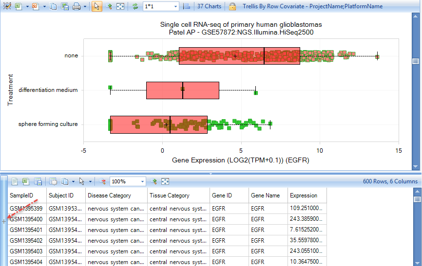

# Single Cell Lands

Single-Cell RNA sequencing is emerging as a powerful tool for capturing cellular heterogeneity, which is useful in profiling tumors, nervous system development, detection of rare cell types, and more. Cells are sorted or captured in microfluidic devices, and individual cells are sequenced, providing unprecedented insight into the composition of tissues.

OmicSoft’s Single Cell Lands (scHuman and scMouse) contain datasets from multiple single-cell RNAseq projects. Because of the special nature of scRNA processing, both the data and metadata processing steps differ somewhat from "standard" Land processing.

Data are aligned with OmicSoft's OSA aligner, and each sample is analyzed to ensure that it passes certain QC parameters, such as overall alignment rate, mitochondrial mapping rate, mapped reads, and the number of genes covered (the latest filter criteria can be found at the OmicSoft wiki page **SCLand Development Notes**). Gene expression for most samples will be quantified by **Transcripts Per Million (TPM)**. RNA with **Unique Molecular Identifiers (UMI)** (as well as samples with a severe 3' or 5' gene coverage bias) will be quantified as **Reads Per Million (RPM)**, which assumes that all transcripts are 1kb long.

Metadata are processed and brought in-line with Controlled Vocabularies. Several metadata columns are especially important for single cell data, including ''Cell Number'' (whether the sample is from a single cell, 10 cells, population, etc.), ''Library Strategy'' (the method for generating the sequencing library), ''UMI'' (whether or not UMIs were used), and ''Clinical - Subject ID'' (groups together cells from a single tissue sample).

Additional project-specific metadata may also be in the **Clinical Variables**; after you have filtered for samples of interest (e.g. an interesting project), be sure to explore the clinical metadata to help you partition samples and subjects by metadata.

## Gene-level Views

scLands contain RNaseq data, so all of the familiar RNAseq-based Views will be available.

In this example, we display views when searching for the gene "egfr". The default View is the **Gene TPM (Project View)**, where the RNAseq data are **trellised** by ProjectName and PlatformName into separate charts:

Either scroll down or filter for project **GSE57872**, sequencing of five glioblastoma tumors. Select some of the samples from the **Treatment: None** row, to see the metadata for these samples:

Click the **+** Symbol in the **Metadata pane** to allow selection of different metadata types. In this case, we are interested in **Clinical metadata**, specifically **Clinical - SubjectID**, which uniquely identifies the subject from which the cells were isolated.

Filter for **CellNumber:1** to only show expression data from single cells (not populations). Under the **Task** tab on the right, choose **Change Symbol Properties**. Change **Color** to **Clinical - SubjectID** to color each sample by the source tumor:

Now choose **Task tab: Specify Multiple Profile Columns**, and select both **Treatment** and **Clinical -SubjectID**:

Profiling by multiple metadata columns allows more detailed separation of data. In this case, three tumors show relatively high median expression of EGFR, while two tumors (and the induced sphere-forming culture) show lower expression:

!|scLand_TPM_Treatment_SubjectID_png|(images/scLand_TPM_Treatment_SubjectID.png)
