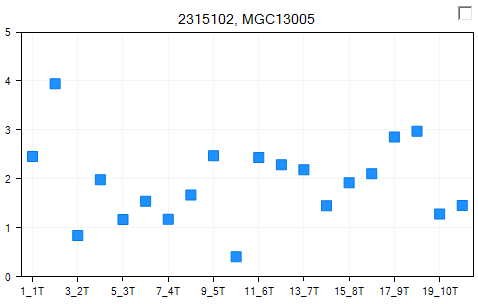
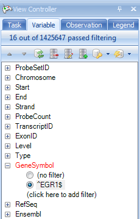
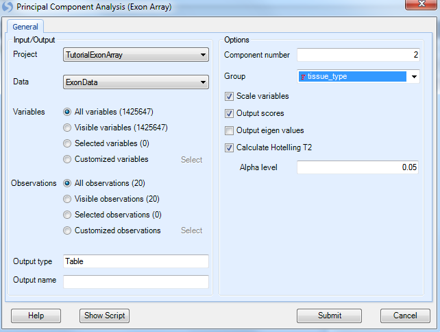
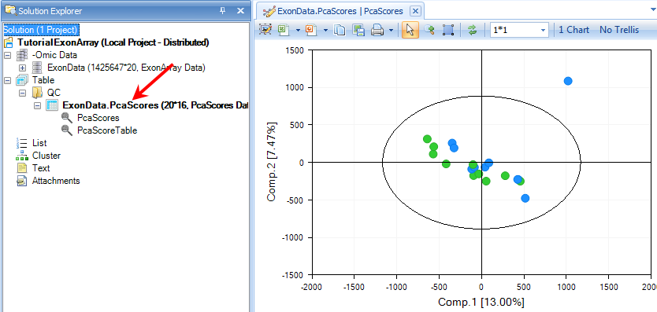
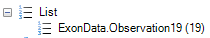

# Data Visualization and Quality Control

*Array Studio* contains a large collection of visualizations and Quality Control (QC) modules for MicroArray Data. Two commonly used visualizations and one quality control method are described in this chapter.

## The VariableView

Once a dataset has been imported, one of the first tasks for a user might be to visualize the results of a particular probeset or probesets.
This can be accomplished in a number of different ways in *Array Studio*, but the most unique way is the **VariableView**.

The **VariableView** allows the user to visualize one chart for each of the variables in the dataset. So, for this dataset, there will be 1425647 charts available for visualization.

To add a **VariableView**, go to the *Solution Explorer*. For the **ExonArray** dataset, right-click on ExonData and select **Add View** from the dropdown box.

This opens the *Add View* window, which lists all the different types of views available for a *Data* object.

Choose **VariableView** from the *Choose View Type* box. Notice that a preview of the view is shown in the *Preview* box. Click *OK* to add the view.

After adding it, a new View will appear in the main View window. In addition, this new View will appear in the *Solution Explorer*, as shown below.
Anytime the **VariableView** needs to be opened, user can double click on the **Variable** item in the *Solution Explorer*, and the view will show up in the main window.

Scroll through all 1425647 charts in the *VariableView* to see that *Array Studio* can easily handle showing the visualizations for all the variables in the dataset.
Note: if you don't have 1425647 charts, it is likely that a previously generated filter is still applied.

On the X-Axis, each of the 20 chips are shown, while the Y-Axis represents the intensity values (values are log2 transformed).
Each point on the chart represents the intensity value of that chip for that variable (probeset).

However, the power of the *VariableView* lies in its ability to be customized.

The *Task* tab in the *View Controller* of the *VariableView* (below), will be used to customize this view.
The first step in customizing the view is to start from the top of the *Task* tab and work down, completing the customization.
In the *Data* section of the *Task* tab of the *View Controller*, click **Specify Title Columns** now.

This opens the *Specify Title Columns* window.
This window allows the user to specify which columns from the attached *Annotation table* (downloaded automatically for Affymetrix datasets) should be used to identify each chart.
Scroll through the *Available columns to add*, and select **Gene Symbol**.
Move it to the *Listed columns* box, so that *Probe Set ID* and *Gene Symbol* are all listed. Click **OK** to continue.

Notice that the charts have been updated to reflect the additional title information, from the *Gene Symbol* columns.

For the purposes of this tutorial, go to the *Variable* tab of the *View Controller*, and once again filter *Gene Symbol*, using **^EGR1$** as the filter, as shown below.
"^" and "$" are RegEx symbols to require that EGR1 is matched *exactly*, instead of as part of a longer string (*e.g. FEGR12*).
Note: All of the customizations performed on this view apply to all variables; however we will concentrate on visualizing **EGR1** for demonstration purposes.

Notice that the view is now updated to reflect the filter, and shows 16 charts.

Now go back to the *Task* tab of the *View Controller*.

The next step is to **Specify Profile Column**.
This allows the user to group the data points by a particular column of the *Design Table*.
Remember, the *Design Table* contained columns for a number of different items, including *tissue* *type*.
Choose **tissue_type** and click **OK**.

The chart is updated so that data points are grouped by *tissue_type*.

The user could use **Specify Split Column** from the *Task* tab of the *View Controller* to further split each *Profile Column*.
We will not do so in this tutorial.
Please refer to the McroArray Tutorial for more options on customizing a view using **View Controller**.

Before continuing, make sure to **Clear all filters** in the *Variable* tab of the *View Controller*.

##Visualization of Transcripts

Array Studio includes two specialized views for exon data at the transcript level (rather than the probeset level). These views are the **TranscriptProfileView** and **TranscriptHeatmapView**.

To add a **TranscriptProfileView**, right-click on **ExonData**, click **Add View** and select **TranscriptProfileView**. Click **OK** to continue.

This view shows one chart for each transcript on the chip. Notice that there are 311971 charts, one for each transcript according to the Transcript ID in annotation.

The x-axis represents each probeset belong to this transcript, while the y-axis represents the expression level (on a log2 scale).

Each line represents one sample.

To make the view more interesting, it is possible to either color or group the samples by a design column. Click **Specify Grouping** from the *Task* tab of the *View Controller*. Choose **tissue_type** from the window.

This groups the view by each tissue type (in this case normal and tumor).

The user can further color the two groups by choosing **Change Line Properties**, then changing the *Color By* to **Categorical** and selecting **tissue_type**.

This updates the view colors each line by either tumor or normal.

This shows the each probeset in the transcript, and can help to differentiate between transcripts (or genes) that have differential expression.

For purposes of alternative splicing, the user would want to remove the gene effect from the view (i.e. subtract the average of the probesets for that gene). This can easily be done by clicking **Remove gene effect** in the *Task* tab of the *View Controller*.

This effectively normalizes the data around 0, but helps indicate if there is any differential expression. This gene, in the example shown, clearly does not have any differential expression.

To see the known transcripts for a particular gene, click **Show Ensembl Entries** in the *Task* tab of the *View Controller.*

This shows each known transcript (from Ensembl) for a particular gene. The user can use this to visualize whether there is any known alternative transcription occurring. If there are multiple probesets for an exon, they will be separated by a space in the view, as shown below.

Similarly, to add a **TranscriptHeatmapView**, right-click on **Exon** **Data**, click **Add View** and select **TranscriptHeatmapView**. Click **OK** to continue.

This shows the intensity of each probeset in a transcript. User can order samples by **tissue_type** to see whether there is a different pattern in normal and tumor tissue types.
Click on **Sort Heatmap Rows** in the *Task* tab in *View Controller* and select **tissue_type** to sort.

 The user can add tissue_type in the Y-axis label, by clicking on **Change Y-Axis Labels**.

After customization, user can easily visualize whether there is any difference between tissue types.
Again, this gene clearly does not have any differential expression in any of the probesets.

## Principal Component Analysis of RMA Signals

For quality control purposes, the user may be interested in running a **Principal Component Analysis**.

Principal component analysis can be used to detect outliers in a dataset. To run a principal component analysis on an ExonArray dataset, go to the *ExonArray Workflow*, and select **Principal component analysis** from the **Quality control** section of the *Workflow*.
Alternatively, go to **MicroArray | ExonArray | Principal Component Analysis** to open the *Principal Component Analysis* window.

The *Principal Component Analysis* window, like most analysis windows in *Array Studio* , contains an *Input/Output* section.
In this section, the user picks the *Project* and *Data* on which to run the analysis, as well as the *Variables* and *Observations* on which to run the analysis.
This allows the user to specify if the analysis should be run on all, selected, visible, or particular *Customized Lists* of *Variables* or *Observations*.

Ensure that **Tutorial** **ExonArray** is selected under the *Input/Output Project* drop-down box and *ExonData* is selected under *Data* drop-down box.
Ensure that *All variables* is selected for *Variables*.
Ensure that *All observations* is selected for *Observations*.
Leave *Output Name* blank, as by default the outputted plots will be called *(DataName).PcaScores*.

Under options, change the **Group** to **tissue_type**.
Ensure that **Scale variables**, **Output scores**, and **Calculate Hotelling T2** are selected, with an *Alpha level* of **0.05**. Click *Submit*.

A dialog box will open showing the progress of the PCA. This should take approximately 1 or 2 minutes.

When complete, a new view will have been created, as well as a new *Table* object in the *QC* tab of the *Solution Explorer* with associated views.

Switch to the view *ExonData.PcaScores | PcaScores* to look at the score plot.
First, notice that on the X and Y axis, the percentage of variance each component can explain (equivalent of R 2 value). Component 1 (x-axis) explains 13.00 % of the variance in the data, while Component 2 represents an additional 7.47% of the variance in the data. At first glance, it is clear that there is one outlier in the chart.

SampleID for each data point on the plot can be displayed by customizing the symbol properties. Click on the **Change Symbol Properties** in the task tab. Change the **Labels** section to **All**, then the **By** drop-down box to **ID**. Then close the dialog box.

The SampleID of the outlier (8_4N) shows up once the plot is updated.

*Array Studio* includes the unique feature to quickly and easily re-run a principal component analysis with selected outliers removed. First, select sample 8_4N by selecting it on the chart (either click directly on the data point, or left-click and drag, or right-click and use the *Lasso* to drag around the sample). When selected, the point will turn red.

In the *View Controller*, select the *Task* tab. Then, under the *Update* tab, select **Exclude Selection**.
The principal component analysis will re-run on the remaining samples, with a newly generated *PCAScores* object in the *Solution Explorer*.

*Array Studio* has also added a new *List*, called **Exon Data.Observation19**. This is a list of the remaining 19 chips (after the outlier, 8_4N, has been removed).
This *List* can be used for all further downstream analysis, to automatically exclude chip 8_4N.

## Filtering Data

For ExonArray data, it is important to filter the data, as many of the probesets have low intensities. Array Studio allows the user to create a filtered **List** of probeset IDs that can be used for further downstream analysis.

This module can be opened by selecting **Filter variables/observations** from the **Preprocess** tab of the **Workflow** window. Alternatively, user can open it by going to the **Micro Array Menu | Preprocess | Filter**.

There are many ways to filter in *Array Studio*.
For instance, one may want a list of all probesets where the Max intensity of that probeset is greater than 4.
This, in effect, would only return probesets that had at least one chip over the log2 intensity of 4 (16 on a linear scale).

Array Studio also allows filtering using the detection p-values generated in the importation of the .CEL files, which is the recommended way to filter. The user would want to create a list of probesets where at least one sample had a detection p-value of less than 0.05. To do this, set the **Criterion** to **Min < 0.05**, and click **Add criterion**.

Make sure to select the **Filter by detection** checkbox.

An example of this setting is shown above.
Click **Test** to find out how many probesets fit this criterion.
If acceptable, click **Submit** to run the module and generate a list.

When completed, a *List* is generated in the *List* section of the *Solution Explorer*, containing the 1,159,411 probesets that fit this criterion. This list will be used for further downstream analysis.

