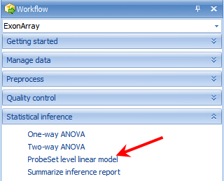
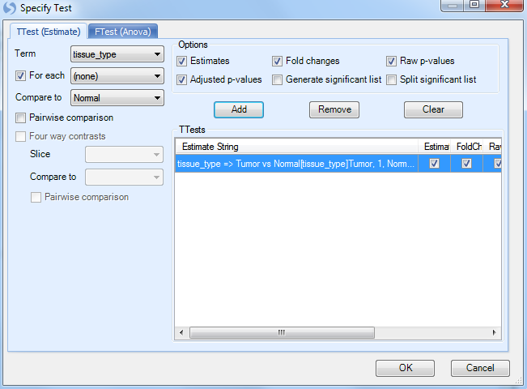

# Differential Expression (Probeset Level)

*Array Studio* contains a number of different modules for performing univariate analysis/differential expression on the probeset level, including One-Way ANOVA, Two-Way ANOVA, and the more advanced General Linear Model, as well as a few others. For probeset level, the differential expression analysis is similar to that discussed in MicroArray Tutorial. We will only provide an example of **General Linear Model** in this tutorial.

## Probeset Level Linear Model

The design of the experiment in this tutorial is set-up so that the user should perform a *Probeset Level* *Linear Model*. The first factor in the ANOVA is *tissue_type* while the second factor is *patient_id*. For each patient, there is a tumor and a normal sample, and we are interested in the difference between the two.

To run the *Probeset Level Linear Module*, go to the **Statistical Inference** section of the **workflow**, and select **Probeset Level Linear model**. Alternatively, the same module can be selected by going to the **MicroArray Menu | Inference | General Linear Model**.

This opens the *General Linear Model* window.

As with other analysis windows, the user must first set the *Project* and *Data* on which to run the analysis, in the *Input/Output* section. Make sure **Tutorial ExonArray** is chosen as the project and *Exon Data* is chosen as the input data.

For *Variables*, choose **Customized variables** and click **Select**. Choose the list that was generated earlier by the *Filter* command.

For *Observations*, choose **Customized Observations**, and then click the **Select** button to choose the list **ExonData.Observation19**.
This ensures that the statistical tests are only run on the  good  19 observations, ignoring the one outlier chip.

Go to **Step 1: Specify Model**.

The two factors in this model are **tissue_type** and **patient number**. Use ctrl + click to select both of them and click the **Add** button.

*Patient* is random effect, so click the **Random** checkbox for **patient number**.
Click **OK** to return to the **General Linear Model** window.
Notice that the information of the specified model is displayed in the box under step 1.

Next, click **Specify Test** for comparisons.

This opens the *Specify Test* window, which allows the user to manually or automatically specify the tests (or comparisons). In this case, the user is interested in the difference between tumor samples and normal.

The easiest way to specify the comparison is to ensure that the **Term** box is set to **tissue_type**, click the **For each** box to set to **(none)**, and set **Compare to** as **Normal**.
In effect, this says that for every level of *tissue_type*, compare it to normal.
Since there are only two levels (tumor and normal), there will be one comparison.

Make sure that **Estimate**, **Fold Change**, **Raw p-values** and **Adjusted p-values** are checked, and then click **Add** to add the test. Add test will be displayed in the **TTests** box.

Click OK to return to the original *General Linear Model* window.

*Step 3* is optional, and includes a number of options that can be set for the *General Linear Model*. Please refer to MicroArray Tutorial for more details on the options.

The *Linear Model* option is now complete.
If the user is familiar with SAS code, clicking *Show SAS Code* will show the equivalent SAS code.

Click **Submit** to run the module.

This module should take approximately 6 minutes (Note: the length of time is dependent on the number of variables in this case over 1 million, as well as the type of model).

## The Volcano Plot View and Inference Report

After running the *General Linear Model* (the computing time should be a few minutes), a *Table* is generated under the *Inference* tab of the *Solution Explorer*, named *ExonData.Tests*.
 This table contains the statistics report generated by the General Linear Model, together with a *VolcanoPlot* visualizing the pvalues vs. estimate.

Also notice that a new *List* has been automatically generated by the *General Linear Model*. This *List* can be used for purposes of filtering, and any other downstream analysis. However, for this experiment, there are actually no probesets that pass the adjusted p-value criteria of 0.05, so this list contains 0 probesets.

Double click on *VolcanoPlot* to open it. Notice that one *volcano plot* has been created in this view, for the comparison *Tumor vs. Normal*.

The *VolcanoPlotView* shows the *\-Log10 (Raw P-value)* on the y-axis and the *Estimate* (*Estimate* is defined as the statistically adjusted difference between the means of the two groups being compared) on the x-axis. Thus, the most significant probesets are higher on the y-axis, while the mostly differentially expressed probesets can be found at the extremes of the x-axis. Similar to all views in Array Studio, the *VolcanoPlotView* is fully interactive. Please refer to MicroArray Tutorial for more details on these options.
