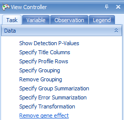
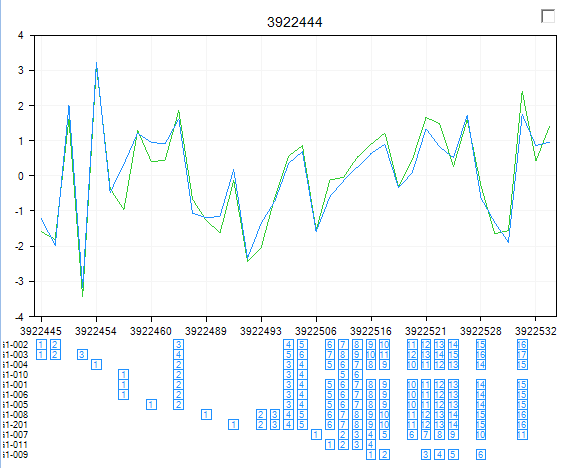

# Exon Level General Linear Model (Exon Differential Expression)

Array Studio includes the ability to find differential expression at the exon level, rather than the probeset level.
This can help for finding differentially expressed exons, or alternatively expressed exons.
To open the *Exon Level Linear Model*, user can click on the **Exon Level Linear Model** in **Alternative Splicing** section of the **Workflow** window.
Alternatively, user can go to **MicroArray | ExonArray | Exon Level Linear Model**.

This opens the *General Linear Model (Exon Level)* window.

The first step is to select the **Customized variables** and **Customized observations** using the lists created with the *Principal Component Analysis* and *Filter* module.

Click **Specify Model** to begin *Step 1*.

As with the probeset level linear model, the two factors are **tissue_type** and **patient number**. Use ctrl + click to select both of them and click the **Add** button.

*Patient* is random effect, so click the **Random** checkbox for **patient number**. Click **OK** to return to the **General Linear Model** window. Notice that the information of the specified model is displayed in the box under step 1.

Click **Specify Test** to start *Step 2*.

Once again, choose **tissue_type** as the **Term**, click the **For each** checkbox, set it to **(none)**, and set **Compare to** as **Normal**. Click **Add** to add the test. Click **OK** to continue.

For step 3, **Change Options**, we will leave all the options as the default.

For this module, the user has the option to choose how the summarization of the exons will be calculated ( **Mean**, **Median**, or **Median Polish**). In addition, the **Remove gene effect** option allows the user to remove the gene effect (i.e. subtract the average of the probesets for that gene) from the data when running the ANOVA. This is useful for detection of exons involved in alternative splicing.

Leave the **Work on core probesets only (level=core)** checkbox on to only run the ANOVA on the core probesets (recommended for the tutorial).

Click **Submit** to run the linear model, which should take 2-3 minutes for over 1 million variables.

This module, in effect, summarizes the probesets into the exon level, then looks for differentially expressed exons.

This returns **ExonData.Tests_2** under the **Inference** tab of the *Solution Explorer*. Both a *Report* and *VolcanoPlot* are generated. Double-click *Report* to take a look at the results.

This time, p-values and fold changes are generated at the exon level. This data can be sorted by p-value. Right-click on the raw p-value column now and choose **Sort Ascending**. This sorts the table by p-value, from most significant to least significant.

Notice **ABCG1** is one of the top transcripts at the top of the list.

Switch back to the **TranscriptProfileView** and filter for this gene.

Make sure that the **Remove gene effect** button has been clicked.

You can now look for those exons in this gene that may have alternative splicing using this filtered TranscriptProfile View. The top Exon has ID 993113 and probeset ID 3922532.

