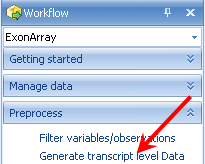

# Generate Transcript Level Data

For users interested in obtaining transcript-level data from the exon array, *Array Studio* includes the capability to **Generate Transcript Level Data** by summarizing the probesets from exons level data.

From there, any of the standard microarray modules (see the Microarray Tutorial for more information) can be run on this data to differentiate the gene expression (i.e. Genera Linear Model, ontology analysis, clustering, etc.).

To run this module, go to **Generate Transcript Level Data** in the **Preprocess** section of the *workflow*.

Alternatively, user can open this module by going to the **MicroArray menu | ExonArray | Generate Transcript Level Data**.

This opens the *Select Data* window. Select the **Exon Data** and click **OK**.

The *Generate Transcript Level Data* dialog box appears next.

The user can choose the **Exon level** (*core*, *core + entended*, *core + entended + full* and *all*).
The user can choose customized variables and observations (just leave this as default), then choose a **Summary method** (*Mean*, *Median*, and *MedianPolish*), then click **OK** to continue.

This will create a new *MicroArray* dataset under the **-Omic Data** section in the *Solution Explorer*, *ExonData.Transcript*.
The data is based on transcript level.
Any of the *Microarray* modules should work on this data (including running the General Linear Model to find differentially expressed transcripts).

