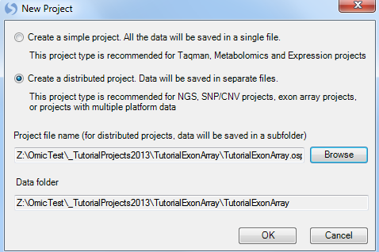

# Importing a Dataset

## Downloading the Exon Array Dataset

For this tutorial, the following materials will be required: 20 .CEL files from Affymetrix HuEx-1_0-st-v2 exon array platform, as well as the included .ARR files, which is the design (sample) information for the 20 .CEL files.

The Exon data set contains information for 1425647 probe sets in a paired design (each patient has a tumor and normal sample). The experiment measures the intensity of exon expression level of 1425647 probe sets, with 10 samples of normal and 10 samples of tumor. The primary interest of this experiment is to find exons that are differentially expressed between tumor and normal, or to find alternative splicing between tumor and normal.

The *.ARR* files contain the design information for this study, including columns for *chip, time, treatment, and group*. By default, *.ARR* files will be imported automatically, upon .CEL file extraction.

Optionally, if the user does not have *.ARR* files, a design table can be created at any time by the user, using Microsoft Excel or Array Studio.
As a rule, the design table must contain a first column, usually deemed *Chip* for Affymetrix platforms, that contains the exact file names of the chips used in the experiment, without the *.CEL* file extension. Additional columns usually include *treatment, time, etc.* (anything pertinent to the experiment). If you forget to include a particular column at the time of the creation of the design table, it is not a problem, because any design factors can be added or edited after importing the design into *Array Studio*.

The ExonArray sample dataset (20 Affymetrix .CEL files and 20 *.ARR* files) is available at:
[^link^](http://omicsoft.com/downloads/data/tutorial/Exon.zip )

After downloading the single .zip file, unzip the file to a folder to be used for this tutorial.

## Creating a New Project

When Array Studio is first installed, it will look similar to what is displayed below.

If you have previously opened projects in Array Studio, you will see the *Last Opened Projects* window. If so, just click cancel so that Array Studio looks similar to below.

To create a new project, click the **New Project** button in the Workflow, or the **New** button on the toolbar, or go to **File** Menu, then click **New Project**.

This opens the *New Project* window.

*Array Studio* allows the user to create two different project types:

*   A simple project, in which all the project is saved in a single file (recommended for microarray and RT-PCR projects).

*   A distributed project, where data is saved in separate files (recommended for exon array, CNV, or genotyping projects).

Choose the **Create a distributed project** option. Click the **Browse** button to choose a location and name for the project. Click *OK* to continue.

Switch to the **Solution Explorer** by clicking on the *Solution Explorer* tab, which should be found at the bottom of the *Workflow Window*.
If the *Solution Explorer* tab is not visible, open to it by going to the **View Menu | Show Solution Explorer**.

The Solution Explorer will be empty except for data containers for List, Cluster, and Text files.
You can right-click on List, Cluster, and Text for their additional options.
For instance, right-clicking on List will bring up options to add a new List, add list from file, etc.
A List can be used to filter the data, by either Variables (e.g. probe sets), or Observations (e.g. chips or samples).

## Adding Exon Data & Chip Normalization

At this point, we are ready to add ExonArray data to the *Solution Explorer*.
This can be done in a variety of ways, but the easiest way is to first switch back to the **Workflow** *Window*, by selecting the *Workflow* tab at the bottom of the *Solution Explorer*.
Alternatively, go to **View Menu | Show Workflow** to show the *Workflow Window*.

Next, choose **Add ExonArray Data**, from **the Manage Data** section of the workflow.
Alternatively, data can be added by going to the **File Menu | Add Data | Add ExonArray Data** or by clicking the **Add** button on the taskbar, and choosing **Add ExonArray Data**.

A dialog box will open asking the user to specify the source of data.
Two different sources of data are currently available in Array Studio and can be seen in the dialog window below.
For this tutorial, the 20 Affymetrix .CEL files downloaded earlier will be used.
Select **Affymetrix .CEL files (Exon Arrays)** and click *OK*.

The *Extract Affymetrix Exon Array CEL file* window appears.

Click the **Add** button to select the CEL files for extraction. Navigate to the location of the CEL files, and then click **Open** to continue.

 

Check that there are 20 .CEL files listed for extraction by looking in the upper left corner of the dialog box. When complete, the window should look similar to the following screenshot.

Under *Options*, the **Chip type** and **Array type** of the CEL files automatically recognized.

If the user is using *Affymetrix Expression Console*, the **Import Sample Information from ARR files** checkbox will automatically import sample information (design table) from any ARR files found in the same directory as the selected CEL files.

Click **Submit** to start the CEL signal matrix extraction. Data extraction will begin and take approximately 10-20 minutes (about 60 seconds per .CEL file, but the first time an extraction is done annotation has to be downloaded, so the process may be slower).

Once data is imported, Array Studio should look similar to the following screenshot. By default, a *TableView* is created for the imported dataset.

Also, note that a new data object ("ExonData") has been added under the *\-Omic Data* section of the *Solution Explorer* (on the left-hand side of the screen).

The *Solution Explorer* can provide important information about the different datasets and tables that are created in Array Studio.
For instance, note that next to the name of the dataset, **ExonData**, Array Studio lists the number of rows and columns (or variables and observations) in the dataset.
In this case, there are 1,425,647 variables and 20 observations in each of the datasets.

The *Solution Explorer* also provides the user with information on the different views that have been created.
Notice that there is a *TableView* for dataset **ExonData**, as well as for *Annotation* and *Design* (Expand the nodes to see this).
User can double-click either of these views (named *Table*), and open them in the main view window.
