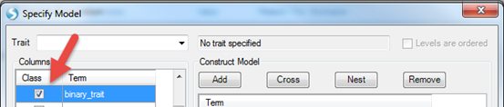

#Association

The association analysis module provides a high-throughput genetic association analysis pipeline for tens of millions of genetic variants.
Users can build genetic association analysis models for continuous, binary and survival endpoints with or without covariates and interaction terms.
Stratified analysis is also available for survival model.

Throughout, additive genetic models will be used, which means genotype data are coded as 0, 1 or 2, 
while imputed dosage data will range from 0 to 2 on a continuous scale to reflect the estimates of the imputed dose.
To ensure consistent analysis and annotation of the results, 0, 1 or 2 always refer to 0, 1 or 2 copies of the alternative allele.

##Input file format

As shown in the figure below, input files for genetic data can be genotypes in VCF or Plink BED format, or dose data in the VCF format.

An input *phenotype file* needs to be specified separately, where subject IDs need to be in the first column, followed by phenotype and covariates. 
Subject IDs need to be the same as those in the genetic data file. 
In the case of the plink format, subject IDs need to match individual IDs if they are different from family IDs. 
It is possible to specify a region of SNPs for analysis by using a special syntax in the  SNP list  field. 
For example, by specifying  <15:1-10000> , analysis will only be based on the region on chromosome 15 from base pair position 1 to 10000.

In the current version of the analysis module, users need to combine PCA results from the QC step ( PCA_results.txt ) with phenotype data,
and provide this combined dataset along with the genotype data, to be used in the association analysis.
For the purposes of this tutorial, a combined Phenotype file ( Phenotype.txt ) has been provided, so can be directly used with the imputed genotype data from the previous section.

In this tutorial, we use the imputed VCF file (as VCF dose type) as genotype input.
The phenotype file in the downloaded zip folder contains the CPNE1 gene expression data downloaded from the Geuvadis RNA sequencing project, gender information, and the first 3 principal components from the previous QC step.

##Analysis model

Currently, three statistical models are supported in the association analysis module: Linear model for continuous traits, 
logistic regression for binary traits and Cox proportional hazard model for survival endpoints.

By clicking **Specify Model (Phenotypes and Covariates)**, users can specify phenotype trait and covariates in the phenotype file. 
Phenotype and covariates can be in any order in the phenotype file.

The model below shows how to analyze a continuous trait, *CPNE1* gene expression data.
This analysis is an eQTL analysis to find the SNPs in chr20 that are significantly associated with *CPNE1* gene expression. 
In this step, please first add the file containing imputed dosage vcf data (from the previous step), and the expression file that is in the downloaded zipped folder ("Phenotype.txt").
After selecting **Specify Model (Phenotypes and Covariates)**, the following interface will appear.

Columns shown are those included in the phenotype file, which includes gender, first 3 PC scores and CPNE1 expression levels. 
In this instance, please select CPNE1 expression level as the *trait*.
*SNP* is automatically selected to include in model. 
Users can then highlight all the covariates for the model; 
in this example, they are *gender*, *Eigen1*, *Eigen2* and *Eigen3*, which represent gender and the first three principle component scores.
The phenotype file includes all 210 samples. 
When performing association analysis, the subjects that are not in input VCF file will be excluded automatically.

Once the model is constructed, press OK and General window will appear again. 
Note now under **Specify Model (Phenotypes and Covariates)**, the complete model is shown. 
Users may inspect this model and make sure that this is correct. 
Users may **Specify Model** again to make changes to the model shown.

In the **Options** panel, users can specify the following three options prior to analysis. 
Only markers meeting the pre-specified thresholds will be included in the analysis.

*   R2 cutoff (dose data only): only markers with imputation quality score R2 greater than the specified value will be included in the association analysis.

*   HWE p-value cutoff (1 means no cutoff): 
    only markers with HWE p-value more significant than the specified cutoff value will be included in the association analysis.

*   Allele count cutoff (0 means no cutoff): 
    only markers with at least the specified number of minor alleles will be included in the analysis. 
    For example, when 1 is specified as the cutoff value, all the monomorphic markers will be excluded from the analysis.

P-values generated for both genotype and dose data are based on a likelihood test.
For binary and survival trait association test, if wald tests are desired, users can uncheck the box  Use likelihood test instead of wald test . 
Likelihood ratio tests can be more robust than wald tests for low frequency and rare markers.

A variety of options for multiple testing adjustment are available. 
Bonferroni correction is often used for a GWAS study where P-value < 5E-08 is considered as statistically significant. 
The same significance threshold can be applied to genome-wide analysis based on imputed data.

As the association analysis is computationally intensive, especially for imputed data, users can specify a large  Job number , as long as it is supported by the server.

Logistic regression and survival analysis can be carried out similarly.
By default, all the variables are numerical. 
A categorical variable can be specified by checking the box in the  Class  column by the  Term  of interest.
Below is an example (not in tutorial data).
The response variable (Term = binary trait) in the figure below is coded as 1 and 2. 
By checking the box in the  Class  column beside it, the trait will be treated as a binary trait with two levels, 1 and 2.

Similar to continuous trait analysis, users can add covariates, interactions and nested models.

In this tutorial, we keep other options as default, specify an output name and output folder (as in the screenshot shown below), then click  Send To Queue  to submit the job.

##Association output

Once an association analysis is complete, the results table will be available in the main window.
The name of this table will be shown in the Solution Explorer window ending with  .AssociationReport(GTT) . 
In the report, you will find information on chromosome, position, variant ID, reference allele, alternative allele, analyzed subject number (N),
alternative allele count (AC), alternative allele frequency (AF), Call Rate (CR), HWE p-value, SNP SE, SNP effect (or SNP Beta), raw p-value,
Bonferroni adjusted p-value, etc.

In the case of analysis of a binary trait or survival endpoint, reported effect estimates will be OR (Odds Ratio) or HR (Hazards Ratio), SE, 95% CI for OR or HR.

These results can be filtered based on SNP ID or chromosome position using the filter feature in the **View Controller** window.

The NCBI eQTL browser [^link^](http://www.ncbi.nlm.nih.gov/projects/gap/eqtl/index.cgi ) 
is a browser containing the information of expression quantitative trait loci (eQTL). 
Users can use NCBI eQTL browser to find out the expression associated SNPs.

If we search for CPNE1 eQTL in chr20 in NCBI eQTL browser, 

We will find the significant SNPs associated with CPNE1 gene expression level.

Please note that the positions shown in this browser are 0-based, while in our association result (and the input VCF file), the SNP positions are 1-based.
Therefore, the SNP position shown in association result table should be adding 1 base to the position shown in eQTL browser.
eQTL browser shows rs6060535 (chr20:34235521) as the top SNP associated with CPNE1 which has the p-value of 2.3233e-28. 
We can search position of rs6060535 (chr20:34235522) in the association report table. 
It shows a very significant association with raw p-value in the order of e-27 which is quite comparable to NCBI eQTL browser.

Users can also try looking for the p-value of other significant SNPs shown in eQTL browser. 
Please note that due to different study subjects, sample size, and study tissues, the p-values may show discrepancy when comparing our association result to NCBI eQTL browser.

One additional handy feature of the served-based analysis is the availability of the full log information.
As with all the served-based jobs, log information is available under the Server Jobs tab. 
An example is shown below. 
By right clicking the name of the job, a new window will pop up with the option to *View Full Log*.
Detailed information on the analysis job is outlined in the log file step-by-step. 
The full path name to the output folder is also listed just in case you forget which Output folder was specified during the analysis step.

