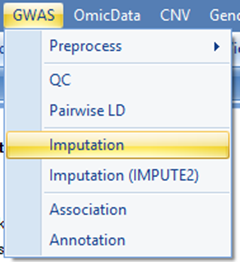

#Imputation

##Imputation process

In the imputation step, it is **absolutely essential** that you are using the strand-normalized and post-QC data for this step.
Genotype imputation makes statistical inferences of unobserved genotypes based on reference haplotypes. 
Currently, haplotypes from 2504 1000 Genomes Phase 3 subjects are used as reference panel. 
Future implementation may include larger reference panels to allow more powerful and accurate imputation. 
The entire process can be divided into two stages. 
In the first stage, GWAS subjects are pre-phased. 
To achieve memory and speed efficiency, this pre-phasing step is carried out in parallel for chunks of chromosomes. 
After pre-phasing, imputation is conducted in parallel for each chunk of the chromosome and imputed data are subsequently combined into one VCF file. 
Similar to QC pipeline, imputation needs to run on Linux server.

During the pre-phasing step, there are three methods to choose   HAPI-UR, MaCH and Automatic 
For automatic method, MaCH is used for studies with less than 1000 subjects and HAPI-UR is used for studies with at least 1000 subjects.
The choice of HAPI-UR for bigger studies is primarily due to computational speed reason. 
Pre-phasing is the most time-consuming step. 
It is estimated that using MaCH, 40~50 hours on 40-node cluster are needed to phase ~180 subjects based on ~4 million markers. 
It is highly advisable that users find out the number of nodes available on their servers/clusters to determine an optimal number of jobs (Job number) for this step.

Users can also try it out by running imputation for one chromosome region (e.g. 50 mb) to estimate the number needed. 
This can be achieved by entering <chr#:start_position-end_position> in the SNP list field as shown in the figure below.

Users can specify a subset of subjects instead of the entire set of subjects available in the plink files for imputation. 
This allows flexibility to impute data for a subset of subjects should there be a need to exclude certain subjects from the post-QC plink files.

The following options can be specified for the imputation process.

*   **Number of iterations**: 
	This is one of the two key parameters used to infer haplotypes during the phasing stage. 
    It specifies how many iterations of the Markov sampler should be run. 
    These iterations are used to simultaneously update the crossover map, to update the error rate map and to estimate the missing genotypes. 
    A set value of 20 is given.

*   **Number of haplotypes**: 
    This is the other key parameter used to infer haplotypes during the phasing stage. 
    It specifies how many haplotypes should be considered when updating each individual. 
    A set value of 200 is given.

*   **Number of markers per chunk**: 
    This option specifies the number of markers to be included in a chromosome chunk during the phasing stage.
    It is recommended that hundreds (not thousands) of chunks be generated for a given GWAS panel. 
    For example, 5000 markers/chunk can be specified for a 5M GWAS panel.

*   **Number of markers in the overlap region**: 
    It is crucial that adjacent chunks are overlapped such that phasing is done correctly. 
    It is recommended that the overlap is at least 100kb. 
    This is often achieved by specifying the overlap no less than one fourth of the chunk size. 
    For example, 1500 markers/chunk can be specified with 5000 markers/chunk for a 5M GWAS panel.

*   **Reference library**:
    Human B37.3 is currently used for the reference panel.

*   **Job number**: 
    This needs to be determined by the number of core processors on the server. 
    A higher number would improve the overall speed of the process.

The output of the imputation step will be saved in the output folder specified.
Users can use the **Browse** button to choose output folder.
In this tutorial, chromosome 20 is imputed with HAPI-UR using 8 nodes (Job number = 8) on the server. 
Please click **Send To Queue** to run imputation step.

##Imputation Output

At the end of the imputation process, a single VCF file is generated that combines data from all the chromosome chunks.
In the VCF file, chromosome, position, reference allele, alternative allele, marker ID, imputation quality (R2), minor allele frequency (MAF), 
genotyped or imputed (Is Genotype), and allelic dosage data are included.
The VCF table will show under Table.

In this table, rows correspond to variants.
Columns provide aforementioned information on variants and from column 10 and onwards, subjects  genotype and dose information are presented.
A subject s ID is represented by  Family ID -> Individual ID  as provided in the original plink files. 
In this instance (as pointed by the red arrow), the first subject is NA18524->NA18524 with both Family ID and Individual ID being NA18524.
Imputed data of the first marker for this subject is 0|0:0.000 as shown in the red rectangle in the figure below. 
The notation is based on output of GT:DS where GT is imputed genotype and DS is the imputed dosage data.
In the "Is Genotype" column, "False" means this marker is imputed, while  True  means this marker is included in genotyping file and not from imputation result.

