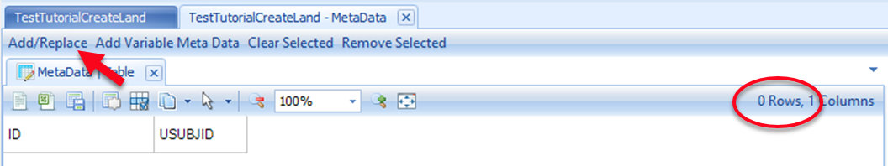
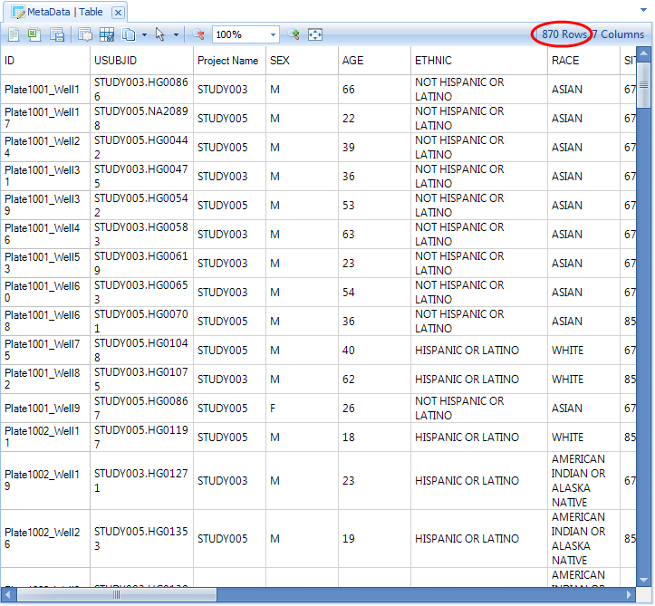
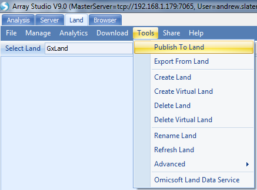
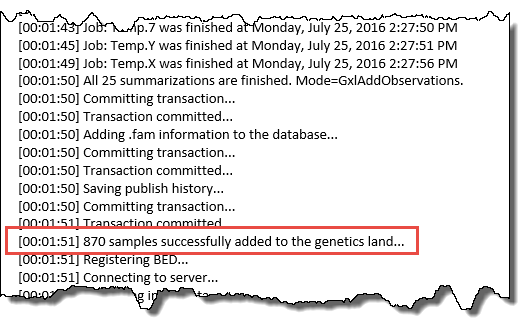
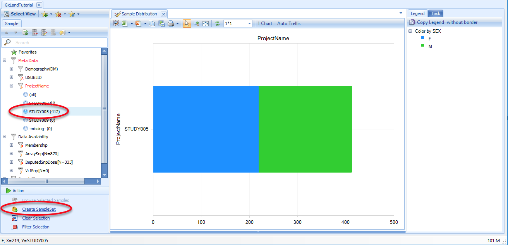
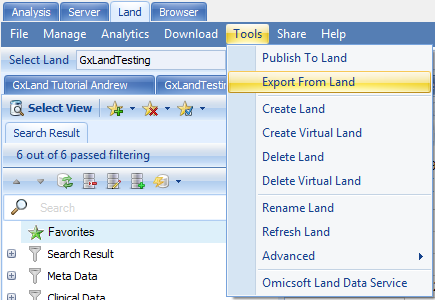

# Adding Data to GeneticsLand
In this section, you will go through the basic procedures for adding data to your GeneticsLand (Sample Metadata, control access to patient information, genotypes/imputed doses, associations, and phenotypes), as well as how to export these different data to **Array Studio** to perform analyses such as GWAS.

## Add Sample MetaData to a GeneticsLand

To avoid conflicting sample IDs, and to ensure access controls are in-place *before* restricted genetic data are added,
it is considered  best practice  to register samples in the *Sample MetaData* table before adding their genetic data into the Land.

From the *Land* tab, select **Manage | Samples | Manage Sample Meta Data**

Take note of the number of samples (rows) currently in the table. Following this tutorial, the Land will be empty at this point so there will be 0 rows. Click the **Add/Replace** button:

Click **Load from tab delimited file** and select the SampleMetaData.txt file from the tutorial dataset.
Preview the metadata to ensure that you selected the proper file, then click the **OK** button to finish.

Note the new number of samples   it should be the sum of the prior number and the number of new samples being registered (0 + 870 = 870 in this case). If it is less, then one or more of the new sample IDs has conflicted with an existing sample ID, which means that the old metadata were over-written for the conflicting sample(s).

If sample metadata were overwritten, the simplest solution is to map the new samples to new unique IDs.
First, restore the appropriate metadata for the existing samples, as necessary (load from the metadata text files you had previously used). Then, re-register the new samples with new IDs. Use a **mapping file** when publishing the new samples  data to the Land (next steps) to ensure they are published with the new IDs and don t collide with the existing samples and their data.

Click the **X** in the *MetaData* tab to close it, and repeat with any other open tabs.

Re-select the Land using the **Select Land** button, and the *Sample Distribution* view should now be populated:

This view shows the number of samples by project, colored by sex, as indicated in the legend on the right. These groupings are the defaults (PrimaryGrouping and SecondaryGrouping) as configured when the Land was created. You can change the primary grouping using the **Grouping** button at the top. You can change the secondary grouping and make other adjustments to the chart by switching to the *Task* tab on the right.

Note the sample attributes under the *Sample* tab on the left, which can be used to filter the view. All of these come from the *Sample MetaData* that you just loaded. The exception is the *Data Availability* attributes, which displays the amount of genetic data in the Land (currently none, as we haven t added any yet).

Using your mouse to select a component of the chart (the males of STUDY009 here) will display the details of the relevant data points (the *Sample MetaData* in this case) below the chart:

These chart configuration, filtering, and selecting mechanisms will generally behave the same across all views in the Land.

For more detailed explanations of how to group/filter/alter Land Views, please see the OncoLand tutorial.

## Control Data Access in GeneticsLand

If there are any restrictions on access to data for certain projects, it is best to configure this before adding the genetic data for those projects. Select **Manage | Manage Project Access**:

You will see the default access level is *Read* for the *standard users* group (includes all users) across all GeneticsLand projects.
You can adjust the access for each project at the *User* or *User group* level.
Users with *Read* access (either individually or through a user group) will be able to see all data for samples in that project.

Note, samples are mapped to a project using the ProjectName column in the *Sample MetaData* table, which is a **key** column.
This is why we had to register the samples in the *MetaData* before configuring this access control. The **Project level frequency access** is a restricted access level that will hide all sample level data (like the *MetaData* that we just loaded, and the genotype data we will add in the next step) but expose allele frequencies and other aggregate summary statistics calculated from those hidden samples.

In addition to this project level access control, there is also a higher Land level access control. To configure this, select
**Manage | Manage User Access**

You will see the default is for the *standard users* group to have *Read/Search* access (amongst others). Without this basic access level, a user s project level access becomes irrelevant, as they won t be able to access the Land (it will not be listed under the **Select Land** menu).

## Publish Array Genotypes to a GeneticsLand

Loading data into a GeneticsLand is done through publishing procedures
that
are optimized to be multi-threaded, assuming these datasets may be very large. There are several procedures available for different data types (sequencing, non-sequencing, imputed allele doses, association results) and formats (VCF, PLINK, IMPUTE2, *etc.*). Following the logical experimental workflow, we will first publish the assayed genotypes. In the tutorial dataset, these are from a genotype array in PLINK format.

From the Land tab, select **Tools | Publish To Land**:

Select the tutorial *Land*, set *Data type* to *BED* and *Job number* to *4* (or higher if your server can handle more than 4 parallel threads). For *File*, **Browse** to the downloaded Callset_2016-05-26.bed file. We won t specify a *Sample File* here (this is an option to allow adding *Sample Meta Data* while publishing, but we have already done this).

---
!!! note
    **Note:**
    The File Browser will display Array Server locations,so you either need to upload the data to your Array Server folder, or navigate to a network drive location with the data.
---

For the *Panel*, you would normally select the array that was used to generate the data, so that its annotations can be used to resolve the alleles to VCF convention. However, this tutorial dataset is synthesized and not from any particular array, so you should instead select the **<StandardSnpID>** option. This option assumes the alleles are already resolved to VCF convention and reads the REF/ALT designations from the variant ID in the PLINK bim file (IDs are CHROM:POS:REF:ALT). Tick the box to *automatically generate variant annotation*.

In the *SampleID Mapping* section, note that the sample IDs have been populated from the PLINK fam file. Specifically, they are the IIDs (second column). The data will be published using these IDs as their primary sample identifiers, which is used to join to the *Sample MetaData* we added above. The FIDs (first column of fam file) will be read and stored for future exports of the data to PLINK format, but otherwise won t be visible in the Land.

In some cases, the SampleIDs extracted from the file are not the IDs you want used for the Land, for example, if you determined in the prior step when adding *Sample MetaData* that some of these IDs conflict with samples that already have data in the Land. You can load a *mapping file* containing two columns (column 1: Original Sample ID; column 2: Land Sample ID), either from a local file, or from the server.

If you use the local **Load** option, the preview will display the contents of the file, NOT the effective mapping. For example, below we have only included the first two samples in the mapping file (all other samples in the PLINK dataset will be loaded using
their IID). However, note the typo in the first sample (the extra *a* at the end). This means the *Plate1008_Well63* sample will be loaded as-is without any mapping. For this tutorial, it is not necessary to specify any mapping as these IDs are sufficiently unique. Click the **Send to Queue** button to submit the job.

After clicking **Send To Queue,** you will be taken to the *ServerJobs* tab under the *Server* tab to see the status of the publish job. Note, these jobs are multi-threaded (per the specified *Job number*), so to avoid disk IO issues, only one **publish** job per server will run at a time. If another publish job is already running, you will see the status of your job as *InQueue*.

If your user profile on the server includes your e-mail address, you will get an e-mail notification when the job is complete (~10 minutes if *Job number* set to 4, faster if higher). The Server Job *Status* should be *Finished*, and if you scroll towards the bottom of the log, you should see a section like:

Where the last line indicates the number of samples that have been published. You can also confirm by logging off the server and re-connecting. Then re-open the Land, and in the default *Sample Distribution* view in the *Sample* tab on the left, expand the *Data Availability* attributes to see that there are now 870 samples with *ArraySnp* data.

## Export Array Genotypes from a GeneticsLand

In the next section, you will import a set of imputed dose data pre-generated from the tutorial dataset, but only using a subset of the output data. If you wished to generate the full dataset, or wanted to perform GWAS on other data in GeneticsLand, you can follow the steps in this section to export GeneticsLand data. Otherwise, you can skip ahead to the next section.

We are going to export a subset of the genotypes that we just published to PLINK format,
so that we can run a GWAS on these data.
First, create a *Sample Set* containing the samples you wish to export for analysis.
Return to the *Sample Distribution* view by opening the Land (if not already open)
and clicking on the **Select View** button to select the **Samples** **View**, under the **Overview** heading.

Use the *Sample* attributes on the left to filter to *STUDY005*, then click on **Create SampleSet**:

Select *Create Sample Set From Filter* and click **OK**.

Enter *STUDY005* as the *Name* and *STUDY* as the *Tag*, then click **Upload**.

Now the samples in *STUDY005* can be exported as one group. SampleSets are a convenient and powerful way to sub-group Land Data for analysis.

To export the *STUDY005* data for GWAS analysis, in the *Land* tab, select **Tools | Export From Land**:

Select the tutorial *Land*, leave *Output* as *Plink BED*, and set *Data type* to *Genotyped Data*, which will exclude any imputed allele doses or genotypes from sequencing. **Browse** to a location and give a name to the *Output file*. For the *Variants*, leave the *All variants* option selected. The other options allow you to **Browse** to a file containing a list of variants, genes, or regions.

For the *Samples*, switch to the *SampleSet* and then **Choose** the set just created (*STUDY | STUDY005*).
The *Selected samples* option allows you to **Browse** to a file containing a list of sample IDs.

Untick the box to *Infer RS IDs from the variant definitions* (rs IDs are not needed for GWAS) but leave the box ticked for *Remove fully missing variants* (these will have call rate of 0 in the selected samples, so are of no value for GWAS). You can leave the Dose to genotype threshold at 0.5 and the R2 cutoff at 0. The default dose to genotype threshold will convert all dosage values to a genotype. The R2 cutoff is the imputation quality threshold. Set to 0 to export everything. Set the *Job number* to *4* (or 64 if your Array Server uses a cluster) and click the **Send To Queue** button to start the job.

You will again be taken to the *ServerJobs* tab under the *Server* tab to see the status of the export job. If your user profile on the server includes your e-mail address, you will get an e-mail notification when the job is complete (5 to 10 minutes). The *Status* should be *Finished*. You can also confirm that the expected number of samples were exported by navigating to the PLINK fam file and counting the lines it should be 412.

## Publish Imputed Allele Doses to a GeneticsLand

GeneticsLand can also contain imputed dose data, such as those that would be calculated by running Array Studio GWAS functions
(see the GWAS tutorial for further guidance). The tutorial dataset contains a subset of imputed dose data from the tutorial GeneticsLand data, but you could run the full genotype data from the previous section through the Array Studio GWAS pipeline for additional practice.

In order for the data underlying association results to be explorable in the Land, we need to add the imputed allele doses that were analyzed to generate the results. The tutorial imputed data were generated by the **minimac** imputation module in Array Studio, and thus the imputed allele doses are in 3 VCF files   autosomes, male chrX and female chrX (thinned to ~1 million variants for the purposes of this tutorial).

From the *Land* tab, select **Tools | Publish To Land**:

Select the tutorial *Land*, set *Data type* to *VCF (imputed)* and *Job number* to *4* (or higher if you have a server than can handle more than 4 parallel threads). For *File*, **Browse** to the downloaded autosome VCF file ( ThinnedAuto.vcf.gz ).

In the *SampleID Mapping* section, note the joint FID->IIDs in the VCF file have automatically be truncated to just the IID. This ensures that the data will be added to the Land under the same ID as the array genotypes from which it was derived. Unlike when initially publishing the array genotypes, where we first added the *Sample MetaData* to ensure no sample ID conflicts, here we are intentionally publishing the data under the same IDs. Because they are different data types (genotypes vs imputed doses), they are both stored in the Land (one will not overwrite the other), and you will be able to visualize them separately.

Click the **Send to Queue** button to submit the job. You will be taken to the *ServerJobs* tab under the *Server* tab to see the status of the publish job.

If your user profile on the server includes your e-mail address, you will get an e-mail notification when the job is complete (~10 minutes if Job number set to 4, faster if set higher). The *Status* should be *Finished* and if you scroll towards the bottom of the log, you should see a section like:

Where the last line indicates the number of samples that have been published. Note, this is less than the 412 that were exported, due to the pre-GWAS QC, which excluded some samples. You can also confirm these imputed allele doses were published by logging off the server and re-connecting. Then re-open the Land and in the default *Sample Distribution* view in the *Sample* tab on the left,
expand the *Data Availability* attributes to see there are now 333 samples with *Imputed Snp Dose* data.

Repeat this process with the remaining two VCF files (ThinnedFchrX.vcf.gz and ThinnedMchrX.vcf.gz). Note, even though we are publishing the same data type (imputed doses) for the same sample IDs, these operations won t overwrite any data already in the Land, because these VCF files contain entirely new variants (*i.e.* those on chromosome X, which were not present in the ThinnedAuto.vcf.gz file).

## Publish Genetic Associations to a GeneticsLand

In addition to the subject-level genetic data generated from DNA samples, GeneticsLand can also host and present genetic association results. For this step, we are assuming a genotype-phenotype association analysis has been conducted with the **Association** module in Array Studio, and the results are already in the appropriate GTT format; these data can be found in the tutorial dataset. From the *Land* tab, select **Tools | Publish To Land**:

Select the tutorial *Land*, set *Data type* to *Association Report* and *Job number* to *4* (or higher if your server can handle more parallel threads). For *File*, **Browse** to the downloaded GTT file (fev1 study005.gtt).

In the *SampleID Mapping* section, note the file name has been used as the *Sample ID*. For association results, *Sample ID* is the name or label for the result set. This is what will be searchable and displayed in the Land, so ensure it is sufficiently descriptive. For example, if you have analyzed the same dataset multiple times and have multiple result sets (*e.g.* once with smoking status as a covariate and once without), you will need to ensure each association file has a unique name, and you will want the names to be descriptive enough to distinguish between them when you see them in the Land. You have the same options for mapping from the default file name to a new value as described above when publishing the array genotypes. For this tutorial, it is ok to leave the *Sample ID* as-is.

Click the **Send to Queue** button to submit the job. You will be taken to the *ServerJobs* tab under the *Server* tab to see the status of the publish job.

If your user profile on the server includes your e-mail address, you will get an e-mail notification when the job is complete (~10 minutes if Job number set to 4, faster if set higher). The *Status* should be *Finished*, and you can confirm the set was published by starting to type the name into the search bar at the top of the Land tab to see the *association* type record found:

## Add Phenotype Data to a GeneticsLand
In order to aid in the interpretation of the genetic data in GeneticsLand and explore the data underlying a genetic association result, the Land will host and present sample attributes (metadata). There are currently four ways to manage phenotype or other sample measures in a GeneticsLand:

1.  Sample Meta Data (metadata categories that can be viewed for all samples in GeneticsLand)
2.  Sample Set Meta Data (metadata categories attached only for a selected subset of samples)
3.  Clinical Data (extended sample metadata for clinical variables)
4.  Manage Project Meta Data (association sets can be tied to a project and metadata organized by Project Name)

Our objective here is to add the phenotype data that were used for the GWAS whose results we just published. These types of measures are typically not added to the *Sample MetaData*, as they can be sparse (*i.e.* you may have lung function measures for a respiratory study but not for a neurology one). The *Clinical Data* system is likely the best location for these types of data, as it is shared by all users like *Sample MetaData* (pursuant to access controls), while a *Sample Set s* access can be managed by its creator. However, for the sake of simplicity in this tutorial, we will use the *Sample Set MetaData*.

From the *Land* tab, select **Manage | Samples | Manage Sample Sets**:

We will use the same sample set created to export the array genotypes.
Select *STUDY005* and then click on the **edit** button:

Switch to the *MetaData* tab and select **Load tab delimited file**:

Browse to and select the phenotypes.txt file, then click the **Update** button to finish.

You may now close the *SampleSets* tab by clicking the**X**:

And if you close the other tabs and re-open the Land to the default *Sample Distribution* view (allowing the Land to refresh with your SampleSet data), you will now see the phenotypes listed under the *Sample Set* heading:

Note, we are using the term  phenotype  loosely, as we have also included other sample measures like smoking status, drug treatment, and consent, which are relevant to exploring and interpreting the data and results.
