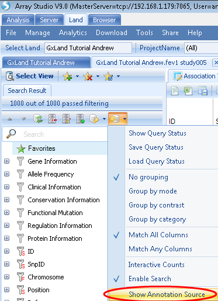
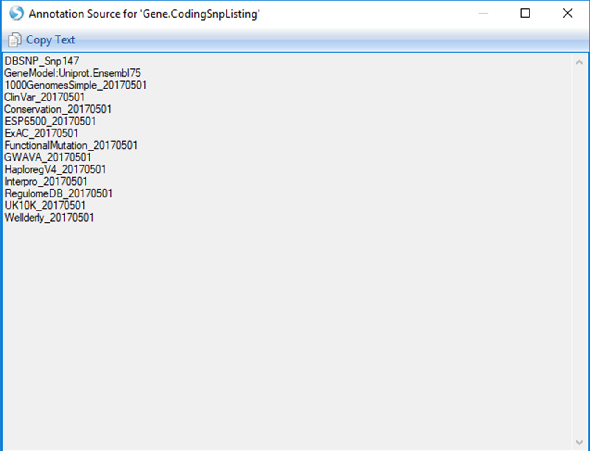
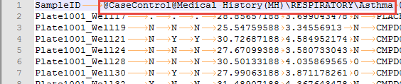
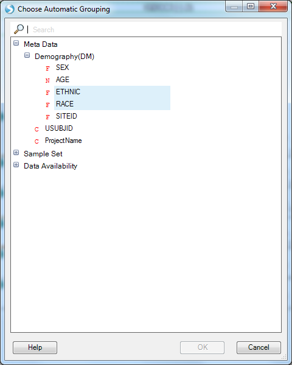
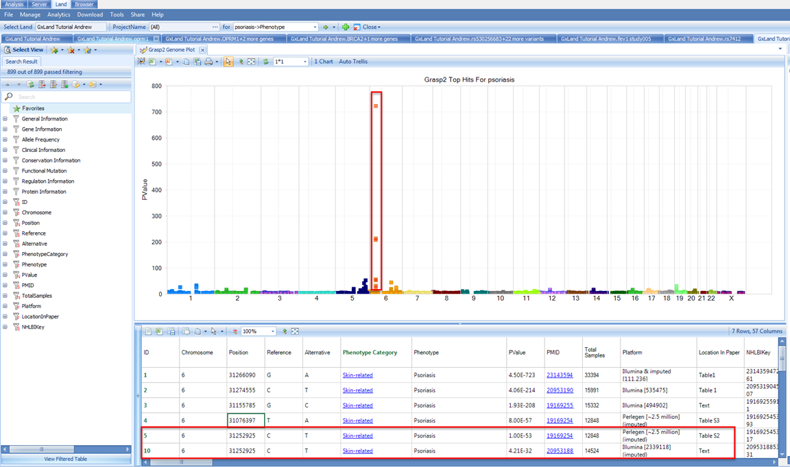
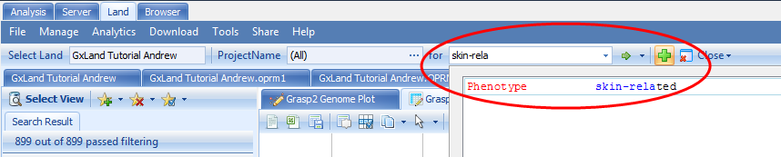
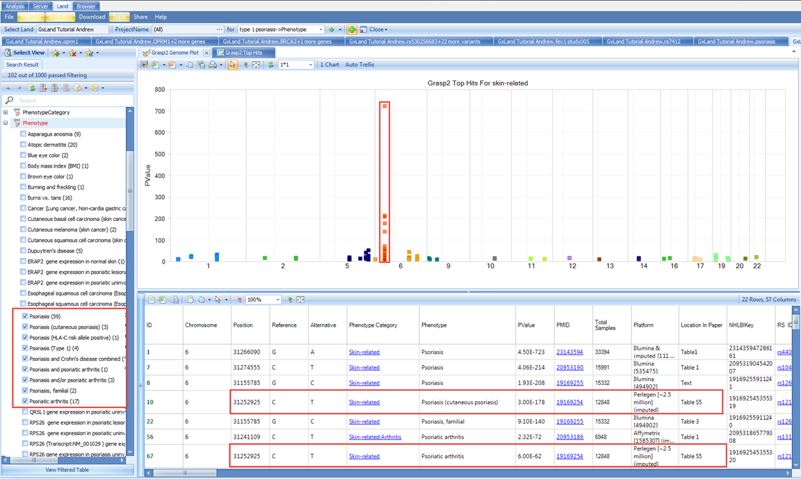

# Explore Your Data in GeneticsLand

## Review Genetic Association Results in a GeneticsLand

After all that setup, we are now ready to explore the data in your GeneticsLand. The tutorial dataset reflects a respiratory GWAS assessing genetic association with the FEV1 (Forced Expiratory Volume in One Second) endpoint. The primary access point for exploring the data in the Land will be the search box at the top of the *Land* tab. Start typing the name of the genetic association result set that we just published ( fev1 study005 ), then select the matching entry from the drop-down box:

### Association Annotation View

When you search an association, five views are available.

The *Association Annotation* view is the fully annotated table of all association results. The primary use case for this view is to query (filter) all results by variant attributes (*i.e.* all putatively functional coding variants).

Note, these annotations were generated when the association results (GTT file) were published, and thus may be slightly out of date if new annotations have been released since then. For all other views in the Land, the most current annotations will be dynamically joined. The annotation sources were defined in the configuration when the Land was created (VariantClassifiers=ClinVar_20170501, FunctionalMutation_20170501…). The specific classifiers we used for this tutorial are provided by OmicSoft. OmicSoft support (omicsoft.support@qiagen.com) can assist you with building custom classifiers if you have proprietary or licensed annotations you wish to include.

You can use the variant attributes in the *Search Result* tab on the left to filter. Switch to the *Task* tab on the right and click on **Specify Columns** to configure which columns to display (by default, they are all displayed):

If you have filtered to a smaller number of rows (<2000 rows), new buttons will appear at the top to enable sorting and searching of the table (you can also right click on a column header to sort):

Once you have configured the table as you want, you can use the three buttons at the top-left to either open in a text editor, Excel, or save to a file, including an OmicSoft object file (.osobj) that can be opened in an Array Studio project (*Analysis* tab) for further analysis. Alternatively, you can save the view to a file that can be re-opened later (**File | Save View**) or share it for future access by you or others (**Share | Share Land View**). All of these options for configuring, exporting, and saving the view are common across all tabular views in the Land, and similar options are available for graphical views.

### Region Plot View

Use the **Select View** button to switch to the **Region Plot** view: This view will show a Manhattan plot of the top 10,000 most significant results by p-value. With your mouse, click and drag to select the peak over chr15. This defines the center for the region plot. Note, the genome plot will disappear as the region plot is displayed. Click the **Show Overview** button to re-display it (and **Hide Overview** to hide it again).

In addition to selecting points from the genome plot, you can also go to a specific variant, gene, or region using the **Select Region** button:

This also allows you to set the region length (500 kb is the default). Note, specifying a variant (or coordinate using the Region option) does not set that as the  key  variant for calculating LD. The pairwise LD is always calculated relative to the variant in the region with the lowest p-value. Back in the region plot, you can choose to display or hide the pairwise LD matrix by selecting or de-selecting *pairwise LD*.

Also in the region plot, you can use the *LD Source* and *LD Measurement* menus to adjust those values.
As the *LD Sources* are from 1000 Genomes, which are shallow short read data that have been statistically phased, these data are subject to switch errors, and the *R2(Haplotype)* may be inaccurate.

Looking at the default *1000G.EUR LD Source* with *R2* as the *LD Measurement*, we see that many of the variants passing the genome wide significance threshold (PValue < 5E10 -8) appear to be in LD and thus likely represent a single causal variant.

However, given the extreme significance of many of these associations (note the scale of the -Log10(PValue) Y axis), there may be additional independent signals that are less significant but still pass the genome wide PValue threshold.

This *Region Plot* view is based on the OmicSoft Genome Browser, so you can configure display of various genomic annotation tracks. These options are available in the *Task* tab on the right, where you can **Manage** the existing tracks and **Add Tracks** from a variety of sources. This tab also has the option to **Export** the plot to an image file.

There are three remaining views available under **Select View**. These three views are **Top Hits** views and the results displayed are user defined by the TopHitsN parameter. The TopHitsN parameter controls how many association results with the most significant p-values to display in these views. The default is 10,000.

The **Top Hits (Genome Plot)** view is a variation of what we have already seen. It is the same genome plot as shown in the *Region Plot* view, except instead of being used to set the center of the region plot (the primary component of the *Region Plot* view), the genome plot itself will be the primary component. The **Top Hist (QQ plot)** displays the negative logarithm of the observed (x-axis) and the expected (y-axis) P value for each SNP. This plot can be used to investigate confounders and identify true associations. Both of these views are fully interactive, such that you can use your mouse to select from the views, and give you options to explore the most significant results (filter on variant attributes, select to see details, *etc*.) and configure the charts.

The **Top Hits (Table)** will be the fully annotated table of those same 1,000 most significant results. The output here is similar to the original *Association Annotation* view, except that the most current annotations will be dynamically joined. Select this view. To see which specific annotation versions are being reported, use the **Options** button in the *Search Result* tab on the left to select *Show Annotation Sources*:

This same classifier listing will be included as a header if you **Open as Text file**

The first column in the *Top Hits (Table)* view is the *Snp ID*, which contains a link to the variant s views (as if you had searched for the variant from the search box at the top). Right click on the *PValue* column to *Sort Descending*
(the sort is based on the -log(PValue), so larger values are more significant).

Then click on the *Snp ID* for the first row (**rs475535**) and continue to the next section to learn about the data and views available for this highly-significant variant.

## Review Variant Knowledge in GeneticsLand

Having searched for rs475535, the default view that is returned is the *Allele Frequency* plot. Like the *Sample Distribution* view, this is also grouped based on the PrimaryGrouping=ProjectName defined when the Land was created, and can be adjusted using the **Grouping** button at the top.

Note there are actually two charts here, the first (*Genotyped*) being calculated from all the non-sequencing based genotypes that are in the Land (the array genotypes we published). Scroll down to see the next chart (*Imputed*), which is calculated from all the imputed allele doses in the Land (*i.e.* the ones we published from the GWAS).

In addition to the frequency being represented on the X axis, the carrier count is also displayed to the right of the bar in parentheses. Another view available is **Genotype Frequency**, which is configured similarly to the *Allele Frequency* plot.

The number displayed to the right of each bar is still the carrier count (sum of heterozygotes and homozygote ALT). To get the count of each of these sub-groups, click on the **View Filtered Table** button at the bottom left to see the counts for each chart element.

There is also a special view named *Case Control Allele Frequency*, which is available because at least one of the columns in our phenotype file was specified as a case/control value:

Switch to this view under the **Select View** menu and you will see that instead of being grouped by *Project Name*, the allele frequencies are now grouped by the case/control status for all three phenotypes that were specified as case/control:

The final view under the *Summary* heading in the **Select View** menu (**SNP Annotation**) is the table of variant annotations. These will match what were reported in the *Top Hits (Table)* view when we were reviewing the association results.

Back in the **Select View** menu, select the **All SNPs** option under the *Genotypes* heading. This will display a table of all genotypes in the Land (those we published).

Note the *Data Type* column, which will indicate if the genotypes came from sequencing (*Sequenced* ), non-sequencing (*Genotyped*), or imputation (*Imputed*). You can filter on this column, or there are dedicated views for each of these under the same *Genotypes* heading in the **Select View** menu. This is the first view we have encountered with individual level data; these data can be hidden, depending on the project level access controls we configured before publishing the genetic data. If a user only had the *Project level frequency access*, they would have seen all the summary level information in the prior views (allele and genotype frequencies and counts) but would not see the corresponding genotypes in this table.

Select the last view under the Genotypes heading in the **Select View** menu, **Covariate View**:

This view will plot each relevant numeric sample attribute by genotype. Note that there are three charts (one numeric column from the *Sample MetaData* table and two from the phenotypes we added to the *Sample Set MetaData*).
There are not separate charts for each genotype source (sequencing, non-sequencing, imputed). Imputed doses are converted to genotypes and plotted with all other genotypes. Scroll down to the *FEV1* chart, which was the endpoint analyzed for the association results we were just reviewing. We can clearly see a relationship between FEV1 and genotype. From the *Task* tab on the right, under *Customize*, select **Show Summary Information** to add a PValue

Note, this does not match the PValue reported in the association results we were just exploring (1.00E-325) for a number of different reasons. The two primary reasons being the statistical model used for the association analysis (*i.e.* it included covariates) and the samples included in the association analysis (this view considers all samples for which there is a genotype and FEV1 measure in the Land, while the association analysis only included a subset of samples).

We can filter the results using the *Search Result* tab on the left to try to better emulate the association analysis. For example, we only analyzed STUDY005, so we can filter to that under *ProjectName* (note, there is no change, as we only added these phenotype measures for STUDY005, so the samples from other projects are already missing).

Next we can filter to those which remained in the analysis after consent check under *Sample Set | STUDY005 | GxConsent | Disease*. This filtering did cause a change so the view defaulted back to the first chart   scroll down to *FEV1* again and note the PValue is now closer to the one reported in the association results.

Another potential source of different sample content could be the project level access controls. You can select points on the chart to display the sample details below including Sample ID. For example, select the highest FEV1 values for the AA genotype:

Since this view could potentially expose sample identity, samples from any project where you only have *Project level frequency access* will be excluded from the view, and the PValue calculation will not take them into account.

Our initial interest in this variant was piqued by it being associated with our endpoint from our association analysis.
Let s look at what other endpoints it may be associated with. From the **Select View** menu, select **GRASP2 Table** under *Association*:

This displays a table of all the records in the GRASP database (version 2) for this variant. GRASP is a collection of all published GWAS results with Pvalue < 0.05, however, as most publications only include genome wide significant results using a much more stringent PValue threshold, it should generally be considered to only contain  top hits.

By default, this table is sorted by PValue, so the most significant results are at the top. You can see the phenotype and link to the source paper. Here we see a potential eQTL and three likely insignificant findings. Nothing related to our lung function endpoint (not surprising given our GWAS was simulated).

Next we can look at the **Curated Studies (Table)** view under the **Select View** menu under the *Association* heading:

This is similar to the *GRASP2 Table* view, except the source is all the association results that have been published to the Land, and as such will be complete (no PValue thresholds applied). In our case, we have only published the results from our single GWAS, so only see that one record returned.

## Review Gene Knowledge in GeneticsLand

If you recall from the *SNP Annotation* view for rs475535, this variant was in the IGDCC3 gene, so let s search that from the box at the top:

The default view is *All SNPs*. This table includes the annotations for all variants both known from dbSNP and that have data published to the Land (whether that be genotypes, imputed doses, or association results). Like the association *Top Hits (Table)* view, the *RS ID* column contains links that will take you directly to those variant searches as if you had typed them into the search box at the top. To filter to just the variants that have data in the Land, use the *Source* attribute in the *Search Result* tab on the left:

The **Coding SNPs** view under the same *Variants* heading will return the exact same columns but remove the variants (rows) that are non-coding.

Under the **Select View** menu, note the first section of views are divided by data source (*Sequenced*, *Genotyped* for non-sequencing assays, and *Imputed*). Let s switch to the corresponding **Gene Summary** view for *Imputed* data:

If we switch to the *Variant Annotation* tab on the left, we see how the putatively functional variants were selected, and can modify this classification to update the chart

If we switch to the **Genome Browser** view, we can see these data summarized across the gene:

We see the variants in this gene plotted along the genome colored by their classification (per the *Legend* on the right) where the height and dot size correspond to the allele frequency. We see two tracks, one for *All* (meaning all samples) and one for *STUDY005* because the grouping is still the PrimaryGrouping=ProjectName we defined when creating the Land. As we currently only have imputed data from this one project published, the grouping is uninformative. Let s switch to grouping by *RACE* and *ETHNIC* using the **Grouping** button at the top:

Now, in addition to the *All* track, we see five new tracks grouped by the RACE and ETHNIC values from the
*Sample MetaData*:

Note, some of the longer labels are truncated, right click on the chart and select *Organize Groups* to see the full listing and optionally re-sort.

As a genome browser view, you can configure the tracks and add new ones using the *Task* tab on the right.

We can also look at the allele frequency in a table view for our selected grouping (RACE+ETHNIC) using the **Grouped Allele Frequency** view under the **Select View** menu.

Here we see six *Allele Frequency* columns. The first five on the left correspond to the grouping, which is still set as *RACE* and *ETHNIC*. The last one on the right is the overall frequency considering all samples including those to which you don t have access per the project level access controls. As long as you have *Project level frequency access*, the samples from that project will be included in calculating the allele frequencies reported here. However, if you switch to a view that reports individual level information like the **Dose Matrix**, you would not see the samples from those projects for which you only have *Project level frequency access*:

This view is a table of the imputed ALT allele doses with samples as rows and variant as columns. The column headers take the form *CHROM:POS:REF:ALT*, so you know, for example, that the first column contains doses of the A allele.

There is also the special **Case Control Allele Frequency** view, where the grouping will be based on the three case/control values that were specified in the phenotype file:

We can also look at the variant annotations in a table view. In the **Select View** menu, under *Variants*, select **All SNPs** This table includes the annotations for all variants both known from dbSNP and that have data published to the Land (whether that be genotypes, imputed doses, or association results). Like the association *Top Hits (Table)* view, the *RS ID* column contains links that will take you directly to those variant searches as if you had typed them into the search box at the top. To filter to just the variants that have data in the Land, use the *Source* attribute in the *Search Result* tab on the left:

The **Coding SNPs** view under the same *Variants* heading will return the exact same columns but remove the variants (rows) that are non-coding.

The final two views in the **Select View** menu, **GRASP2 Table** and **Curated Studies (Table)** under the *Association* heading, are identical to what we saw when exploring rs475535, except they will contain the list of associations for every variant in the *All SNPs* view (all variants in the gene).

## Review Knowledge for a Region or Variant / Gene List in GeneticsLand

In addition to searching for one gene, you can also search for a region (up to 1 Mb) using the form **CHROM:START-END** in the search box. For example, if we wanted to search 15 bases up and downstream of rs475535, we could enter **15:65632700-65632730**. You will have all the same views as when looking at the search results for the IGDCC3 gene with one additional **Genes in Region** view under the *Variants* heading which will show a list of all genes mapping to this region.

You can click on the link in the *Gene Name* column to search that gene as if you had typed it into the search bar.

You can also **Search Multiple Variants** or genes by clicking on the drop down arrow next to the green **Search** arrow at the top:

Note the instructions above the entry box for formatting the list of variants.

For the **Search Multiple Genes** option, the gene symbols you enter will be checked. For example, having intentionally entered a non-existent gene BRCA56:

The genes found sum in the upper right indicates only the single OPRM1 gene was found, and the **Remove invalid gene symbols** button at the bottom left appears. You can also create a re-usable *Gene Set*, analogous to a *Sample Set*, in that access is controlled by the creator. From the **Manage** menu, select **Genes | Manage Gene Sets**

Select the **Add** option to create a new *Gene Set*

Enter *STUDY005 Candidate Genes*  for *Name* and  *STUDY005*  for *Tag*

Switch to the *MetaData* tab and select **Load from tab delimited file** to browse to the downloaded GeneList.txt file

The first column must contain the gene identifier and you can specify the type of identifier with the *ID type* option (we are using *Gene_Symbol* for this example). Note, unlike when searching for multiple genes where the symbols are validated as you enter them, any erroneous identifiers here won t be reported until you try to use the *Gene Set*. Any additional columns are just treated as generic user notes and not used in any way. Select **OK** to save the *Gene Set*. Now you can search for this *Gene Set* by name in the search box at the top. Start typing the name and select the *Gene Set* which is found.

For these multi-variant and multi-gene searches, you will get all the same views as the IGDCC3 gene search except for the *Genome Browser* view.

## Review Phenotype Knowledge in a GeneticsLand

We first started exploring the data in our Land with the endpoint from our association analysis. Now let s look at some other phenotypes. Start typing  psoriasis into the search box at the top and select the result for psoriasis:

As a *Phenotype* result (as opposed to an *association* result, as we selected when we searched for the endpoint from our association analysis), this indicates the results are from GRASP. The default view is a genome plot of the top 1,000 results. This is identical to the *Top Hits (Genome Plot)* view we saw when exploring the endpoint from our association analysis except instead of the results coming from out single analysis, they are compiled across all the literature. Therefore, we are likely to see the same variant reported multiple times. For example, if you select the peak on the p arm of chromosome 6, we see the SNV at 31252925 is reported twice:

Although, scrolling right to review the annotations, we see it is a common variant with MAF > 5% in all reference populations, is intergenic, has *GWAVA* scores indicating it has no functional effect, and *HaploReg* and *RegulomeDB* values confirming minimal regulator impact.

So even though this variant was found to be associated with psoriasis in two studies, the association is likely to be driven by a variant with more functional effects in LD with this variant. We see from the *Platform* description that these studies used imputation, however, from the variant counts ~2 million, we can infer that these used reference haplotypes from HapMap, which only captures a fraction of the variation in the 1000 Genomes project.

So, it is possible the driving variant in LD was not imputed from HapMap.

We can switch to the other view, **Top Hits (Table)**, to explore or export these fully annotated results using the **Select View** menu:

Note, in the GRASP data, Psoriasis is categorized under Skin-related for the *Phenotype Category*. And if we return to our original psoriasis search results, scrolling down to the bottom of the list, we see other psoriasis phenotypes that are likely of interest.

By searching the broader  Skin-related category, we can get to all of these

If we filter in the *Search Result* tab on the left to only the psoriasis related phenotypes and select the same peak on the p arm of chromosome 6, we see that same variant at 31252925 shows up again but for slightly different phenotypes.

Although, note from the PMID that these are coming from the same study (19169254), which was also one of the studies we saw when looking at the  psoriasis  specific results.
