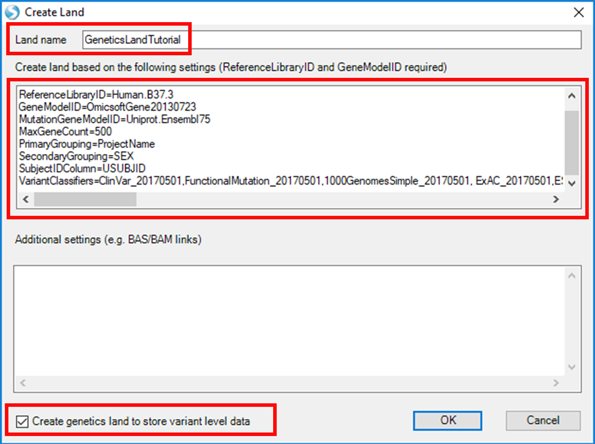
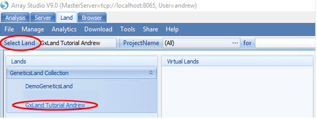

# Introduction to GeneticsLand

GeneticsLand is a robust solution for storage, integration, querying, and visualization of big genetic datasets   up to a million samples, each with 100 million genotypes. This includes both subject-level data, such as genotypes, and summary statistics like allele frequencies and genotype-phenotype association results. In addition to the genetic data repository, GeneticsLand will dynamically join additional data at both the variant and sample level. It currently contains variant annotations from more than fifteen sources and can handle any type of sample attribute (phenotype or clinical measures, QC and tracking information, *etc.*).
There are numerous tabular and graphical visualizations for exploring the data in the context of a variant, gene, genomic region, or phenotype of interest. These include standard displays like allele frequency distributions, Manhattan plots, and region plots as well as advanced views like the OmicSoft Genome Browser, all of which are highly configurable.

## Download Demo Dataset

We will be using a small simulated dataset during this tutorial. Please download from here:
[^link^](http://omicsoft.com/downloads/data/Tutorial/GeneticsLand.zip )

to a location that is both accessible from your client machine and Array Server
(if you don t know which locations are accessible to Array Server, consult with your server admin).
This dataset consists of several files that you would be expected to generate during a typical GWAS experiment:

*   Sample information (demographics, phenotypes, *etc*.)
*   Assayed genotypes
*   Imputed allele doses
*   Genotype-phenotype association results

Note, you may begin the first few steps of the tutorial while the data are downloading.

## Create a GeneticsLand

This tutorial is intended as a training exercise, and thus you will begin by creating your own Land, so as not to affect any existing GeneticsLands that are actively being used by others with real data. Generally, it is best to maintain a single primary GeneticsLand, containing all of your institution s genetic data, to benefit from all of the cross-dataset integration features.

To create a GeneticsLand, go to the *Land* tab and from the **Tools** menu, select **Create Land**:

Enter a *Land name*, specify the configuration (below), and tick the box to *Create genetics land to store variant level data*. Then click the **OK** button and wait momentarily as the Land is created.::

	 Description=GeneticsLandTutorial
	 ReferenceLibraryID=Human.B37.3
	 GeneModelID=OmicsoftGene20130723
	 MutationGeneModelID=Uniprot.Ensembl75
	 MaxGeneCount=500
	 PrimaryGrouping=ProjectName
	 SecondaryGrouping=SEX
	 SubjectIDColumn=USUBJID
	 VariantClassifiers=ClinVar_20170501,FunctionalMutation_20170501,1000GenomesSimple_20170501,
	 ExAC_20170501,ESP6500_20170501,RegulomeDB_20170501,HaploregV4_20170501,Conservation_20170501,
	 GWAVA_20170501,GRASP2_20170501,GTexEqtl_20170501,GWASCatalog_20170501,UK10K_20170501,
	 Wellderly_20170501

Note, if this is the first GeneticsLand ever created on this server, please log off the server and restart it to trigger downloading of the relevant reference files before proceeding (contact your server admin if you don t know how to restart it). Also note, we have specified ReferenceLibraryID=Human.B37.3 in the configuration above. All data we add to the Land in subsequent steps must also use this build.

### User Permissions in Creating a GeneticsLand

If you are not a member of the Array Server *Administrators* group, you will not be able to create a new GeneticsLand. Please ask an Array Server Administrator to create the Land. Then, the Administrator should connect to the test GeneticsLand and using the Manage User access function, change your User permissions to allow Write/Publish (for this Land only). Permissions should also be granted for other GeneticsLand management functions, such as **Refresh/Rebuild**, **Manage Meta Data** and **Manage Measurement Data**.

## Open a GeneticsLand
After the Land has been created, open it from the *Land* tab using the **Select Land** menu to find it under the **GeneticsLand Collection** heading.

As a new Land without any samples, you will see an empty *Sample Distribution* view like this:

