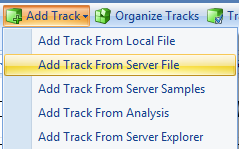
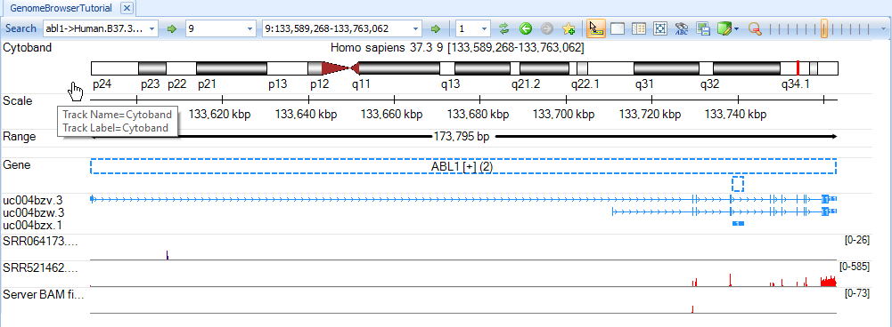

# Adding Tracks

A number of data types can be added as tracks including:

*   Alignment files, e.g. BAM, SAM
*   Files with standard format, e.g. BED, bedGraph, GTF, VCF, BigWig
*   Tab-delimited text files containing genomic coordinate information columns (chromosome, start, end)
*   Pre-built mapping tracks by Omicsoft, e.g. Affymetrix probes and probesets track, SNP
*   Data sets in Analysis tab of Array Studio, e.g. NGS data sets, variable view of -omic data sets

This section focuses on adding next generation sequencing data files (BAM files). A common task is to add alignment tracks, e.g. BAM files. The BAM alignment track can display a variety of information such as coverage, exon junctions, pileup, profiles, sequences, and variations.

In this tutorial we will add BAM files from a server drive. First, go to **Add Track | Add Track From Server File**.

## Adding BAM Files As Single Tracks

In the *Specify Track Source* window, select **Alignment track | Sorted BAM file**.

Choose the two BAM files, *SRR064173.subset.bam* (RNA-Seq alignment) and *SRR521462.subset.bam* (DNA-Seq alignment). Click **Open**.

The two new BAM tracks will appear at the bottom of the browser. The first time that tracks are added, it may take a few minutes while indexing is performed. This only occurs once.  

The user can zoom in and out using the mouse wheel or zoom tool at the top right of the tool bar.

We can navigate to a gene region by typing a gene symbol, e.g. *abl1*, in the search box (on the top-left corner, arrow). The coverage will be displayed in red in exon region and blue in intron/intergenic regions.

## Adding BAM Files As Combined Tracks

The user can choose to merge multiple BAM files into a single track. In the Specify Track Source window, select **Alignment track | multiple sorted BAM files**.

Choose the four fusion BAM files and click **Open**.

A new track from four BAM files is created in Genome Browser:

