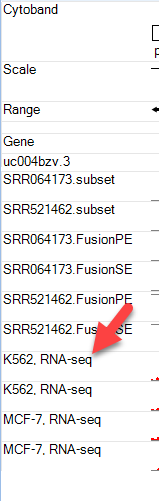

# Browsing Data from Analyses

Array Studio provides convenient views of -omic and NGS data in genome browser. The Analysis tab has been fully integrated with the Browser tab in Array Studio.

## Open NGS Data in Genome Browser

We created the *TutorialRNASeq* and *TutorialDNASeq* projects in the RNA-Seq and DNA-Seq tutorials. The user can open both projects in Analysis Tab.

NGS data sets in Analysis projects can be directly loaded into a Genome Browser by going to the Browser tab and clicking **Add Track | Add Track from Analysis | Alignment track: NGS data**.
It will ask user to select NgsData loaded in any open (Local and Server) projects.

Alternatively, in the Analysis tab, user can add new genome browser on NgsData directly:

## Open OmicData/Table in Genome Browser

By using **Add Track | Add Track from Analysis**, user can add Omic Data, such as CNV and MicroArray data, and table data directly to genome browser, as long as they have the chromosome, start, end annotation columns. In this module, we will load data from the CNV Tutorial analysis performed as part of the training module. In the **Analysis** tab at the top of the screen, click **File | Open Local Project** and open the CNV Tutorial. Next, try adding this data to the **Genome Browser**.

First, try choosing the option *Segment track: segment data* and click "OK".

Find your open segment table from the CNV tutorial and click **OK**:

Choose the default options and click "OK" again:

You will see two additional tracks appear in your **Genome Browser**: *Log2RatioMean* and *CNStatus*. Browse to chromosome 13 within the toolbar and you will find that the "Beta2" sample has a *log2RatioMean* of ~0.35 and a corresponding copy number status of 3 for a large portion of the chromosome:

Users can zoom in on regions of interest by using magnification tools in the upper right part of the browser, the click wheel of a mouse, or by simply holding *Shift* and left-clicking to highlight a region.

In addition to the segment tracks, one can upload additional CNV tracks. Go to **Add Track | Add Track from Analysis**:

This time, choose the option *Numeric track with multiple series: CNV data*:

Find your CNV analysis output and click **OK**. Select the data you want to visualize and click **OK**. Here, we choose all the data and set all other parameters to default:

In this view you can visualize the individual SNPs on the CNV chip and their position within the genome. This can also be achieved by going to the Table view of the CNV data, right-clicking on individual SNPs, and selecting the genome browser view:

As you can see with this SNP, our top sample, has an elevated log2 value relative to the other samples. Users are encouraged to explore display options to adjust track height, width of data points, and more:

Users are encouraged to explore additional features of the genome browser with their own data.

##Viewing ENCODE Data in the Genome Browser

Currently, nearly 20,000 ENCODE tracks are available for the OmicSoft Genome Browser for Human Genome Reference version 37.3, over 30,000 tracks for Human Genome Reference version38, and over 12,000 tracks for Mouse Genome Reference version 38. These tracks include alignment (bam), coverage (bigWig/gcf), and feature annotation (broadPeak/narrowPeak/gtf/gff3) files. To find tracks of interest, use the Filter Window on the left to subset available tracks by Data Type, Output Type, Assay Terminology Name, Organ, etc.

Users can quickly add genome coverage and annotation data for thousands of ENCODE project experiments, to compare to their data in the Genome Browser. To add ENCODE data, **click Add Track | Add Track from ENCODE**

###ENCODE Filters and Data Types

Because of the sheer abundance in ENCODE tracks (almost 20,000), users will need to filter tracks based on different attributes to find tracks they are specifically interested in. When you add an ENCODE track, you will see a view listing all ENCODE tracks available. On the left side of the window, you should see a number of filters:

Some of the most commonly-used filter columns for assay type are described below:

* Data Type: The display track type:
	* Aligned sequence data - bam
		- BAM tracks load from the actual .bam files, so exon junction, variation, and sequence data for individual reads can be displayed. However, these data are quite large, so BAM tracks can take a long time to update.
	* Coverage track - gcf, bigWig
		- BigWig tracks are genome coverage data generated by ENCODE.
		- GCF tracks use OmicSoft's custom binary coverage format, enabling extremely fast streaming of genome coverage data. OmicSoft has processed every ENCODE .bam file into a .gcf file, to dramatically improve load times for these data.
		- BAM, GCF, and BigWig tracks are displayed as coverage files. When you only want genome coverage for a sample, GCF files will load much faster than .bam or BigWig files

		* Peak calls - broadPeak, narrowPeak
		- BroadPeak/NarrowPeak tracks are usually generated by peak-calling algorithms, using different settings, and usually mark high-confidence regions of increased signal (e.g. chromatin accessibility, ChIP signal, etc).
	* Feature annotations - gff3, gtf
		- GTF/GFF tracks display feature annotations, such as predicted promoter sites based on CAGE or RAMPAGE assays.
* Output Type: The measurement represented by the track
* Assay Terminology Name: Experimental procedure to generate data (categorized by Assay Category)
	* Transcription - RNA-seq, CAGE, RNA-PET, RAMPAGE
	* DNA accessibility - DNAse-seq, FAIRE-seq, MNase-seq
	* Protein/RNA/DNA binding - ChIP-seq, RIP-seq, eCLIP, iCLIP

### Adding ENCODE Tracks

In this module, we will select additional RNA-seq tracks from ENCODE performed on the K562 and MCF-7 cell lines used in the RNA-seq tutorial. To identify these tracks, we will use the following filters/features: **File | Data Type | gcf**, **Experiment | Assay Title | RNA-seq**, and **Biosample | Term**. For the **Term** filter, create an entry for "K562 OR MCF-7". In total, these filters will select RNA-seq alignment coverage from the same cell lines used in the RNA-seq tutorial:

Notice in the upper right hand corner of the window that the number of files available to view reduces with the addition of each filter. For this tutorial, we will load just four of the tracks (2 files from each cell line). Find the four files at the bottom of the table - they should have a description under the column "Biosample Description" that reads: "RNA Evalution (K562 or MCF-7) Long Total from Graveley. Left-click and select all four files (holding down *Shift* or *Control* to select multiple files). Click *Add Tracks* on the bottom of the window. One can also combine tracks by using *Add Grouped Tracks* while multiple files are selected. This will function similar to grouping .gcf files when adding tracks in the beginning of this tutorial.

Click **Close** to return to the **Genome Browser**. You will find that the four new tracks have been added to your view.

### Customizing and Viewing ENCODE Tracks

Once tracks have been added, the Genome Browser is fully customizable to better visualize the data. For instance, the track name is not an easy to understand identification, so the user can change this by going to **Organize Tracks** and clicking on the **Metadata** tab. As you scroll from left to right, the *Assay Title* and *Term* column headers are good indicators of what these samples are. Highlight the four new ENCODE tracks, and click **Set Labels**. Choose the *Term* and *Assay Title* columns to be listed and click **OK** twice.

The new ENCODE tracks now have simpler identifiers:

Now the user can examine these tracks and compare them to their own data. In this example, we have zoomed in on the 5' end of ABL1. As you can see below, there is a pileup of reads spanning the region of intron 1 where the BCR-ABL1 fusion has occured in K562, while there are no such reads in the MCF-7 cells line.

Users are encouraged to explore the many ENCODE tracks available to enhance their analyses. Once the tracks of interest have been loaded and identification changed in the genome browser, use **Track Properties** to adjust track heights, colors, and more. For example, in the image above, notice that the track height is set to 0-100 for all four ENCODE BAM files that were added. This allows us to visualize the alignment coverage at the same scale for each of these four tracks.
