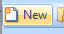

#Create Genome Browser

A new browser can be created by choosing the **New** 
button on the toolbar, or by going to **File | New Browser**.

A window will appear and allow the user to specify a reference genome build and gene model track to be loaded into the new browser. If the Reference or Gene model is not listed, the user can build one using Array Studio tools (**NGS | Build Reference or Gene Model**). Select the Human.B37.3 Reference and the OmicsoftGene20130723 gene model.

Clicking the **Browse** button allows the user to specify a location to save the Genome Browser:

Note:

1. If one intends to load a BAM alignment track, the reference in BAM headers has to match the one in the Genome Browser. 
   The version of reference genome in the BAM file can be checked using Array Studio (**NGS | Tools | Bam Tools | Extract header and infer reference**).

2. If the user has connected to a server, the newly created genome browser will be a server genome browser, 
   the window for creating a genome browser will be slightly different from creating a local genome browser, 
   and the server genome browser will use reference genome from server (if your server already has that genome reference, 
   you won't need to download it again).

3. For server genome browser, users can still add tracks from local files, but alignment file can't be shared (users can only share the genome browser when they are connected to the server).

After creating a new browser, the default browser window for the chromosome 1 is shown.

