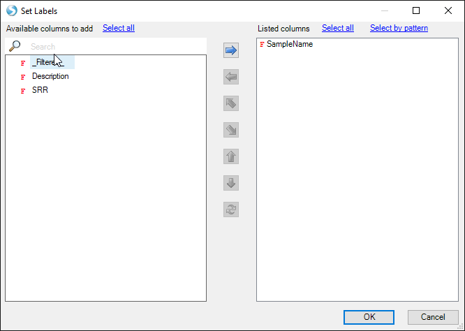
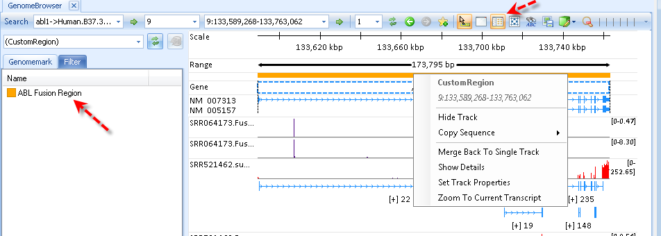

# Additional Browser Options

In this chapter, we will explore additional features users can utilize to change the display on the browser, mark specific genome locations, search specific sequences, and share browser views with others.

## Organize Tracks

Click **Organize Track** on top.
It will allow user to add meta data for tracks.

In the **MetaData** tab, user can import meta data for track. Click **Load Meta | Import Table | Tab delimited file | OK** and find the file "Design.txt" you downloaded with the BAM files. Click **OK** to load the design.

The Track label can be switched to any column in the meta data. For example, select the column header "Sample Name" and click **Set Labels**:

Move the column SampleName to the ""Listed columns" and click **OK** twice:

Notice the track names have now changed to reflect this transformation:

## Track Properties

Click **Track Properties** on top or right click select **Set Track Properties**.
It shows all properties that the user can specify, such as color, font, cutoffs to hide/show coverage, exon junctions, mutations and read sequences.

## GenomeMark

GenomeMark is a bookmark-like utility in genome browser. Adding regions into GenomeMark will record genomic regions.
The user can jump back to marked regions by a single click on the GenomeMark.

Click **favorite star** icon to bookmark the current region:

User can open GenomeMark and jump to marked regions:

Left click on the color line to modify the GenomeMark properties.

The user can also import GenomeMark regions via **File | Import Custom Regions** from gene lists or bed files.

## Sequence searching
The OmicSoft GenomeBrowser also allows searching for DNA and RNA sequences.

First, click the "Show/Hide Sequence Search Toolbar", which will add a new toolbar below the main toolbar.

Enter a DNA or RNA sequence string in the "Sequence" search window (shortest sequence for search is 15nt), and click the green arrow to the right.

The user can specify whether DNA or RNA sequence should be searched, which specifies whether genomic or transcript sequences (including inter-exonic sequences) should be searched.

In addition, the user can specify whether partial or full alignments should be searched, and whether to search only the visible region. Genomic coordinates to Sequence Searches will be saved in the GenomeMark navigator, under the SequenceMatch sub-heading.

!!! note
    If running ArrayStudio and logged into ArrayServer, a user will get the following message when ArrayServer has not been used to perform an aligment with the chosen *Genome Reference* and *Gene Model* used to start a Genome Browser:

If this occurs, there are two solutions to this error and they are outline here:
[^link^](http://www.arrayserver.com/wiki/index.php?title=Automatic_index )

##Sharing Genome Browser

If user has ArrayServer and the Genome Browser was created using server components (reference and server BAM files), the Genome Browser is sharable on the server where others can then access it (provided that they have the necessary privileges).

Click **Share | Share Genome Browser**, specify the genome browser title and privileges.

Click **OK**

If user has Outlook opened, an email draft with a link will be created.

Other users can open the Genome Browser by clicking the link or open it based on genome browser id (gb000016) in **Share | Open Shared Genome Browser**.
