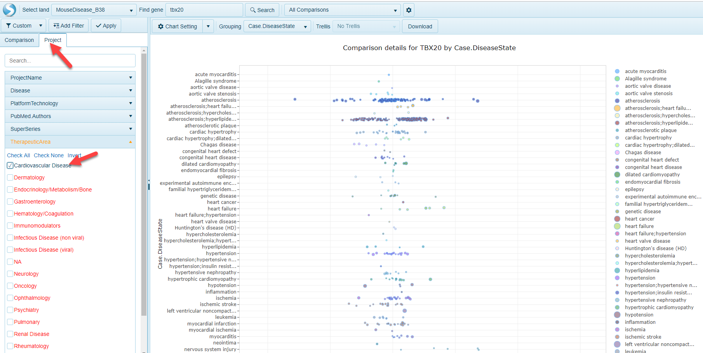

# LandExplorer Comparison Explorer

OmicSoft has added an optional Comparison Explorer to the Land Explorer interface. Here users can view a distribution of all comparisons represented within OmicLands, grouped by disease or tissue, with interactive pie charts and tree blocks that allow users to view and click through to OmicSoft-curated comparison(s) of interest. On this help page, we describe the usage of the Comparison Explorer. Users can navigate to the Comparison Explorer using the menu button in the top right corner of the screen:

## Comparison Explorer

The Comparison Explorer has been designed to allow users to quickly access comparison data of interest. Comparison metadata from multiple lands has been unified to allow users to quickly filter to comparisons of interest and pre-filter a Land to 1) access full comparison results for a comparison of interest, or browse comparison results for a single gene.

### Filter samples

OmicSoft lands are curated to include key metadata across all Land types (such as OncoLand and DiseaseLand). In the filtering section of the Comparison Explorer, users can filter samples across all lands using comparison- and project-level metadata. If a user would like to filter comparisons on broad areas of focus, comparisons can be filtered by Tissue (i.e. TissueCategory or Tissue) as well as Disease (i.e. DiseaseCategory or DiseaseState). Projects are also curated using the broader "Therapeutic Area" term. On the other hand, if a user has a specific publication or public dataset they would like to search for, the ProjectName and PubMed filters will allow for searching of specific projects.

### Cross-Land Distribution

The distribution view is a common way to visualize how many comparisons are available using the filters selected on the left-hand side of the webpage. The default visualization will be a plot that shows the number of comparisons (ranked from highest to lowest), grouped by Case.DiseaseCategory on the y-axis. To view the distribution grouped by Case.TissueCategory instead, simply click the toggle at the top of the screen.

In addition, by scrolling over the bars in the plot, users can quickly identify how many comparisons belong to that category (colored by Case.Tissue when grouping by Case.TissueCategory in the image below):

### Comparison Pie Charts

The stacked pie charts in the upper right portion of Comparison Explorer allow users to visualize more details about the comparisons filtered to. The inner circle of the pie charts represents the proportion of comparisons represented by the Land, colored by Land. For example, the example below has been filtered by TherapeuticArea of Cardiovascular Disease and the pie charts have been updated to have to colors in the inner circle, representing MouseDisease_B38 and HumanDisease_B37. Scrolling over the circle will reveal the Land represented (the gray portion representing HumanDisease_B37):

The outer portions of the pie charts represent the Comparison Category (left) and Therapeutic Area (right) represented by each land. Not surprisingly, in the example above, the majority of these are under the Therapeutic Area of Cardiovascular Disease (with some cross-listed in other areas). For this example, there are also a number of Comparison Categories, such as Treatment vs. Control, Disease vs. Normal, Responder vs. Non-responder, etc. Scrolling over each color will show how many of each are found for the corresponding land (inner circle):

### Land Comparison TreeBlock View

A user can quickly identify which Land(s) the filtered comparisons in with this view belong to. The blocks are sized based on the overall proportion of the comparisons represented in the selected land.

## Interactive Views

Each of the views in the Comparison Explorer are interactive and allow users to quickly visualize additional comparison details at the project level, as well as the gene level within the respective land.

### Browse Comparisons and Volcano Plots

When users click on the bars in the Cross-Land Distribution or Comparison Pie Charts, Comparison Explorer will populate a Comparison Details table. This table can be scrolled up and down and filtered further using the controls at the top of the table:

Also, by clicking on one the comparisons, users can quickly go to the Volcano plot view that will represent the differential expression of all genes in the chosen comparison:

### Open Land to Gene-level Comparisons view

Within the tree block view, a user can click on a Land and a search window will appear. For example, in the Pie Chart example from above (pre-filtered to TherapeuticArea of Cardiovascular Disease), clicking on the MouseDisease_B38 block at the bottom a search window appears:

Typing a gene name, such as TBX20, and selecting the Search button will allow a user to open up the [AllComparisons](../Land Views/Gene Level Views/AllComparisons#all-comparisons) view, prefiltered to the Project metadata (Therapeutic Area) using the Comparison Filters:

