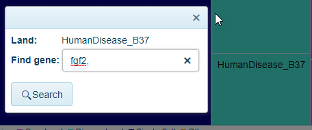

# LandExplorer FrontPage

OmicSoft has added an optional FrontPage to the Land Explorer interface. Here users can browse data across all available lands to identify samples of interest. On this help page, we describe the usage of the FrontPage.

## Sample Explorer

From the Sample Explorer, if users are interested in a specific Land, they can choose the appropriate Land from the drop-down menu at the top of the screen *Select Land* and click the search button.

* When performing a search without selecting a gene (1), users will be taken to the [sample distribution view](../Land Views/Sample Level Views/Samples.md) to display all samples in that land.

* When performing a search after selecting a gene (2), users will be taken to the [Gene FPKM view](../Land Views/Gene Level Views/RnaSeqQuantification#gene-fpkm-view) to display all samples in that land.

### Filter samples

OmicSoft lands are curated to include key metadata across all Land types (such as OncoLand and DiseaseLand). In the filtering section of the Sample Explorer, users can filter samples across all lands using these metadata, including the Land Collection (OncoLand, DiseaseLand, BodyMap, SingleCell). For a full description of the OmicSoft Lands, please visit [here](http://www.arrayserver.com/wiki/index.php?title=Introduction_to_Land_Content). Land samples can also be filtered by the species and genome used to process the data, the type of data available, and what tissues samples came from.

### Cross-Land Distribution

The distribution view is a common way to visualize how many samples are available using the filters selected on the left-hand side of the webpage. The default visualization will be a plot that shows the number of samples (ranked from highest to lowest), grouped by tissue on the y-axis.

### Collection Summary

This table in the upper-right corner of the Sample Explorer will display details of how many samples exist for the filtered samples, including the data types available (RNA/DNA-seq, CNV, microarray and proteomics assays)

### Collection TreeBlock View

A user can quickly identify which Land(s) the filtered samples are in with this view. The blocks are sized based on the overall proportion of the samples are represented in the selected land.

#### Open Land to Filtered Gene FPKM view

Within the tree block view, a user can click on a Land and a search window will appear:

Typing a gene name and selecting the Search button will allow a user to open up the [GeneFPKM](../Land Views/Gene Level Views/RnaSeqQuantification#gene-fpkm-view) view, prefiltered using the FrontPage Filters:

#### Open Land to Filtered Land view

Without entering a gene, clicking the search button will take users to the [sample distribution view](../Land Views/Sample Level Views/Samples.md) to display samples, prefiltered using the FrontaPage Filters.
