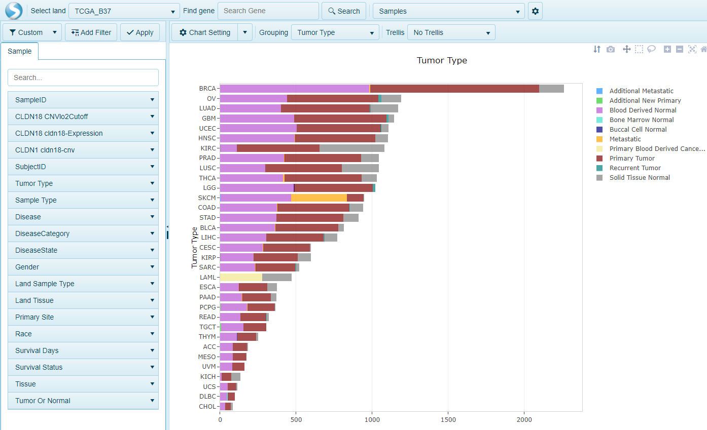
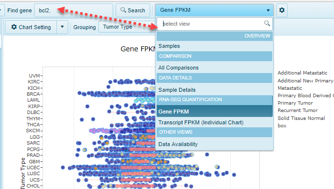

# Introduction

## Land Portal

OmicSoft uses ArrayLand framework to deliver large data service results. ***Land Portal*** is the quickest way to explore OmicSoft Land data (OncoLand, DiseaseLand, GeneticsLand, and Internal Lands). The streamlined web interface uses our most popular visualizations to help researchers and clinicians explore OmicSoft Lands.

Once users configured Land Portal on both Windows Server and ArrayServer internally, all ArrayStudio/ArrayLand users can log in to Land Portal and search all types of genomics profiles of a single gene or a set of genes instantly with rich visualizations.

This tutorial is mainly based on TCGA Land Portal. Please refer to the OncoLand Whitepaper, available through the Help menu item, for descriptions of all available land portals within Land Portal.

## Log in to Land Portal

Once you connect to the **LandPortal** server, you can find the TCGA land data by default, users could switch to other Land portals by clicking **Select Land**:

The default **TCGA_B37 Land Portal** view shows a histogram plot of samples grouped by tumor type. Other views are also available for users to query the sample data at a general level.

## Select views

### Overview

Besides the default Samples view which shows the number of samples in each tumor type. Other views like Data Avaliability and Table View are also available for users to query the sample data at a general level.

### Gene level view
When one gene or a gene set has been inputted, there will be more views available, like DNA-Seq, Somatic Mutation Distribution, RNA-Seq, Gene FPKM, Transcript FPKM, etc.

## Customize Views
Users could also customize the available views for selected genes/transcripts.

## Filter samples for the view
Users could also customize the view for a selected gene/transcript by filtering samples.

