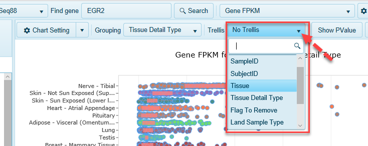
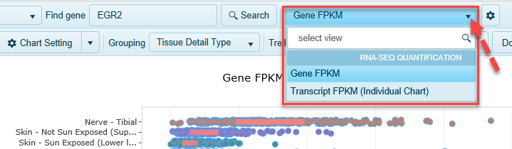

# Land Explorer for IPA

Explore detailed expression patterns across human tissues directly from IPA’s Isoform Views. Land Explorer for IPA provides interactive plots of gene expression in 51 different human tissues from the GTEx project, for the gene level and individual splice variants. Learn more about the details underlying IPA’s IsoProfiler, and visualize patterns of differential transcript utilization across profiled tissues, or profiled by any metadata.

## Accessing Land Explorer for IPA

IPA users can examine detailed expression patterns across human tissues directly from IPA's Isoform Views.

From IPA's Isoforms View for your gene of interest, click **"View Expression in Land Explorer"** to open the web portal, displaying expression information for your gene.

**Land Explorer for IPA** plots the expression of the splice variants of any human gene in 51 different human tissues. Gene-level expression is also available in Land Explorer (see below).

You can find detailed information about navigating Land Explorer's [gene and transcript level Views](../Land Views/Gene Level Views/RnaSeqQuantification.md),
and [filtering data](../Using Land Explorer/Filters/Filters.md).

## Tips and Tricks

###	Filtering on metadata

You can use the extensive metadata for each sample in GTEx to focus only on the samples of interest to you, such as Tissue, Gender, etc.

 1.	Find metadata of interest, then select only the categories you want
 * For example, under **Tissue tab**, click **"Check None"** then keep only four tissues.
 2.  Click Apply button to apply the newly created filters

### Regrouping on metadata
You can re-organize all samples along the Y-axis based on any metadata. For example, you can find more detailed tissue-level information by grouping on **Tissue Detail Type**. 
 

###	Trellis on metadata
Separate samples out into entirely different charts using the **Trellis** option.

 

### Switch between transcript-level and gene-level View
By default, expression data for your gene of interest is displayed for transcripts, but you can also view gene-level expression information.

 

###	Search for a new gene
While you are in **Land Explorer for IPA**, you can search for expression of other genes of interest, simply be typing in your gene's identifier in **Find Gene**.

 

Land Explorer for IPA is available at no charge for all IPA users, and does not require registration or manual sign-in, providing gene expression data from GTEx. 

For full access to hundreds of thousands of samples from healthy and disease tissue, please request a trial of the full OmicSoft Land Explorer: https://www.qiagenbioinformatics.com/land-explorer/.
