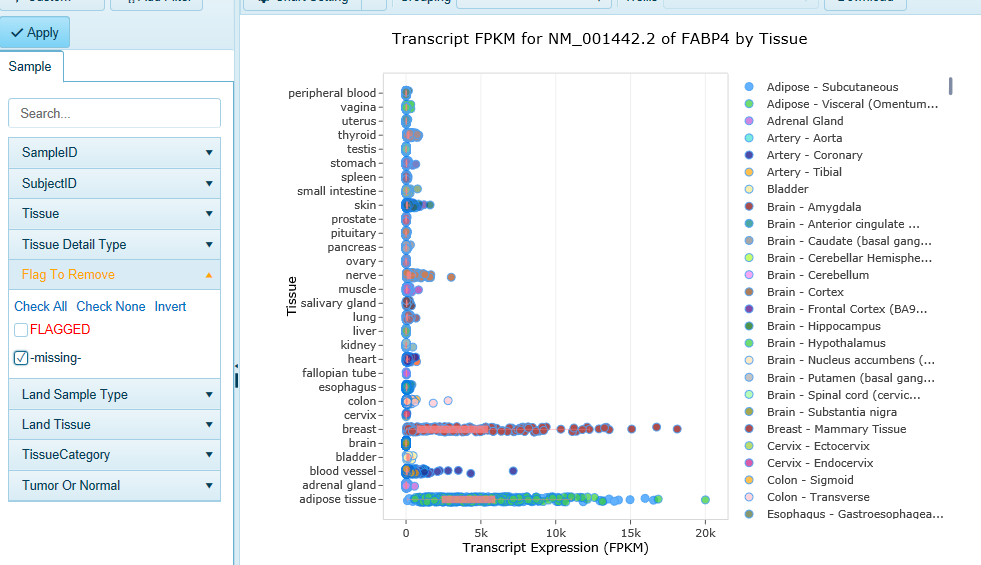

# Land Explorer for IPA

Explore detailed expression patterns across human tissues directly from IPA’s Isoform Views. Land Explorer for IPA provides interactive plots  of gene expression in 51 different human tissues from the GTEx project, for the gene level and individual splice variants. Learn more about the details underlying IPA’s IsoProfiler, and visualize patterns of differential transcript utilization across profiled tissues, or by profiled any metadata.

## Accessing Land Explorer for IPA

IPA users can examine detail expression patterns across human tissues directly from IPA's ISoform Views.
From IPA's Isoforms View, click "View Expression in Land Explorer" to open the web portal, displaying expression information for your gene.

Land Explorer for IPA provides interactive plots of gene expression in 51 different human tissues from the GTEx project, for both gene level and individual splice variants. You can filter the view for a particular tissue, or filter on metadata suc

Navigate to sample-level human tissue expression for human genes via links in isoform view. Click the link (shown in the red box) to view the Land Explorer for IPA web page that plots the expression of the isoforms (splice variants) of a human gene in 51 different human tissues. Gene-level expression is also available in Land Explorer.

You can find detailed information about navigating Land Explorer's [gene and transcript level Views](../Land Views/Gene Level Views/RnaSeqQuantification.md),
and [filtering data](../Using Land Explorer/Filters/Filters.md).
