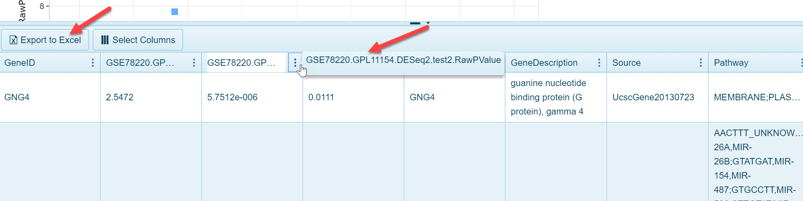

The OmicSoft Land curation teams carefully curate samples in the Land using a controlled vocabulary for each project. For each project containing RNA-seq or microarray data, the curation team will generate sample groupings (often matching the ones used by the authors, as well as other meaningful ones) such as Disease vs Normal samples, or Treatment vs. Control samples. The Land Explorer allows users to browse overall comparison reports (DEseq2 for RNA-seq data and General Linear Model for microarray studies) in a volcano plot view. Within a land, users can search for an individual comparison in the search bar:

As shown in the screenshot above, fold change is plotted on the x-axis (log2 fold change) and p value is plotted on the y-axis. Each dot represents an individual gene. Selecting dots in the view will populate the details table at the bottom of the view:

As seen above, users can export this data to Excel, or simply browse the information to see the specific fold change and p value for the comparison result.
