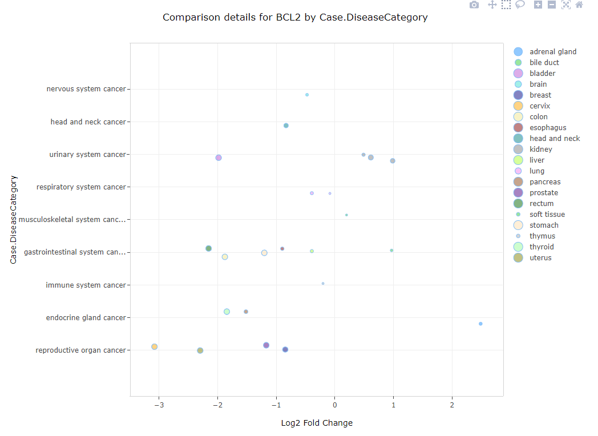

# Comparison views

The OmicSoft Land curation teams carefully curate samples in the Land using a controlled vocabulary for each project. For each project containing RNA-seq or microarray data, the curation team will generate sample groupings (often matching the ones used by the authors, as well as other meaningful ones) such as Disease vs Normal samples, or Treatment vs. Control samples. The Land Explorer allows users to browse gene level information for these types of comparisons in a simple "bubble plot" view. When searching a gene, and choosing this view, the fold change of the gene will be plotted (each bubble, or dot represents a single comparison). The y-axis will group the comparisons by the primary grouping category, while the x-axis will represent the Log2 Fold change of that gene. The size of the dots will reflect the p value from the comparison (DESeq2 for RNA-seq and General Linear Model for microarray). Selecting dot(s) in this view will populate a Details table at the bottom of the view showing some key metadata from the comparison(s)

The views below can be filtered to comparisons of interest. For information on customizing comparison views, please see: [Comparison Filter](../../Using Land Explorer/Comparison_filters.md)

## All Comparisons

This view combines all comparisons for a gene into one view. In this view, all of the different types of comparisons in the select Land will be plotted:

 

## Disease vs Normal

This view shows all comparisons where samples from affected subjects (i.e. Tumors or Disease) are compared to samples from normal subjects in the same project:

 

## Treatment vs Control

This view shows all comparisons where samples from affected subjects (treated with drug or other therapy) are compared to samples from untreated subjects in the same project:

 

## Responder vs NonResponder

This view shows all comparisons where samples from subjects that show favorable response to a treatment are compared to samples from subjects with no response to the same treatment in the same project:

 

## Resistant vs Sensitive

This view shows all comparisons where samples from subjects that show resistance to a treatment are compared to samples from subjects showing significant difference in outcome to the same treatment in the same project:

## Cell Type1 vs Cell Type2

This view shows all comparisons where samples of one cell type from a subject are compared to samples another cell type from these subjects in the same project:

 

## Disease1 vs Disease2

This view shows all comparisons where samples from subjects presenting one disease are compared to samples from other subjects presenting another disease in the same project:

 

## Treatment1 vs Treatment2

This view shows all comparisons where samples from subjects undergoing one treatment are compared to samples from other subjects undergoing a different treatment in the same project:

 

## Tissue1 vs Tissue2

This view shows all comparisons where samples of one tissue from a subject are compared to samples another tissue from these subjects in the same project:

 

## OtherComparisons

This view shows all comparisons that do not fall under the standard categories above:

 
