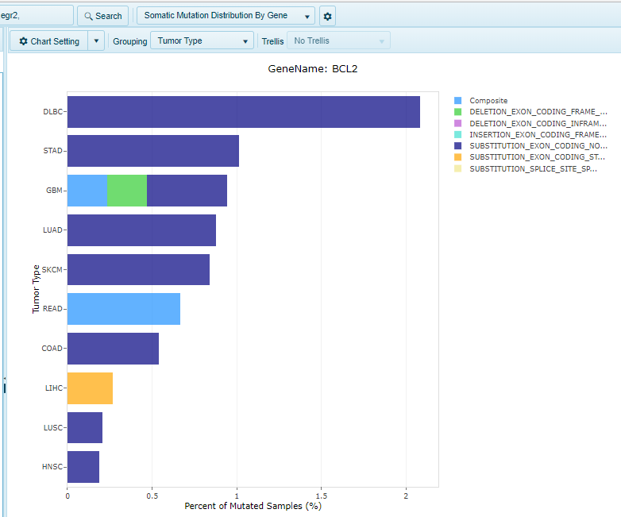
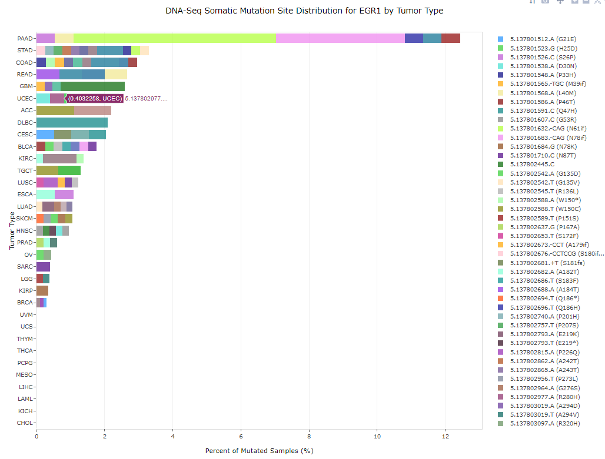

# DNA-seq views

Omicsoft Lands hold a number of mutation calls from DNA-seq data. The mutations attributed to this data can be viewed in many formats. This page describes how users can browse these data types.

## DNA Alteration Distribution

The alteration distribution view shows all alterations (mutations and copy number) of gene(s) for the samples in the Land. searched in the current view, limited to DNAseq alterations (mutations and copy number, such as amplification or deletion events). Samples with multiple calls will be represented as such. The view will plot the percentage of samples within each group (specified in the Grouping dropdown menu) that is altered for the gene of interest. In the example below, the % of samples with such alterations are plotted for the gene BCL2. The graph will be plotted in order of magnitude of alterations (with the highest percent at the top of the graph). For BCL2, it is most affected in DLBC (Diffuse B-cell lymphoma), with roughly 10% of samples in this group showing either CNV (Amplifications, red) or DNA-seq mutations (green):

Copy number calls are derived from GISTIC2 calls, and only represent samples with the status Amplification (gain of at least 2 copies) or Homozygous Deletion (loss of both copies). For DNA-seq mutation calls, the MUT category refers to non-synonymous mutations. Filters for each data type can be altered using the CNV and Mutation filters, respectively, on the left.

## DNA Alteration Distribution By Gene

For multi-gene searches, all mutation and CNV data will be compounded for the genes in the search to identify samples with an alteration in any of the genes queried using the DNA Alteration Distribution View. If a user is interested in the per-gene distribution of samples (rather than compounded distribution), the "DNA Alteration Distribution By Gene" will generate one chart per gene queried.

## Somatic Co-Mutation Frequencies

DNA-Seq somatic co-mutation frequencies shows a bar plot of # genes with mutation vs frequency of mutation. For instance, for a gene set of BRAF and PTEN, a bar will be shown for samples exhibiting 0, 1, or 2 mutations.

## Somatic Mutation Pattern

DNA-Seq somatic mutation pattern view shows a bar plot showing the number of mutations matching a particular pattern for the specified gene set across a grouping (e.g. Tumor Type).

## Somatic Mutation Distribution

Similar to the DNA Alteration Distribution View, this view displays histograms of DNA-Seq Somatic Mutation Distribution. In this view, only mutation events will be taken into consideration when calculating the percentage of affected samples in each group. As you can see in the view below, for the gene BCL2, only mutations are plotted. In the legend, a full description of the type of mutation (Indel, Deletion, Substitution) will be displayed.

## Somatic Mutation Distribution By Gene

For multi-gene searches, all mutation data will be compounded for the genes in the search to identify samples with a mutation in any of the genes queried using the Somatic Mutation Distribution View. If a user is interested in the per-gene distribution of samples (rather than compounded distribution), the "Somatic Mutation Distribution By Gene" will generate one chart per gene queried.

## Somatic Mutation Site Distribution

The Somatic Mutation Distibution View displays gene-level distribution plots of all mutations. If users are interested in viewing the distribution of distinct alleles of a gene for the same grouping, the Somatic Mutation Site Distribution is the needed view. This view shows the percentage of each allele identified as a DNA-Seq Somatic mutation, organized by Group (e.g. Tumor Type). The x-Axis shows the percent of mutant samples:

## Somatic Mutation Site Distribution By Gene

For multi-gene searches, a Somatic Mutation Site Distribution will be plotted for each gene in the search, displaying percentages of each allele for the gene specified in the chart title.
