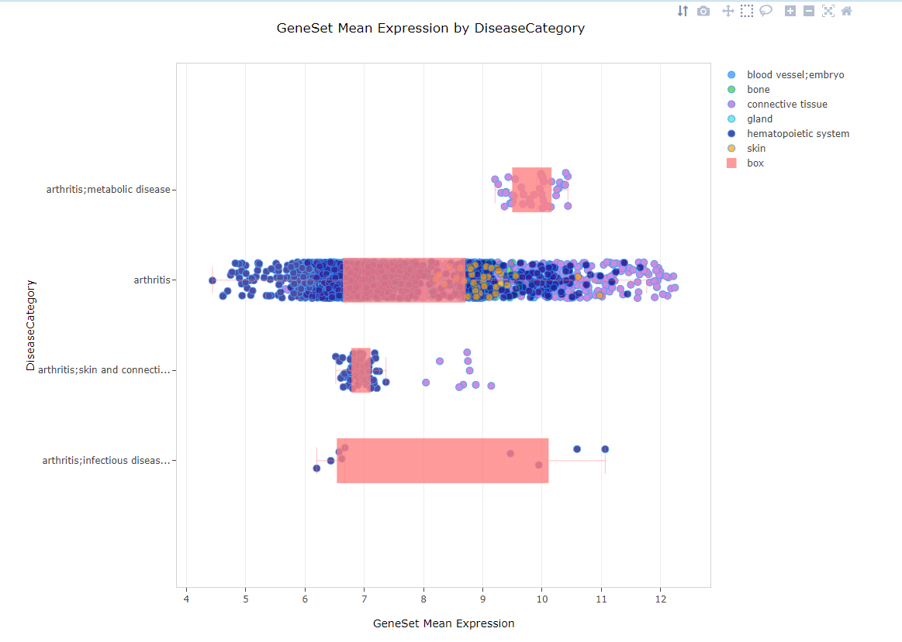
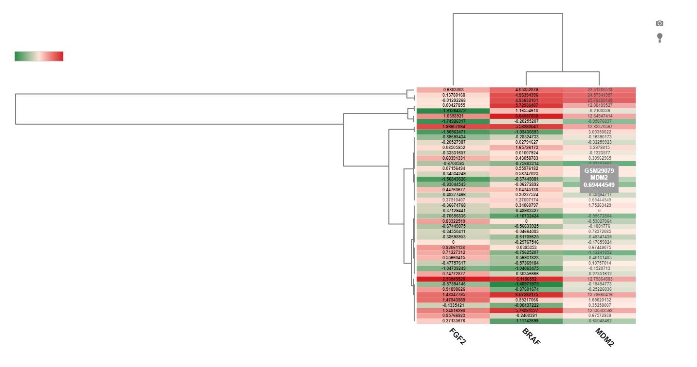
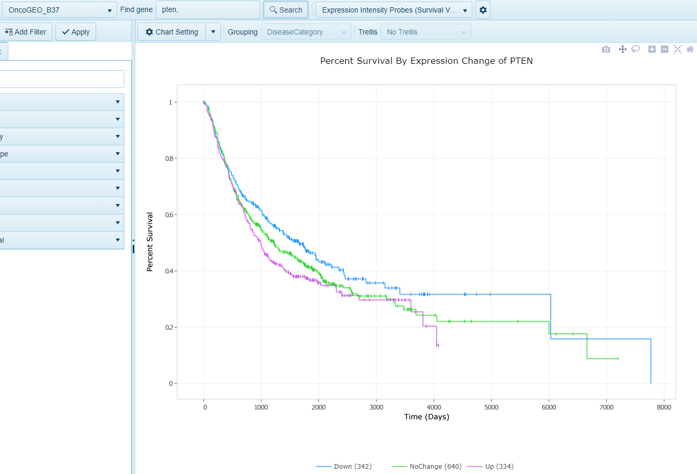

# Microarray Views

Microarray data from various platforms are supported in the Land framework, including many Affymetrix, as well as some Illumina and Agilent Microarrays. For Omicsoft Lands in the OncoLand and DiseaseLand collections, Omicsoft re-processed the raw data and normalizes the data using [standardized pipelines](http://www.arrayserver.com/wiki/index.php?title=Land_normalization_of_expression_data) to improve cross-project comparisons.

Depending on the type of arrays used in a specific Land, when searching a gene in the Land Explorer, two Microarray Variable views will be available: **Expression Ratio** or **Expression Intensity Probes**:

## Expression Ratio

The Expression Ratio view is available in TCGA lands and plots the expression values from Agilent Expression Arrays (Agilent G4502A). When a user searches a gene and selects this view, the Expression value in the Sample compared to the Universal Human reference will be plotted on the x-axis and the samples will be grouped on the y-axis by the Grouping column (e.g. Tumor Type):

## Expression Intensity (Gene Level)

In other Lands, such as the GEO-based HumanDisease and MouseDisease Lands, microarray data from a number of platorms is [re-processed and normalized](http://www.arrayserver.com/wiki/index.php?title=Omicsoft_Affymetrix_Microarray_Preprocessing), and the probes used in the arrays are mapped to the gene models used in the Land. When a gene is searched an the Expression Intensity view is selected, users can browse the expression data that gene. Expression of a gene is averaged across all probes mapping to that gene for each sample.

## Expression Intensity (ProbeSet Level)

In addition to summarizing expression at the gene level for microarray studies, the Expression Intensity (ProbeSet Level) allows users to browse the expression data for all probes that mapped to that gene. One chart will be generated per probe that maps to this gene:

## Multi-Gene Variable (Expression Intensity)

When multiple genes are searched, the multi-gene variable view allows users to visualize the expression of all genes searched in a single view. Here, the genes are grouped on the y-axis, and the expression of the gene in each sample is represented by the dots on the x-axis:

## Average Expression

When multiple genes are searched, the average expression view allows users to visualize the average expression of the gene set (i.e. gene signature) in the filtered samples. Samples are grouped on the y-axis by the grouping category and expression is plotted on the x-axis.

## Heatmap Expression

When multiple genes are searched, another view users can use is the Heat map view. In this view, expression of each gene will shown as a heatmap, where each row represents a sample, and the columns represent the gene. Filtering to fewer samples will aid in visualization of the unbiased clustering of the heatmap and the expression values of each gene:

## Expression Survival

In this view, when survival data is available and attributed to samples within the land, such as within OncoLand studies (TCGA, OncoGEO, etc.), a survival view will be generated. Samples will be grouped into quartiles (Up, upper 25% (Q1) expression of gene, Down, lower 25% (Q4), Mid (all remaining samples, Q2 and Q3)) based on microarray expression values. Survival will be plotted on the Y-axis and time on the X-axis.

