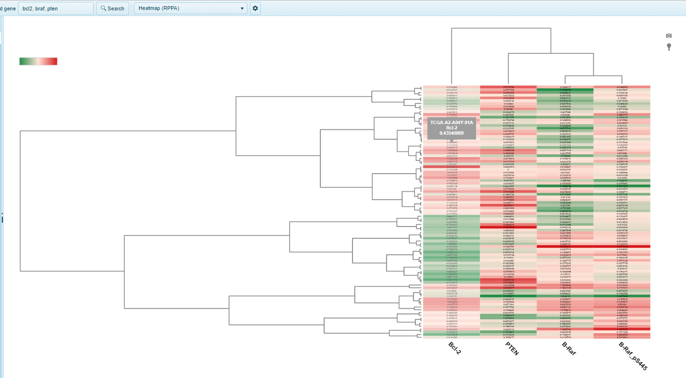
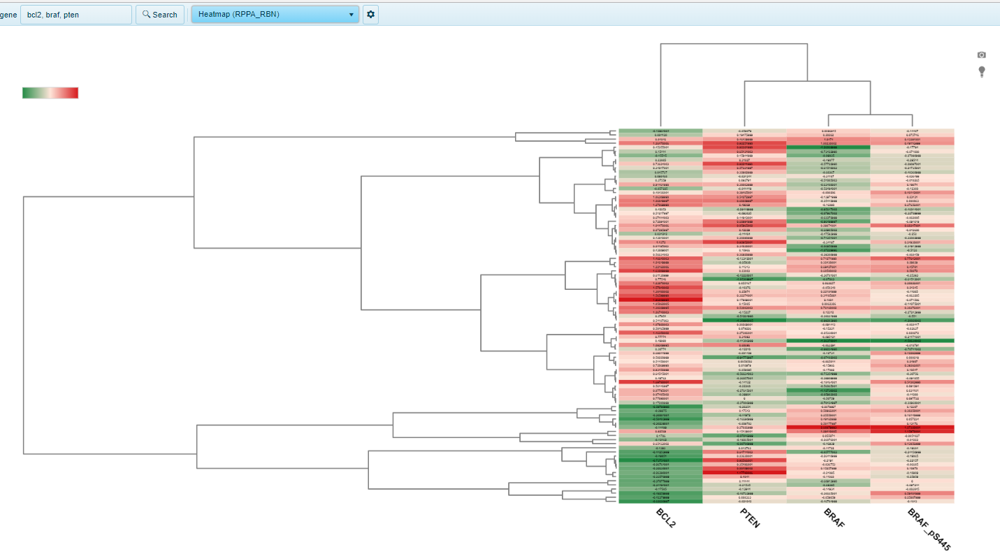

# Proteomics views

In addition to visualizing RNA-seq and microarray expression data, the Land Explorer can be used to visualize data from proteomics assays, such as Reverse Phase Proteomics Array (RPPA) and Mass Spectrometry (MS).

## RPPA Heatmap

The RPPA Heatmap view shows [reverse phase protein array](https://www.mdanderson.org/research/research-resources/core-facilities/functional-proteomics-rppa-core.html) ratio (sample vs universal human reference) for multiple genes. Each gene searched is identified by column, while each sample is represented as a row. RPPA data was only generated for a subset of proteins, so this view may not be available for many genes searched.

## RPPA_RBN Heatmap

This heatmap RPPA_RBN view shows reverse phase protein array ratio (sample vs universal human reference) for group (e.g. Tumor type) for multiple genes, with replicate-based normalization for cross-tumor comparisons (RBN). Each gene searched is identified by column, while each sample is represented as a row. RPPA data was only generated for a subset of genes, so this view may not be available for many genes. 

