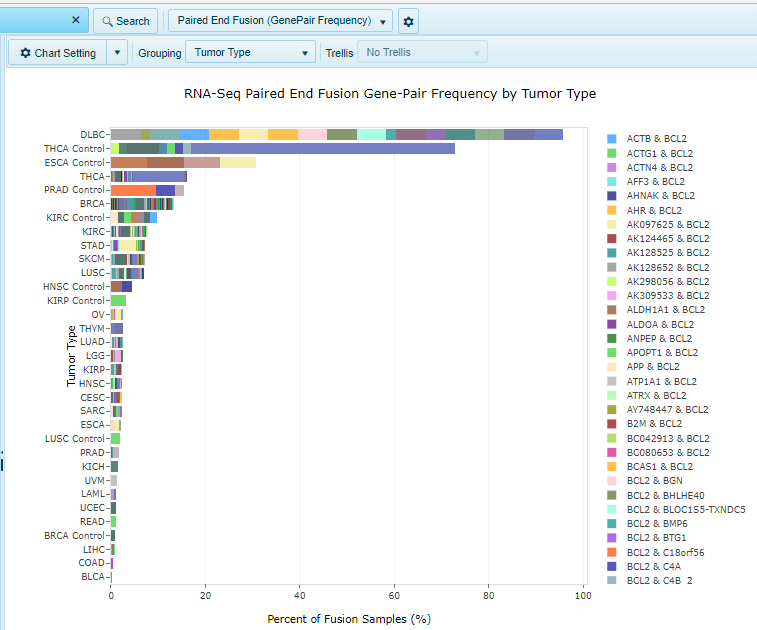

# RNA SEQ Fusion

## RNASeq Fusion (RPKM) View

!!! note
    This view is available only when searching for a single gene.

This view shows a series of charts of potential fusions for the specified gene or genes.

X-axis represents Fusion RPKM. RPKM is defined as seed reads per kilobase of seed region and per million mapped reads.
Y-axis is organized by grouping (e.g. Tumor Type).
Use the Sample tab to further filter the data using any associated sample/subject meta data.
Use the Fusion tab to filter the shown fusions. By default, all potential fusions are shown.

Suggested filters would be SplicePatternClass (remove non-canonical junctions), FrameShiftClass (remove frame shift and undefined fusions) and OnExonBoundary (look for fusions where both ends of fusion are on the exon boundary).

Potential real fusions are not likely to be in many normal samples. As a result, coloring has been automatically set to Sample Type.
Select Fusions in the plot and choose Fusion Details to see the full table for selected fusion.

## RNA-Seq Paired End Fusion (Alteration Frequency)

The RNA-Seq Paired End Fusion (Alteration Frequency) view shows the specified paired end fusion gene in a single chart, organized by Group (e.g. Tumor Type).

X-Axis shows percent of samples with the fusion, while Y-axis shows the group.
Use the Sample Tab to change filtering options on the samples (or to change grouping). Use the Fusion tab to filter the shown fusions. By default, all potential fusions are shown.
Potential real fusions are not likely to be in many normal samples.
Select bars in the plot and choose Fusion Details to see the full table for selected fusion.

## RNA-Seq Paired End Fusion (GenePair Frequency)

The RNA-Seq Paired End FUsion (GenePair Frequency) view shows each paired end fusion gene pair in a single chart, organized by Group (e.g. Tumor Type).

X-Axis shows percent of samples with the fusion, while Y-axis shows the group.
Use the Sample Tab to change filtering options on the samples. Use the Grouping option to change grouping. Use the Fusion tab to filter the shown fusions. By default, all potential fusions are shown.

Potential real fusions are not likely to be in many normal samples.
Select bars in the plot and choose Fusion Details to see the full table for selected fusion.

## RNA-Seq Fusion (Site Frequency)

The RNA-Seq Fusion (Site Frequency) view shows each fusion in a single chart, organized by Group (e.g. Tumor Type).

X-axis shows percent of samples with the fusion, while Y-axis shows the group.
By using the Sample Tab, users could apply filters to samples, and click the Grouping button to change grouping option. Under the Fusion tab, users could apply filters to the shown fusion options.
By default, all potential fusions for quried genes would be shown, however potential real fusions are not likely to be in many normal samples.

## RNA-Seq Fusion (GenePair Frequency)

The RNA-Seq Fusion (GenePair Frequency) view shows each fusion gene pair in a single chart, organized by Group (e.g. Tumor Type).

X-Axis shows percent of samples with the fusion, while Y-axis shows the group.
Use the Sample Tab to change filtering options on the samples (or to change grouping).
Use the Fusion tab to filter the shown fusions.
By default, all potential fusions are shown.

## RNA-Seq Fusion (GenePair Count)

The RNA-Seq Fusion (GenePair Count) summary view shows the count of fusion samples with each fusion gene pair, colored by Group (e.g. Tumor Type).

X-Axis shows count of samples with the fusion, while Y-axis shows the fusion gene pairs.
Use the Sample Tab to change filtering options on the samples (or to change grouping).
Use the Fusion tab to filter the shown fusions.
By default, all potential fusions are shown.

Potential real fusions are not likely to be in many normal samples.
Select bars in the plot and choose Fusion Details to see the full table for selected fusion.

## RNA-Seq Fusion (Alteration Frequency)

The RNA-Seq fusion (Alteration Frequency) summary view shows the percentage of samples having the fusion for the gene in a single chart.

X-Axis shows percent of samples with the fusion, while Y-axis shows the group.
Use the Sample Tab to change filtering options on the samples (or to change grouping).
Use the Fusion tab to filter the shown fusions.
By default, all potential fusions are shown.

Potential real fusions are not likely to be in many normal samples.
Select bars in the plot and choose Fusion Details to see the full table for selected fusion.

