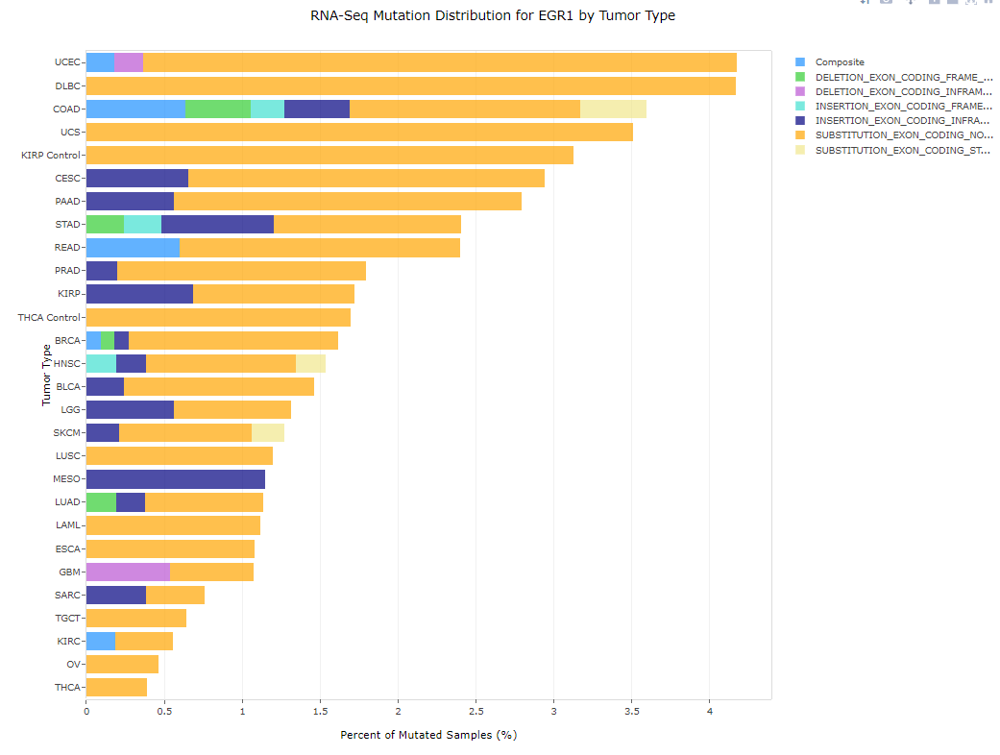
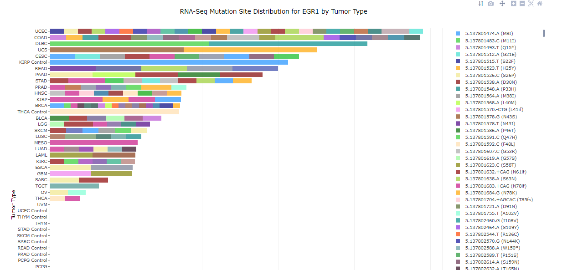

# RNA-Seq Mutation Views

## RNA-Seq Somatic Mutation Distribution

Similar to the [DNA Somatic Mutation Distribution View](./DNAAlterationDistribution.md#Somatic Mutation Distribution), this view displays histograms of RNA-Seq Somatic Mutation Distribution or RNA-seq Mutation Distribution. In this view, mutation events will be calculated as a percentage of affected samples in each group. As you can see in the view below, for the gene EGR1, only mutations are plotted. In the legend, a full description of the type of mutation (INDEL, Deletion, Substitution) will be displayed.

The x-Axis shows the percent of mutant samples, while the samples are grouped on the X-axis by the grouping column. Only groups with any mutations available in that gene will be plotted in the view.

Use the Sample Tab to change filtering options on the samples (or to change grouping). Use the Mutation tab to filter for specific Amino Acid mutation (OS_AAMutation), Annotation Type (i.e non-synonymous via OS_AnnotationType) and more. For more information on filtering in Land Explorer, please see the [filtering guide](../../Using Land Explorer/Filters/Filters.md)

Select one or more bars from the plot and choose Details for Selection to find out more details on the selected samples.

**Note**: In different Lands, RNA-seq mutation data will be presented as RNA-Seq Somatic Mutation or RNA-Seq Mutation. This reflects the difference in mutation calling. For Somatic Mutation calls, matched normal samples can be used to filter out the germline variants. For RNA-seq Mutation calls, no matched normals are available. In this case, since variation from germline is not filtered, there may be more mutations seen in this view:

## RNA-Seq Mutation Site Distribution

Similar to the [DNA Somatic Mutation Site Distribution View](./DNAAlterationDistribution.md#Somatic Mutation Site Distribution), this view for RNA-seq mutation data will plot the RNA-seq mutations for each gene queried:

All alleles identified for that gene will be represented on the x-axis as a unique color in the plot. As for the gene-level distributions for RNA-seq mutations, this can be displayed for RNA-seq Somatic mutation and RNA-seq Mutation data.
