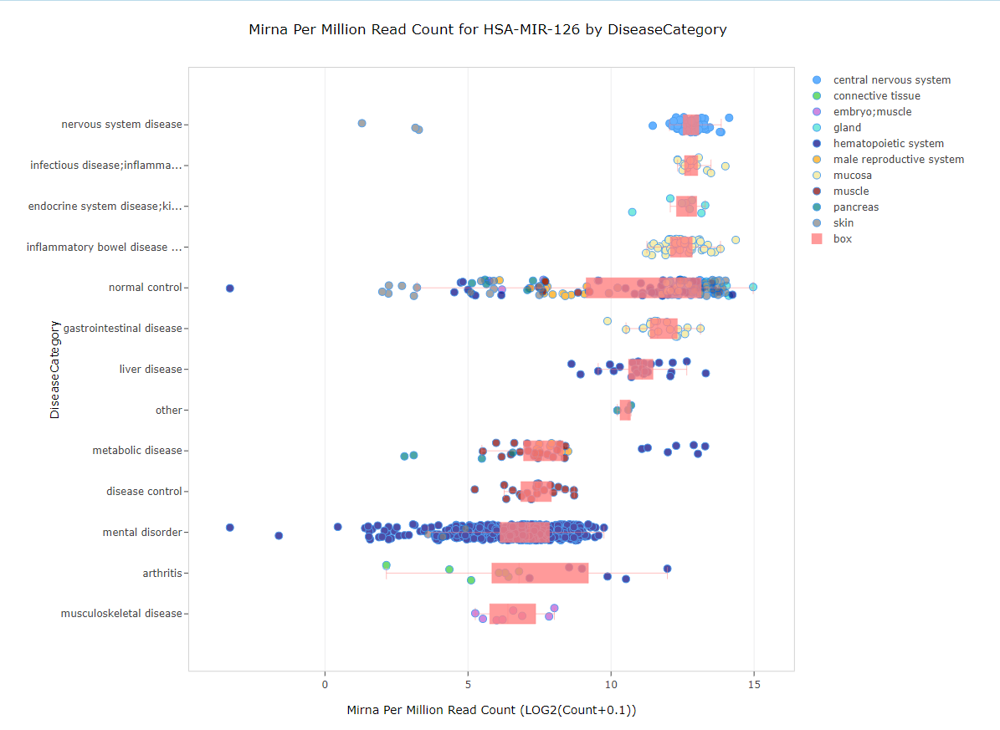

# miRNA views

Users can use the search bar at the top of the screen to identify data associated with microRNAs (miRNAs) within the land. For single miRNA searches, miRNA reads are displayed in a variable view, while searching for multiple miRNAs will display a heatmap view of miRNA expression. In both cases, miRNA expression values are normalized by miRNA per million read counts.

## Single miRNA searches

Searching for a single miRNA, such as MIR-126 in the search bar, the default view will be a variable view representing each sample in the plot as miRNA per million reads (on the x-axis). Samples will be grouped on the y-axis by the primary grouping (Disease Category by default in DiseaseLands):

## Multiple miRNA searches

Searching for multiple miRNAs, such as MIR-126, MIR-101, LET-7 in the search bar, the default view be the same as above will be a variable view representing each sample in the plot as miRNA per million reads (on the x-axis). Simply scroll up and down to see expression of each miRNA.

Another view that can be used for visualizing the expression of multiple miRNAs is the Heatmap view. In the example below, filtering to a smaller number of samples (Disease Category: Metabolic disease) will help visualize how these three miRNAs are expressed within these samples:

