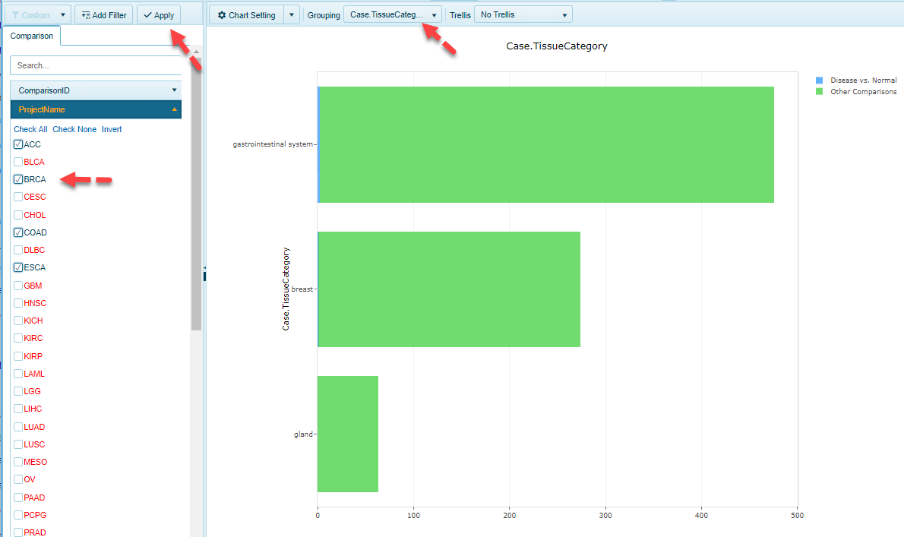

# Comparison views

This view shows all pre-computed comparisons present in the Land. In TCGA land, this will typically be all Tumor vs Normal (where available) comparisons. In DiseaseLands and OncoGEO, this can refer to multiple comparison types (i.e. Disease vs. Normal, Treatment vs. Control, Response vs no response, pre-treatment vs post-treatment). In this view, users can quickly query the different comparisons available within the Land, based on the category shown on the x-axis.

### General Options

This view, like all views in Land Explorer, is highly customizable. Users can filter to samples of interest using columns from the ProjectName and Case vs. Control options. These columns can also be used to determine the primary grouping (what will be plotted on the Y-axis). For example, to see what skin cancer samples are available in TCGA, users can filter to the specific tumor types (ACC, BRCA, CODA, and ESCA, etc), and use Case.TissueCategory to group the samples:

### Chart Options

The bars in the distribution views are interactive. Users can simply click on a bar of interest to get a table view of the metadata:

This table can easily be exported to excel with the click of a button (located at the top of the table). Users can also simplify the table by removing columns from the view using the "Select Columns" button.

For additional customizations of the views in Land Explorer, please see our documentation [here](../../Using Land Explorer/LandExplorerInterface.md)
