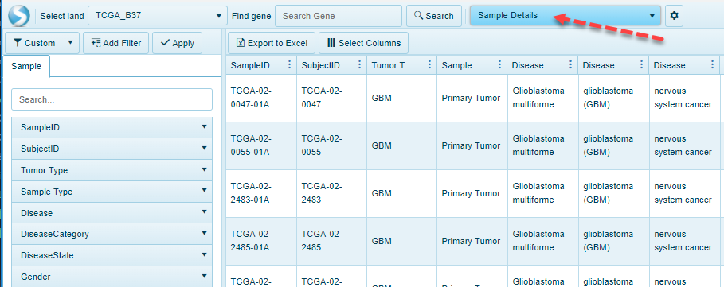

# Sample Details View

This view shows all sample information and -Omic data available in the current Land. In TCGA land for example, this view will typically show a table of all data available where each row represents one Sample, and each column shows metadata (Tumor Type, Sample Type, Disease, Disease State, etc.).

In this view, users can quickly check the sample category and the meta data available within the Land, and export this to Excel with a click of a button:

