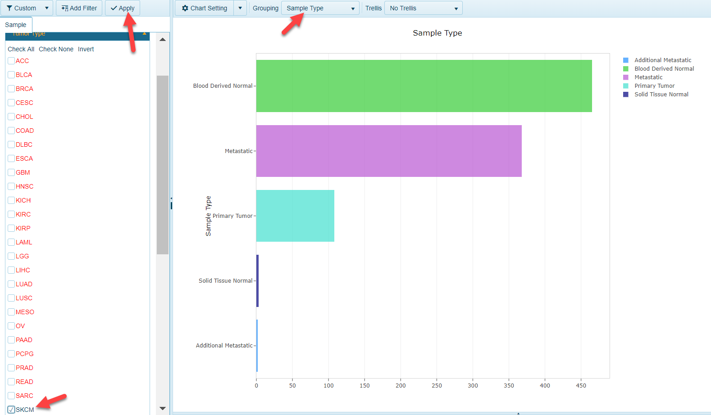
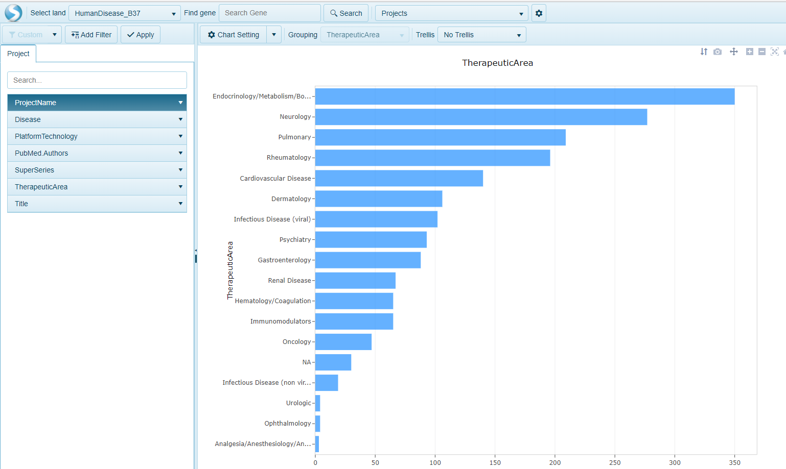

# Distribution views

Omicsoft curators manually curate all projects that are found within the Land, using a controlled vocabulary at the sample, comparison and project level. Users of Land Explorer can use Distribution views to quickly visualize and filter data using the defined metadata. These pages will describe three basic distribution views for browsing Land Data.

## Sample Distribution

The sample distribution view is the default view of all Lands. The view is a stacked bar graph plotting all samples within the Land, grouping the samples on the y-axis by the primary grouping column and coloring the samples on the x-axis using the secondary grouping column. In TCGA land, this will correspond to Tumor type on the Y-axis and Sample type on the X-axis:

### General Options

This view, like all views in Array Suite, is highly customizable. Users can filter to samples of interest using columns from the MetaData and Clinical Data. These columns can also be used to determine the primary grouping (what will be plotted on the Y-axis). For example, to see what skin cancer samples are available in TCGA, users can filter to a specific tumor type (SKCM), and use Sample Type to group the samples:

### Chart Options

The bars in the distribution views are interactive. Users can simply click on a bar of interest to get a table view of the metadata:

This table can easily be exported to excel with the click of a button (located at the top of the table). Users can also simplify the table by removing columns from the view using the "Select Columns" button.

For additional customizations of the views in Land Explorer, please see our documentation [here](../../Using Land Explorer/LandExplorerInterface.md)

## Comparison Distribution

This view shows all pre-computed comparisons present in the Land. In TCGA land, this will typically be all Tumor vs Normal (where available) comparisons. In 2018, the Omicsoft OncoLand team has added a number of comparisons to reflect the mutation status of genes represented in the [QIA-seq Cancer Panels](https://www.qiagen.com/us/shop/sample-technologies/dna/genomic-dna/qiaseq-targeted-dna-panels/#orderinginformation). In DiseaseLands and OncoGEO, this can refer to multiple comparison types (i.e. Disease vs. Normal, Treatment vs. Control, Response vs no response, pre-treatment vs post-treatment). In this view, users can quickly query the different comparisons available within the Land, based on the category shown on the x-axis.

## Project Distribution

In lands that comprise of many projects, such as OncoGEO, HumanDisease and MouseDisease, another useful view to identify specific projects is the project distribution view. In this view, all projects are plotted on the x-axis and categorized on the y-axis by the Therapeutic area, or general disease focus.

