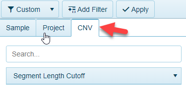

# Copy Number Variation Filters

For views that contain data from [Copy number calls](../../Land Views/Gene Level Views/CopyNumberViews.md), these views can be filtered to the variations of interest. The CNV tab will appear in these views for filtering:

The filters can be applied to:

## Segment Length Cutoff

For CNV Log2 ratio data, users can filter data based on the segment size that is represented by the data:

By default, no filtering is done, but users can filter based on the values shown, or define their own cutoff by typing in the value in the box and clicking the check-mark.
