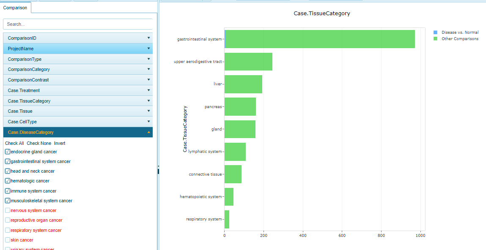
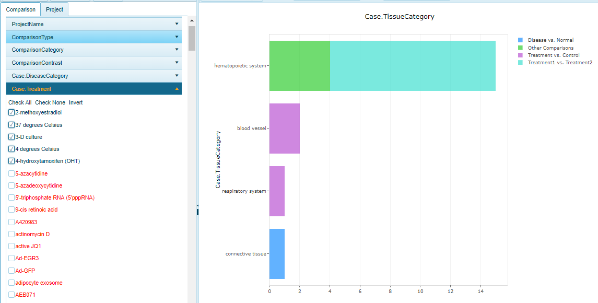

# Comparison Filters

All Samples, Comparisons, and Projects within OmicSoft Land's are associated with extensive metadata, which can be used to filter Land data to find the samples users are interested in. This page describes some filters that can be used to pare down to comparisons of interest. The most common comparison filters are shown here:

Users can add additional filters from the comparison metadata using the Add Filter button:

## Fold Change Cutoff

Users can filter to comparisons in which a gene is differentially regulated by typing in fold changes, or using predefined filters:

## PValue Cutoff

Find where a gene's differentially expression is below a certain p value threshold

## ComparisonCategory

Define the type of contrast that was performed (e.g. Disease vs. Normal or Treatment vs. Control)

## Case.DiseaseCategory

Find comparisons where the test subject had a specified disease:

## Case.Treatment

Find comparisons when the subject had a specified treatment:

