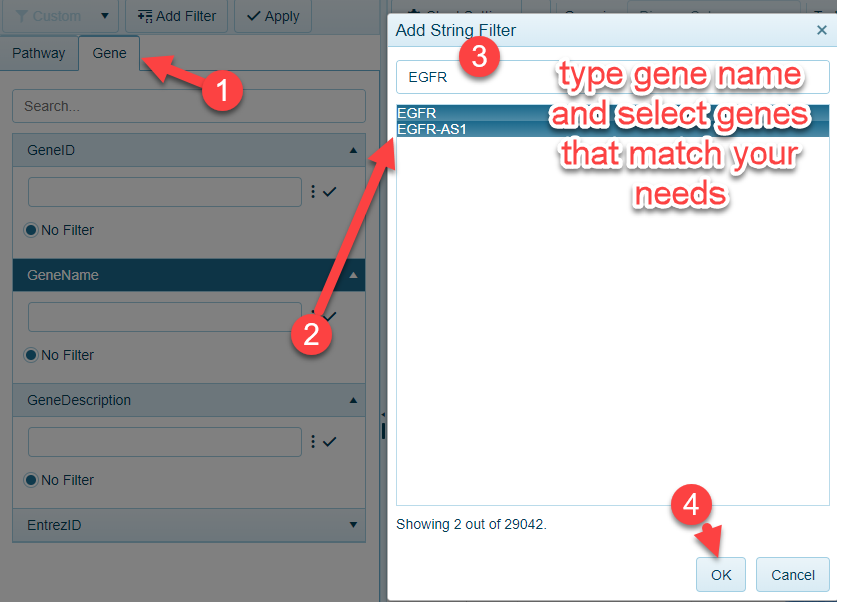

# Gene and Pathway Level Filters

When viewing [Volcano Plots](../../Land Views/Comparison Level Views/Volcano_Plot.md) displaying the differential expression results from a comparison, users may be interested in where gene(s) of interest lie within this comparison. The Gene and Pathway filters can be used to selective plot these genes in the view.

## Gene Filtering

To select a gene of interest from a volcano plot, users can select the Gene filter tab, and choose the Gene Identifier (i.e. GeneID, Entrez, or description). Typing in the gene name will filter the gene list to match your search. Simply click OK, and the view will be filtered to your gene(s) of interest:

## Pathway filtering

Similar to filtering for a gene, users can filter to gene sets in the Pathway tab:

